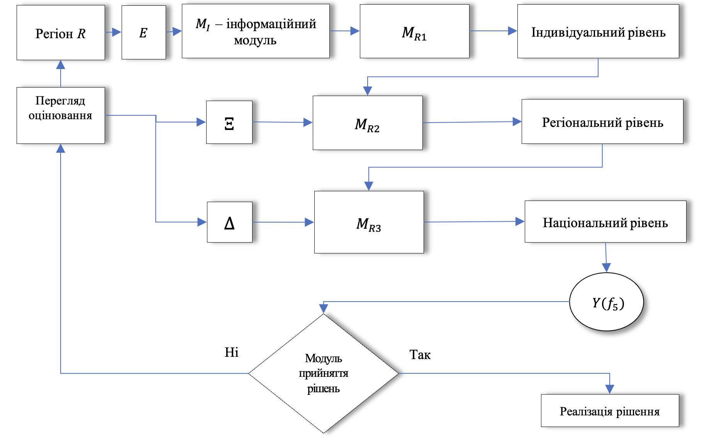

**УДК 519.86**

**ІНТЕЛЕКТУАЛЬНО-АНАЛІТИЧНА ПЛАТФОРМА ОЦІНКИ РИЗИКУ БЕЗПЕКИ ТУРИСТИЧНОЇ ПОДОРОЖІ**

**Андрій Шафар**

*ДВНЗ «Ужгородський національний університет», Україна*

***Резюме.*** *Основною метою даного дослідження є розроблення інтелектуально-аналітичної платформи оцінки ризику безпеки туристичної подорожі. Інтелектуально-аналітична платформа оцінки ризику безпеки туристичної подорожі складається із трьох аналітичних модулів: індивідуальний рівень безпеки туристичної подорожі; регіональний рівень безпеки туристичної подорожі; національний рівень безпеки туристичної подорожі. Суть інтелектуально-аналітичної платформи полягає в тому, що вона, спираючись на оцінки учасників туристичного руху щодо відчуття власної безпеки у вибраному регіоні, передбачуваність повторного візиту та експертну оцінку рівня безпеки регіональних туристичних систем, формує як кількісні, так і лінгвістичні індикатори ризику безпечності подорожі. Вперше розроблено інформаційний модуль для оцінювання рівня безпеки туристичної подорожі, що охоплює 17 критеріїв оцінки власної безпеки у місці призначення. Також вперше розроблено три аналітичні модулі, що охоплюють рівні від індивідуального до національного: модуль терм-оцінки ризику власної безпеки туристичної подорожі; модуль оцінювання рівня почуття безпеки регіону; модуль оцінювання ризику безпеки туристичної подорожі. Вхідні дані представлені у вигляді лінгвістичних змінних, що відображають враження учасників туристичного руху після відвідування регіону та рівень їхньої стурбованості щодо власної безпеки у місці призначення. Модулі базуються на принципах нечіткої логіки та багатовимірних функцій належності. Здійснюється агрегування даних щодо узагальненого ризику безпеки туристичної подорожі та прогнозу повторного відвідування регіону. Поєднуються оцінки безпеки регіональних туристичних систем від експертів із суб’єктивним рівнем почуття безпеки серед туристів. Результатом є як кількісна, так і лінгвістична оцінка ризику безпеки туристичної подорожі. Інтелектуально-аналітичну платформу верифіковано та апробовано на реальних даних 327 респондентів із Закарпатської, Львівської та Івано-Франківської областей, а також проілюстровано приклад її практичного застосування для оцінювання.*

***Ключові слова:*** *інформаційні технології, лінгвістичні змінні, нечітка логіка, підтримка прийняття рішень, ризики, регіональний туризм.*

*Отримано 07.05.2025*

1. **ВСТУП**

У сучасних умовах глобалізації, коли світ стає все більш відкритим для мандрівок, а туристична діяльність стрімко розвивається та охоплює дедалі ширші верстви населення, питання безпеки туристів постає як пріоритетне у сфері туризму, державної політики та міжнародного співробітництва. Туристична подорож, попри численні позитивні враження, культурне збагачення, відпочинок та можливість пізнання нового, може супроводжуватись низкою потенційних загроз. Ці ризики мають різноманітну природу – від соціальних та політичних (наприклад, підвищення рівня злочинності, соціальні конфлікти, терористичні акти) до природних (землетруси, повені, урагани), інфраструктурних (аварійність транспорту, недостатній рівень медичного забезпечення) та інформаційних (брак достовірної інформації про реальний стан безпеки в регіоні).

У таких умовах актуалізується необхідність не лише розробки систем управління ризиками, а й формування нових підходів до моніторингу та прогнозування ситуацій, що можуть становити загрозу для туристів. Врахування й своєчасне оцінювання таких ризиків є ключовою умовою для побудови ефективної системи захисту інтересів туристів, збереження їхнього здоров’я та життя, а також підвищення загальної конкурентоспроможності туристичних напрямків та покращення якості туристичних послуг.

Проте варто зазначити, що традиційні підходи до аналізу ризиків зазвичай орієнтовані на статистичні дані, формальні фактори та історичну ретроспективу, і часто не враховують таких важливих аспектів, як суб’єктивне сприйняття небезпеки самими туристами, емоційний стан мандрівників, рівень довіри до місцевої інфраструктури чи персоналу. Також ці підходи не забезпечують достатньої гнучкості в умовах динамічних змін – наприклад, різких змін епідеміологічної ситуації, політичної нестабільності чи стихійних лих, що виникають у режимі реального часу. У зв’язку з цим виникає потреба у створенні сучасних інструментів, що поєднують методи штучного інтелекту, експертні оцінки та аналітичні моделі.

Інтелектуально-аналітична платформа оцінки ризику безпеки туристичної подорожі складається із трьох аналітичних модулів: індивідуальний рівень безпеки туристичної подорожі; регіональний рівень безпеки туристичної подорожі; національний рівень безпеки туристичної подорожі. Суть інтелектуально-аналітичної платформи полягає в тому, що вона, спираючись на оцінки учасників туристичного руху щодо відчуття власної безпеки у вибраному регіоні, передбачуваність повторного візиту та експертну оцінку рівня безпеки регіональних туристичних систем, формує як кількісні, так і лінгвістичні індикатори ризику безпечності подорожі. Такий підхід дає змогу здійснювати комплексний аналіз території з погляду туристичної безпеки, враховуючи особливості функціонування локальних туристичних систем. Це, у свою чергу, сприяє глибшому розумінню споживчої поведінки туристів і виявленню актуальних тенденцій у розвитку регіонального туризму.

Упродовж останнього десятиліття спостерігається стійка тенденція до активізації наукових досліджень, спрямованих на аналіз та оцінювання ризиків у сфері туризму з використанням сучасних інтелектуальних та аналітичних підходів. Зростаюча складність глобального туристичного середовища, вплив зовнішніх чинників – таких як кліматичні зміни, пандемії, соціальні конфлікти зумовлюють потребу в інноваційних інструментах для забезпечення безпеки туристів. У зв’язку з цим дослідники дедалі частіше застосовують системи підтримки прийняття рішень (СППР), штучні нейронні мережі, механізми нечіткої логіки, багатокритеріальні методи аналізу, а також геоінформаційні системи для моделювання, прогнозування та візуалізації рівня безпеки туристичних маршрутів і регіонів [1–3]. Такі методи дозволяють проводити як ретроспективну, так і прогностичну оцінку ризиків з урахуванням різноманітних факторів, що впливають на туристичну привабливість територій [4–5].

У роботах зарубіжних авторів особлива увага приділяється використанню новітніх цифрових технологій, таких як Big Data, штучний інтелект, соціальні мережі, відкриті дані з офіційних джерел та мобільні додатки, які слугують потужними каналами для оперативного збору та аналізу інформації про потенційні загрози. Серед об’єктів аналізу – природні катастрофи, рівень злочинності, політична стабільність, епідеміологічна ситуація тощо. Створюються інтерактивні карти ризиків із можливістю інтеграції даних у реальному часі, що дає змогу забезпечити туристів актуальною інформацією під час планування поїздки та безпосередньо під час подорожі [6–8].

Водночас українські та інші вітчизняні дослідники зосереджують увагу на більш глибокій персоналізації процесу оцінки безпеки туристичних подорожей. Особливої актуальності набуває використання експертних оцінок, лінгвістичних змінних, суб’єктивних вражень туристів та багаторівневих критеріальних моделей для аналізу сприйняття безпеки. Застосовуються інструменти нечіткої логіки та математичного моделювання для об’єднання якісних і кількісних показників у єдину аналітичну платформу. Такі підходи дають змогу адаптувати оцінювання ризиків до специфіки окремих регіонів, зважаючи на локальні умови та поведінкові патерни туристів [9–11].

Попри зростання наукової активності в зазначеному напрямі, все ще спостерігається нестача комплексних рішень, що забезпечували б багаторівневу оцінку безпеки з урахуванням як індивідуальних чинників (поведінка туриста, рівень тривожності, готовність до реагування), так і регіональних та національних характеристик туристичної інфраструктури. Досі залишаються актуальними питання інтеграції інтелектуальних модулів у загальні СППР, що дозволяло б здійснювати адаптивне управління туристичними потоками залежно від рівня ризику. Таким чином, існує нагальна потреба у створенні інтелектуально-аналітичних платформ нового покоління, які б поєднували сучасні технології аналізу даних із гнучкими механізмами прийняття рішень на основі агрегованих джерел інформації [12–14].

Основною метою даного дослідження є розроблення інтелектуально-аналітичної платформи оцінки ризику безпеки туристичної подорожі, що може бути використана для підтримки прийняття управлінських рішень у сфері туризму, а також для інформування потенційних мандрівників про рівень безпеки в різних регіонах.

1. **МАТЕРІАЛИ І МЕТОДИ**

Для проведення оцінювання рівня ризику, пов’язаного з безпекою туристичної подорожі, розглядається певний регіон, що позначається як $R$. Множина осіб, які беруть участь у туристичному русі, позначається як $E=\{e\_{1};e\_{2};…;e\_{n}\}$. Ці учасники вже відвідали визначений регіон і надали свої суб’єктивні оцінки щодо загального враження, рівня занепокоєння та відчуття загрози з точки зору власної безпеки. Оцінювання здійснюється відповідно до набору критеріїв ризику, які згруповані у категорії $G\_{1};G\_{2};...;G\_{l}$, кожна з яких відображає певний аспект безпеки туристичного середовища.

Інтелектуально-аналітична платформа оцінки ризику безпеки туристичної подорожі формально представляється у вигляді оператора:

$T\_{5}\left(R,E, Ξ,Δ,M\_{I}, M\_{R1}, M\_{R2},M\_{R3}\right)|Y(f\_{5}).$ (1)

Де $T\_{5}$ – оператор, який на основі вхідних даних $R,E, Ξ,Δ,M\_{I}, M\_{R1}, M\_{R2},M\_{R3}$ виводить вихідну оцінку $Y(f\_{5})=\{μ\_{R}, T\_{R}\}$:$ $кількісна оцінка $\left(μ\_{R}\right)$ та лінгвістична оцінка ризику безпеки туристичної подорожі $(T\_{R})$. Вхідні величини наступні: $Ξ- $прогнозований рівень щодо повторного відвідування регіону учасниками туристичного руху; $Δ- $експертний рівень безпеки регіональних туристичних систем; $M\_{I}$ – інформаційний модуль$ $оцінювання рівня безпеки туристичної подорожі; $M\_{R1}$ – модуль визначення терм-оцінки ризику власної безпеки туристичної подорожі (індивідуальний рівень); $M\_{R2}$ – модуль оцінювання рівня почуття безпеки регіону (регіональний рівень); $M\_{R3}$ – модуль оцінювання ризику безпеки туристичної подорожі (національний рівень).

Інтелектуально-аналітична платформа представляється у вигляді структурної схеми, рис. 1.

Рис. 1. відображає структурну схему інтелектуально-аналітичної платформи оцінювання ризиків безпеки туристичної подорожі. На основі вхідних даних по регіону оцінювання та учасниках туристичного руху йде обчислення в інформаційному модулі$ $оцінювання рівня безпеки туристичної подорожі – $M\_{I}$. Опрацьовані дані попадають на $M\_{R1}$ – модуль визначення терм-оцінки ризику власної безпеки туристичної подорожі, що представляє собою індивідуальний рівень. Далі вводиться $Ξ- $прогнозований рівень щодо повторного відвідування регіону учасниками туристичного руху та дані переходять на $M\_{R2}$ – модуль оцінювання рівня почуття безпеки регіону (регіональний рівень). Після цього використовується $Δ- $експертний рівень безпеки регіональних туристичних систем для обробки даних на $M\_{R3}$ – модуль оцінювання ризику безпеки туристичної подорожі (національний рівень). Вихідні дані $Y(f\_{5})$ потрапляють на модуль прийняття рішення. Якщо ризик безпеки туристичної подорожі в розрізу регіонів не задовольняє ОПР, тоді є можливість переглянути оцінювання, шляхом налаштування параметрів платформи.

|  |
| --- |
|  |
| **Рисунок 1.** Структурна схема інтелектуально-аналітичної платформи оцінювання ризиків безпеки туристичної подорожі. |

Далі розглянемо всі модулі інтелектуально-аналітичної платформи оцінювання ризиків безпеки туристичної подорожі.

$M\_{I}$ – інформаційний модуль$ $оцінювання рівня безпеки туристичної подорожі

Розглядається множина критеріїв оцінювання власної безпеки в місці призначення, що позначається як $K=\left\{K\_{i};i=\overbar{1, m}\right\} .$ Ці критерії структуровані у вигляді l логічних груп, що позначаються як $G\_{1};G\_{2};...;G\_{l}$, кожна з яких охоплює певний аспект безпеки. Кожен учасник туристичного руху надає оцінки по кожному з критеріїв, використовуючи набір лінгвістичних змінних $L=\left\{\begin{matrix}l\_{1};&l\_{2};&l\_{3};&l\_{4};&l\_{5}\end{matrix}\right\}$, що відображають рівень його суб’єктивного сприйняття безпеки та очікувань стосовно умов перебування в туристичному регіоні. Пропонується інтерпретувати лінгвістичні змінні таким чином: $L=\{l\_{1}$ – “Зовсім не погоджуюсь”; $l\_{2}$ – “Не погоджуюсь”; $l\_{3}$ – “Ні погоджуюсь, ні не погоджуюсь”; $l\_{4}$ – “Погоджуюсь”; $l\_{5}$ – “Цілком погоджуюсь”}.

Множина критеріїв оцінювання охоплює ключові аспекти сприйняття особистої безпеки з боку учасників туристичного руху, зокрема їхні враження, рівень занепокоєння та ступінь стурбованості щодо умов перебування та ризиків у місці призначення. Ці критерії також враховують очікування туристів стосовно якості безпечного середовища.

З метою більш чіткої структуризації інформаційного модулю, усі критерії об'єднано у декілька логічно обґрунтованих груп оцінювання, кожна з яких відображає окремий аспект безпеки туристичної подорожі. Пропонується наступна класифікація:

$G\_{1} $– група ризиків безпеки інфраструктури місця відвідування.

$K\_{11} $– інформація, розміщена на інформаційних табличках, була для мене недостатньо зрозумілою або нечіткою;

$K\_{12} $– на мою думку, у регіоні бракує інфраструктури або органів, які здійснюють контроль за безпекою туристів;

$K\_{13} $– відчував занепокоєння через хаотичний дорожній рух і можливі ризики для безпеки на дорогах;

$K\_{14} $– був занепокоєний рівнем безпеки житла або помешкання, в якому перебував під час подорожі;

$K\_{15} $– під час поїздки автомобілем я відчував страх або тривогу щодо можливості дорожньо-транспортної пригоди.

$G\_{2} $– група ризиків соціальної та екологічної безпеки туризму.

$K\_{21} $– відчував занепокоєння через серйозне екологічне забруднення у туристичному місці;

$K\_{22} $– через побоювання пограбування з боку місцевих торговців я надавав перевагу покупкам у супермаркетах або спеціалізованих магазинах;

$K\_{23} $– відчував страх або дискомфорт через велику кількість людей у популярних туристичних локаціях;

$K\_{24} $– мене непокоїло недружнє або зневажливе ставлення місцевих працівників до туристів;

$K\_{25} $– відчував тривогу через вороже або неприязне ставлення місцевого населення до туристів;

$K\_{26} $– переймався через можливість випадкового порушення місцевих традицій, культурних норм або неписаних правил;

$K\_{27} $– був стурбований тим, що місцеві жителі неохоче приймають туристів у свої громади.

$G\_{3} $– група медичної безпеки туристичної подорожі.

$K\_{31} $– переймався станом інфраструктури, оскільки вона могла становити ризик для мого здоров’я;

$K\_{32} $– відчував небезпеку для здоров’я, яку могло спричинити навколишнє природне середовище;

$K\_{33} $– хвилювався через ймовірність захворювання на вірусні інфекції під час подорожі;

$K\_{34} $– мене турбувала загроза здоров'ю під час перебування у місці призначення;

$K\_{35} $– відчував занепокоєння щодо якості та безпечності місцевих продуктів харчування.

Звісно, що група критеріїв є відкритою, а інформаційний модуль не залежить від кількості груп чи критеріїв.

$M\_{R1}$ – модуль визначення терм-оцінки ризику власної безпеки туристичної подорожі (індивідуальний рівень)

На основі оцінок туристів щодо відвіданого регіону, їхньої стурбованості власною безпекою та очікувань у місці призначення формується набір вхідних лінгвістичних змінних. На першому етапі, за допомогою правил належності та бази знань, визначається узагальнена терм-оцінка $T\_{g}$ для кожної групи критеріїв ризику. На другому етапі, використовуючи отримані оцінки $T\_{g}$, для кожного туриста e обчислюється агрегована оцінка ризику безпеки подорожі.

Для переходу від лінгвістичних оцінок до числових значень кожній змінній присвоюється оцінка τ: $l\_{1}$ – $τ\_{1}$=1; $l\_{2}$ – $τ\_{2}$=2; $l\_{3}$ – $τ\_{3}$=3; $l\_{4}$ – $τ\_{4}$=4; $l\_{5}$ – $τ\_{5}$=5. Значення кількісної оцінки $τ$ зростає із зростанням рівнем задоволеності туристами від закладів розміщення.

Далі в межах групи критеріїв ризику знаходиться сума значень кількісних оцінок по деякому експерту $e$:

$θ\_{g}=\sum\_{i=1}^{m\_{g}}τ\_{gi}$, $g=\overline{1,l}$. (2)

$m\_{g}- $кількість критеріїв у групі $g$.

Для обчислення підсумкової терм-оцінки кожної групи критеріїв ризику застосовується відповідна характеристична функція:

$T\_{g}=\left\{\begin{matrix}\begin{matrix}l\_{1}&якщо&θ\_{g}<m\_{g},\\l\_{2}&якщо&m\_{g}\leq θ\_{g}<2m\_{g},\end{matrix}\\\begin{matrix}l\_{3}&якщо&2m\_{g}\leq θ\_{g}<3m\_{g},\end{matrix}\\ \begin{matrix}l\_{4}&якщо&3m\_{g}\leq θ\_{g}<4m\_{g},\end{matrix}\\\begin{matrix}l\_{5}&якщо&θ\_{g}\geq 4m\_{g}\end{matrix}.\end{matrix}\right.$. (3)

Далі здійснюється визначення агрегованої оцінки ризику власної безпеки туристичної подорожі. Для цього нехай аналізується об’єкт із $g$ входами та одним виходом:

$r^{\*}(e)=λ(T\_{1},T\_{2},...,T\_{l})$. (4)

Де: $r^{\*}$ − вихідна результуюча терм-оцінка для групи критеріїв ризику $g$; $T\_{1},T\_{2},...,T\_{l}$ − вхідні лінгвістичні оцінки відповідно по експерту $e$. $λ$ − оператор, що ставить у відповідність вихідну результуючу терм-оцінку $r^{\*}$, при вхідних змінних $T\_{1},T\_{2},...,T\_{l}$ (правило логічного виводу). Нехай пропонується наступна терм-множина лінгвістичних змінних ризику власної безпеки туристичної подорожі: $R=\left\{\begin{matrix}L;&BA;&A;&AA;&H\end{matrix}\right\}$, $r^{\*}\in R,$ L – «низький ризик»; BA – «ризик нижче середнього»; A – «середній ризик»; AA – «ризик вище середнього»; H – «високий ризик».

Наступним кроком є побудова правил належності результуючих термів. Ці правила формуються у вигляді логічних конструкцій типу "Якщо–Тоді–Інакше", які встановлюють зв’язок між термами вхідних змінних $T\_{1},T\_{2},...,T\_{l}$ та одним із можливих значень вихідної змінної $R$. Для цього можна скористатися відомими підходами, а саме методами нечіткої логіки, зокрема використанням функцій належності та операцій над ними. Зокрема, в якості основних інструментів можна застосовувати такі техніки, як методи Мамдані або Цзянга, які дозволяють створити правила, що відображають складні залежності між вхідними змінними і результатами на основі нечітких множин [1, 4]. Це дає змогу моделювати невизначеність і нечіткість, що присутні у реальних системах.

Наприклад, правила належності для агрегації оцінки ризику власної безпеки туристичної подорожі визначаються наступним чином: 1) Якщо кількість результуючої терм-оцінки за групами критеріїв не нижче: 1 із термом $T\_{5}$ та 2 із термом $T\_{4}$, то агрегація дає L – «низький ризик»; 2) Якщо кількість результуючої терм-оцінки за групами критеріїв не нижче: 1 із термом $T\_{5}$, 1 із термом $T\_{4}$, та 1 із термом $T\_{3}$, то ризик визначається як BA – «ризик нижче середнього»; 3) Якщо кількість результуючої терм-оцінки за групами критеріїв не нижче: 1 із термом $T\_{4}$, 1 із термом $T\_{3}$, та 1 із термом $T\_{2}$, то агрегація дає A – «середній ризик»; 4) Якщо кількість результуючої терм-оцінки за групами критеріїв не нижче: 2 із термом $T\_{3}$, та 1 із термом $T\_{2}$, то оцінка ризику буде AA – «ризик вище середнього»; 5) Для всіх нижчих випадків результатом є H – «високий ризик».

Таким чином, на виході модулі – $M\_{R1}$ виводиться агрегована терм-оцінка $r^{\*}(e)$ ризику власної безпеки туристичної подорожі для експерта $e$ у відвідуваному регіоні $R$.

$M\_{R2}$ – модуль оцінювання рівня почуття безпеки регіону (регіональний рівень)

Таким чином, на основі попереднього модуля, по кожному експерту отримується агрегована терм-оцінка ризику власної безпеки туристичної подорожі: $r^{\*}\left(e\_{1}\right), r^{\*}\left(e\_{2}\right),…,r^{\*}\left(e\_{n}\right)$.

Спочатку обчислюється загальне значення ризику безпеки туристичної подорожі в досліджуваному регіоні $R$. Усі учасники туристичного руху, що беруть участь у дослідженні, вважаються рівнозначними. Якщо необхідно, ОПР може розподілити їх за рівнем компетенції шляхом введення вагових коефіцієнтів. Агреговану терм-оцінку ризику зазвичай визначають за допомогою відсоткової шкали (0-100%), де кожному з можливих значень присвоюється діапазон з певного проміжку $[a;b]$, наприклад: L – [0; 15], BA – [15; 30], A – [30; 50], AA – [50; 80], H – [80; 100].

Далі вводиться наступна величина для подальшого аналізу:

$δ(R)=\frac{1}{n}\sum\_{j=1}^{n}χ(e\_{j})$, де $χ(e\_{j})=\left\{\begin{matrix}\begin{matrix}15&якщо&r^{\*}\left(e\right)=L,\\30&якщо&r^{\*}\left(e\right)=BA,\end{matrix}\\\begin{matrix}50&якщо&r^{\*}\left(e\right)=A,\end{matrix}\\ \begin{matrix}80&якщо&r^{\*}\left(e\right)=AA,\end{matrix}\\\begin{matrix}100&якщо&r^{\*}\left(e\right)=H\end{matrix}.\end{matrix}\right.$ (5)

$n$ – кількість учасників туристичного руху у регіоні $R$, $j =\overline{1,n}.$ Узагальнене значення $δ(R)\in [15;100]$ ризику безпеки туристичної подорожі, отримане для конкретного регіону, відображає оцінку рівня безпеки в цьому регіоні з точки зору учасників туристичного руху. Чим більше це значення, тим вищий ризик безпеки туристичної подорожі, а рівень безпеки в регіоні відповідно знижується. Цю залежність можна розглядати як невизначеність типу «мала кількість», яка виражається через Z-подібні функції належності. Наприклад, квадратичний Z-сплайн для цієї задачі матиме наступний вигляд:

$ϕ(R)=\left\{\begin{matrix}1,&δ(R)\leq 60;\\1-\frac{\left(δ(R)-60\right)^{2}}{800},&60<δ(R)\leq 80;\\\frac{\left(100-δ(R)\right)^{2}}{800},&80<δ(R)<100,\\0,&δ(R)\geq 100.\end{matrix}\right.$ (6)

Отримане значення $ϕ(R)\in $[0; 1], представляє собою нормоване узагальнене значення ризику безпеки туристичної подорожі. Коли значення $ϕ(R)$ прямує до 1, тоді ризик туристичної подорожі у досліджуваному регіоні мінімальний.

Нехай для досліджуваного регіону $R$ існує прогнозований рівень щодо повторного відвідування регіону учасниками туристичного руху ($Ξ\in $[0; 1]). Значення такого рівня обумовлює потенційну можливість повторного відвідування регіону та/або залучення нових споживачів туристичних послуг [15]. Чим більше значення $Ξ(R)$, тим більший рівень бажання туристів повернутися в регіон. В рамках нашого дослідження припускається, що коли учасники туристичного руху мають намір повторно відвідати регіон, це свідчить про їхнє задоволення попередньою подорожжю та відчуття безпеки в регіоні.

Для визначення рівня почуття безпеки регіону з боку учасників туристичного руху пропонується застосувати інтелектуальний аналіз знань, використовуючи багатовимірні функції належності. Оскільки величини $ϕ(R);Ξ\left(R\right)$ в просторі оцінок [0; 1] характеризуються невизначеністю типу «середнє значення», можна використовувати конусоподібні або пірамідальні функції належності. Наприклад, конусоподібна функція належності, з основою в точці (1;1) та масштабуванням за координатами (2;2), матиме такий вигляд:

$m\_{S}\left(R\right)=1-\frac{1}{2}∙\sqrt{\left(ϕ\left(R\right)-1\right)^{2}+\left(Ξ\left(R\right)-1\right)^{2}} .$ (7)

Отримане значення є нормованим та характеризує рівень почуття безпеки регіону з боку учасників туристичного руху.

$M\_{R3}$ – модуль оцінювання ризику безпеки туристичної подорожі (національний рівень).

Нехай у контексті даного дослідження регіональна туристична система визначається як складна система, що формується на регіональному рівні під впливом туристичних потоків, основною метою якої є інноваційний та сталий розвиток туристичної сфери регіону. На сучасному етапі головним напрямом розвитку туристичної сфери є забезпечення безпеки туризму. У зв'язку з цим вводиться $Δ- $експертний рівень безпеки регіональних туристичних систем, який представляє собою національно-порівнювальну оцінку в межах регіону. Для встановлення цього рівня ОПР проводить аналіз регіону з точки зору інноваційного та сталого розвитку під впливом туристичних потоків, а потім формулює висновки у вигляді лінгвістичних змінних з відповідної тем-множини $Δ=\{Δ\_{1};Δ\_{2};Δ\_{3};Δ\_{4};Δ\_{5}\}$$T=\left\{\begin{matrix}T\_{1};&T\_{2};&T\_{3};&T\_{4};&T\_{5}\end{matrix}\right\}$, де: $Δ\_{1}$={Низький рівень безпеки регіональних туристичних систем}; $Δ\_{2}$={Рівень безпеки регіональних туристичних систем нижче середнього}; $Δ\_{3}$={Середній рівень безпеки регіональних туристичних систем}; $Δ\_{4}$={Рівень безпеки регіональних туристичних систем вище середнього}; $Δ\_{5}$={Високий рівень безпеки регіональних туристичних систем}.

На першому кроці виконується операція фазифікації вхідних гібридних даних. Для цього кожному вхідному значенню $(m\_{S}\left(R\right);Δ(R))$ $(t\_{i};q\_{i})$ ставиться у відповідність значення функції належності $μ(t\_{i})$$μ\_{R}(R)$. Для цього, необхідно побудувати правила належності, щоб отримати нормовану оцінку вхідних даних. Нехай терм-множина лінгвістичних змінних $Δ$ представлена на деякому числовому проміжку, для розмежування термів: $Δ\_{1}\in [a\_{1};a\_{2}],$ $T\_{1}\in [a\_{1};a\_{2}],$ $Δ\_{2}\in [a\_{2};a\_{3}],$ $T\_{2}\in [a\_{2};a\_{3}],$$Δ\_{3}\in [a\_{3};a\_{4}],$ $T\_{3}\in [a\_{3};a\_{4}],$$Δ\_{4}\in [a\_{4};a\_{5}],$ $T\_{4}\in \left[a\_{4};a\_{5}\right],$$Δ\_{5}\in [a\_{5};a\_{6}].$ $T\_{5}\in [a\_{5};a\_{6}]$Значення розбиття проміжків можуть налаштовуватись та змінюватись, на основі реальних даних. Далі за допомогою характеристичної функції обчислюються величини ω:

$ω(R)=\left\{\begin{matrix}a\_{2}⋅m\_{S}(R),&якщо&Δ(R)\in Δ\_{1};\\a\_{3}⋅m\_{S}(R),&якщо&Δ(R)\in Δ\_{2};\\a\_{4}⋅m\_{S}(R),&якщо&Δ(R)\in Δ\_{3};\\a\_{5}⋅m\_{S}(R),&якщо&Δ(R)\in Δ\_{4};\\a\_{6}⋅m\_{S}(R),&якщо&Δ(R)\in Δ\_{5}.\end{matrix}\right.$$O\_{i}=\left\{\begin{matrix}a\_{2}⋅q\_{i}&якщо&t\_{i}\in T\_{1};\\a\_{3}⋅q\_{i},&якщо&t\_{i}\in T\_{2};\\a\_{4}⋅q\_{i},&якщо&t\_{i}\in T\_{3};\\a\_{5}⋅q\_{i},&якщо&t\_{i}\in T\_{4};\\a\_{6}⋅q\_{i},&якщо&t\_{i}\in T\_{5}.\end{matrix}\right.$ (8)

Це дасть можливість об’єднати кількісні оцінки та думки ОПР. В результаті, отримується об’єктивна оцінка $ω(R)$ щодо безпеки туристичної подорожі в регіоні, а це призведе до обґрунтованості прийняття рішень.

Для коректної інтерпретації взаємозв’язку між рівнем почуття безпеки регіону, сформованого учасниками туристичного руху, та експертними оцінками ОПР щодо безпеки регіональних туристичних систем, необхідно провести нормалізацію отриманих значень. З метою порівняння цих даних доцільно застосувати правило належності, представлене у вигляді S-подібної функції належності:

$μ\_{R}(R)=\left\{\begin{matrix}0,&ω(R)\leq a\_{1}\\2\left(\frac{ω(R)-a\_{1}}{a\_{6}-a\_{1}}\right)^{2},&a\_{1}<ω(R)\leq \frac{a\_{1}+a\_{6}}{2}\\1-2\left(\frac{a\_{6}-ω(R)}{a\_{6}-a\_{1}}\right)^{2},&\frac{a\_{1}+a\_{6}}{2}<ω(R)<a\_{6}\\1,&ω(R)\geq a\_{6}\end{matrix}\right.$$μ(O\_{i})=\left\{\begin{matrix}0,&O\_{i}\leq a\_{1};\\2\left(\frac{O\_{i}-a\_{1}}{a\_{6}-a\_{1}}\right)^{2},&a\_{1}<O\_{i}\leq \frac{a\_{1}+a\_{6}}{2};\\1-2\left(\frac{a\_{6}-O\_{i}}{a\_{6}-a\_{1}}\right)^{2},&\frac{a\_{1}+a\_{6}}{2}<O\_{i}<a\_{6};\\1,&O\_{i}\geq a\_{6}.\end{matrix}\right.$. (9)

Функція належності, побудована таким чином, відображає, що значення $μ\_{R}(R)$ наближається до 1 у разі мінімального рівня ризику безпеки туристичної подорожі. Це дозволяє врахувати суб’єктивність експертних оцінок та забезпечити перехід від нечітких лінгвістичних і кількісних суджень до нормованих, зіставних показників.

Далі по отриманій нормованій оцінці ризику безпеки туристичної подорожі представляється лінгвістичне трактування за допомогою темр-множини $T\_{R}$ наступним чином: $μ\_{R}(R)\in [0;0,2)$ ‒ $R\_{1}$: дуже високий ризик туристичної подорожі; $μ\_{R}(R)\in [0,2;0,4)$ ‒ $R\_{2}$: високий ризик туристичної подорожі; $μ\_{R}(R)\in [0,4;0,6)$ ‒ $R\_{3}$: середній ризик туристичної подорожі; $μ\_{R}(R)\in [0,6;0,8)$ ‒ $R\_{4}$: низький ризик туристичної подорожі; $μ\_{R}(R)\in [0,8;1]$ ‒ $R\_{5}$: дуже низький ризик туристичної подорож.

Рівні прийняття рішень системний аналітик має можливість коригувати з урахуванням актуальних даних про учасників туристичного руху та специфіку регіонального туризму в конкретній країні. Такий підхід дозволяє адаптувати модель до реальних умов і забезпечити більш точну та релевантну підтримку управлінських рішень.

1. **РЕЗУЛЬТАТИ ТА ЇХ ОБГОВОРЕННЯ**

Дослідження пройшло процес верифікації та апробації на основі реальних емпіричних даних, зібраних у період з жовтня по грудень 2023 року серед 327 респондентів із Закарпатської, Львівської та Івано-Франківської областях [16]. Учасники дослідження заповнювали спеціально розроблену анкету, що охоплювала різноманітні аспекти їхнього туристичного досвіду в різних напрямах і контекстах. Структура анкети включала 16 тематичних блоків, що містили загалом 320 запитань. До вибірки були включені респонденти різних вікових груп, рівнів освіти, статі та інших демографічних характеристик, що дозволило забезпечити репрезентативність результатів. Отриманий масив даних відповідає основним вимогам статистичної достовірності, охоплюючи всі ключові демографічні та змістовні параметри, необхідні для повноцінного аналізу досліджуваної тематики.

На основі зібраної інформації було проведено низку експериментальних оцінювань ризиків, пов’язаних із безпекою туристичних подорожей. Деталізовані дані за кожним із регіонів представлені у [16], а приклади вхідних лінгвістичних експертних даних наведено в таблиці 1.

Таблиця 1. Вхідні експертні дані.

|  |  |  |  |  |
| --- | --- | --- | --- | --- |
| Група | Критерії | $R\_{1}$ – Закарпатська обл. ($e\_{1}$) | $R\_{2}$ – Івано-Франківська обл. ($e\_{210}$) | $R\_{3}$ – Львівська обл. ($e\_{251}$) |
| $$G\_{1}$$ | $$K\_{11}$$ | $$l\_{5}$$ | $$l\_{4}$$ | $$l\_{1}$$ |
| $$K\_{12}$$ | $$l\_{5}$$ | $$l\_{2}$$ | $$l\_{1}$$ |
| $$K\_{13}$$ | $$l\_{1}$$ | $$l\_{2}$$ | $$l\_{2}$$ |
| $$K\_{14}$$ | $$l\_{1}$$ | $$l\_{2}$$ | $$l\_{1}$$ |
| $$K\_{15}$$ | $$l\_{1}$$ | $$l\_{2}$$ | $$l\_{2}$$ |
| $$G\_{2}$$ | $$K\_{21}$$ | $$l\_{1}$$ | $$l\_{2}$$ | $$l\_{1}$$ |
| $$K\_{22}$$ | $$l\_{1}$$ | $$l\_{2}$$ | $$l\_{1}$$ |
| $$K\_{23}$$ | $$l\_{1}$$ | $$l\_{3}$$ | $$l\_{2}$$ |
| $$K\_{24}$$ | $$l\_{1}$$ | $$l\_{2}$$ | $$l\_{1}$$ |
| $$K\_{25}$$ | $$l\_{1}$$ | $$l\_{3}$$ | $$l\_{2}$$ |
| $$K\_{26}$$ | $$l\_{1}$$ | $$l\_{2}$$ | $$l\_{3}$$ |
| $$K\_{27}$$ | $$l\_{1}$$ | $$l\_{1}$$ | $$l\_{3}$$ |
| $$G\_{3}$$ | $$K\_{31}$$ | $$l\_{2}$$ | $$l\_{2}$$ | $$l\_{1}$$ |
| $$K\_{32}$$ | $$l\_{2}$$ | $$l\_{3}$$ | $$l\_{2}$$ |
| $$K\_{33}$$ | $$l\_{2}$$ | $$l\_{3}$$ | $$l\_{4}$$ |
| $$K\_{34}$$ | $$l\_{1}$$ | $$l\_{4}$$ | $$l\_{2}$$ |
| $$K\_{35}$$ | $$l\_{1}$$ | $$l\_{5}$$ | $$l\_{3}$$ |

На першому етапі виконується перетворення лінгвістичних оцінок експертів за кожним окремим критерієм у єдину узагальнену терм-оцінку в межах відповідних груп критеріїв ризику. Кожній лінгвістичній змінній відповідає певне числове значення. Далі здійснюється підсумовування цих кількісних оцінок у межах кожної групи згідно з формулою (2). Для формування остаточної терм-оцінки за групами критеріїв ризику застосовується характеристична функція, подана у формулі (3). Отримані результати наступні: $e\_{1}$: $T\_{3}$; $T\_{2}$; $T\_{2}$; $e\_{210}$: $T\_{3}$; $T\_{3}$; $T\_{4}$; $e\_{251}$: $T\_{2}$; $T\_{2}$; $T\_{3}$.

Далі здійснюється визначення агрегованої оцінки ризику власної безпеки туристичної подорожі. Для цього використаємо правила належності для виведення ризику власної безпеки туристичної подорожі: $r^{\*}\left(e\_{1}\right)=AA$; $r^{\*}\left(e\_{210}\right)=A$; $r^{\*}\left(e\_{251}\right)=AA$.

Після аналізу на індивідуальному рівні учасників туристичного руху, відбувається обчислення в межах регіону. На цьому етапі здійснюється агрегування даних узагальненого значення ризику безпеки туристичної подорожі та прогнозованого рівня щодо повторного відвідування регіону окремо для регіонів: $R\_{1}$ – по даним 209 експертів; $R\_{2}$ – по даним 41 експертів; $R\_{3}$ – по даним 77 експертів.

Перш за все обчислюється одне узагальнене значення ризику безпеки туристичної подорожі у досліджуваних регіонах. Для цього виводиться одне узагальнене значення ризику безпеки туристичної подорожі, за допомогою введення величин згідно використання зваженої суми, формула (5): $δ\left(R\_{1}\right)=79,54;$ $δ\left(R\_{2}\right)=69,73; δ\left(R\_{3}\right)=87,89.$ Після цього, для порівняння даних використовується функція належності (6): $ϕ(R\_{1})=$0,5; $ϕ(R\_{2})=$0,88; $ϕ(R\_{3})=$0,13.

Нехай по досліджуваних регіонах існує прогнозований рівень щодо повторного відвідування регіону [15]: $Ξ\left(R\_{1}\right)=$0,85; $Ξ\left(R\_{2}\right)=$0,78; $Ξ\left(R\_{3}\right)=$0,88.

Далі за формулою (7) відбувається отримання рівня почуття безпеки регіону з боку учасників туристичного руху: $m\_{S}\left(R\_{1}\right)=$0,74; $m\_{S}\left(R\_{2}\right)=$0,875; $m\_{S}\left(R\_{3}\right)=$0,56.

На третьому модулі відбувається виведення ступеня ризику безпеки туристичної подорожі враховуючи рівень почуття безпеки регіону з боку учасників туристичного руху $m\_{S}\left(R\right) $та експертного рівня безпеки регіональних туристичних систем $Δ$.

Нехай ОПР для кожного регіону має власні міркування щодо величини безпеки регіональних туристичних систем: $Δ\_{5}\left(R\_{1}\right)$={Високий рівень безпеки регіональних туристичних систем}; $Δ\_{4}\left(R\_{2}\right)$={Рівень безпеки регіональних туристичних систем вище середнього}; $Δ\_{4}\left(R\_{3}\right)$={Рівень безпеки регіональних туристичних систем вище середнього}.

Нехай терм-множина лінгвістичних змінних $Δ$ представлена на деякому числовому проміжку $[a\_{1};a\_{6}]$$[0;100]$, для розмежування термів: $Δ\_{1}\in [0;20],$ $T\_{1}\in [a\_{1};a\_{2}],$ $Δ\_{2}\in [20;40],$ $T\_{2}\in [a\_{2};a\_{3}],$$Δ\_{3}\in [40;60],$ $T\_{3}\in [a\_{3};a\_{4}],$$Δ\_{4}\in [60;80],$ $T\_{4}\in \left[a\_{4};a\_{5}\right],$$Δ\_{5}\in [80;100].$ Далі за допомогою характеристичної функції (8) відбувається об’єднання кількісних оцінок та думок ОПР: $ω(R\_{1})=$74; $ω(R\_{2})=$70; $ω(R\_{3})=$44,8.

Після цього, використовується S-подібна функція належності (9): $μ\_{R}(R\_{1})=$0,86; $μ\_{R}(R\_{2})=$0,82; $μ\_{R}(R\_{3})=$0,41.

Далі по отриманій нормованій оцінці ризику безпеки туристичної подорожі представляється лінгвістичне трактування: $μ\_{R}(R\_{1})=$0,86$\in [0,8;1]$ ‒ $R\_{5}$: дуже низький ризик туристичної подорожі; $μ\_{R}(R\_{2})=0,82\in [0,8;1]$ ‒ $R\_{5}$: дуже низький ризик туристичної подорожі; $μ\_{R}(R\_{3})=0,41\in [0,4;0,6)$ ‒ $R\_{3}$: середній ризик туристичної подорожі.

Загалом, розроблена інтелектуально-аналітична платформа оцінювання ризиків безпеки туристичної подорожі демонструє високий рівень формалізації процесу аналізу та прийняття рішень у сфері туристичної безпеки. Її модульна структура, адаптивність до різних рівнів даних та використання нечітких оцінок створюють передумови для впровадження в сучасні системи управління туризмом, зокрема у контексті смарт-регіонів або цифрового моніторингу туристичних потоків.

1. **ВИСНОВКИ**

Основною метою проведеного дослідження є розроблення інтелектуально-аналітичної платформи оцінки ризику безпеки туристичної подорожі, при цьому отримано такі наукові результати.

Вперше розроблено інформаційний модуль для оцінювання рівня безпеки туристичної подорожі, що охоплює 17 критеріїв оцінки власної безпеки у місці призначення. Ці критерії згруповано в три основні категорії. Модуль дозволяє враховувати суб’єктивність експертних суджень та забезпечує перехід від нечітких лінгвістичних оцінок до нормованих та порівнювальних.

Вперше розроблено три аналітичні модулі, що охоплюють рівні від індивідуального до національного: модуль терм-оцінки ризику власної безпеки туристичної подорожі; модуль оцінювання рівня почуття безпеки регіону; модуль оцінювання ризику безпеки туристичної подорожі. Вхідні дані представлені у вигляді лінгвістичних змінних, що відображають враження учасників туристичного руху після відвідування регіону та рівень їхньої стурбованості щодо власної безпеки у місці призначення. Модулі базуються на принципах нечіткої логіки та багатовимірних функцій належності. Здійснюється агрегування даних щодо узагальненого ризику безпеки туристичної подорожі та прогнозу повторного відвідування регіону. Поєднуються оцінки безпеки регіональних туристичних систем від експертів із суб’єктивним рівнем почуття безпеки серед туристів. Результатом є як кількісна, так і лінгвістична оцінка ризику безпеки туристичної подорожі.

Інтелектуально-аналітичну платформу верифіковано та апробовано на реальних даних 327 респондентів із Закарпатської, Львівської та Івано-Франківської областей, а також проілюстровано приклад її практичного застосування для оцінювання.

Подальше дослідження проблематики вбачаємо в конструюванні веб-орієнтованого програмного забезпечення інтелектуально-аналітичної платформи оцінки ризику безпеки туристичної подорожі. Це уможливить практичне використання розробленого інструменту, як бізнесом, так і органами державної влади.

**Список літератури**

* 1. Виклюк Я.І., Артеменко О.І. Використання нечіткої логіки для визначення рекреаційного потенціалу території. // Вісн. Нац. ун-ту «Львівська політехніка». Інформ. системи та мережі. 2008. №631. С. 45–54.
  2. Luštický M., Bína V. Application of fuzzy benchmarking approach for strategic planning of tourism destination. // J. Quality Assurance in Hospitality & Tourism. 2014. Vol. 15, No. 4. P. 327–355. [https://doi.org/10.1080/1528008x.2014.921779](https://doi.org/10.1080/1528008x.2014.921779%22%20%5Ct%20%22_new)
  3. Guo W. Safety risk assessment of tourism management system based on PSO-BP neural network. // Comput. Intell. Neurosci. 2021. P. 1–11. [https://doi.org/10.1155/2021/1980037](https://doi.org/10.1155/2021/1980037%22%20%5Ct%20%22_new)
  4. Fu H.H., Tzeng S.Y. Applying Fuzzy Multiple Criteria Decision Making approach to establish safety-management system for hot spring hotels. // Asia Pac. J. Tour. Res. 2016. Vol. 21, No. 12. P. 1343–1356. [https://doi.org/10.1080/10941665.2016.1175487](https://doi.org/10.1080/10941665.2016.1175487%22%20%5Ct%20%22_new)
  5. Faraji Sabokbar H., Ayashi A., Hosseini A., Banaitis A., Banaitienė N., Ayashi R. Risk assessment in tourism system using a fuzzy set and dominance-based rough set. // Technol. Econ. Dev. Econ. 2016. Vol. 22, No. 4. P. 554–573. [https://doi.org/10.3846/20294913.2016.1198840](https://doi.org/10.3846/20294913.2016.1198840%22%20%5Ct%20%22_new)
  6. Karl M., Schmude J. Understanding the role of risk (perception) in destination choice: A literature review and synthesis. // Tourism. 2017. Vol. 65, No. 2. P. 138–155.
  7. Golets A., Farias J., Pilati R., Costa H. COVID-19 pandemic and tourism: The impact of health risk perception and intolerance of uncertainty on travel intentions. // Curr. Psychol. 2023. Vol. 42. P. 2500–2513. [https://doi.org/10.1007/s12144-021-02282-6](https://doi.org/10.1007/s12144-021-02282-6%22%20%5Ct%20%22_new)
  8. Vena-Oya J., Castañeda-García J.A., Rodríguez-Molina M.Á. Forecasting a post-COVID-19 economic crisis using fuzzy cognitive maps: a Spanish tourism-sector perspective. // Curr. Issues Tour. 2022. Vol. 25, No. 13. P. 2048–2062. [https://doi.org/10.1080/13683500.2021.1944995](https://doi.org/10.1080/13683500.2021.1944995%22%20%5Ct%20%22_new)
  9. Білак Ю.Ю., Шафар А.А. Інформаційно-аналітична модель оцінювання рівня задоволеності туристами щодо закладів розміщення. // Управл. розвитком склад. систем. 2024. №57. С. 164–173. [https://doi.org/10.32347/2412-9933.2024.57.164-173](https://doi.org/10.32347/2412-9933.2024.57.164-173%22%20%5Ct%20%22_new)
  10. Ладик С., Базилюк К. Використання апарату теорії нечітких множин для оцінювання якості турпродукту. // Інновації та технології в сфері послуг і харчування. 2022. Т. 1, №5. С. 47–51.
  11. Femenia-Serra F., Neuhofer B., Ivars-Baidal J.A. Towards a conceptualisation of smart tourists and their role within the smart destination scenario. // Serv. Ind. J. 2019. Vol. 39, No. 2. P. 109–133. [https://doi.org/10.1080/02642069.2018.1508458](https://doi.org/10.1080/02642069.2018.1508458%22%20%5Ct%20%22_new)
  12. Xiang Z., Fesenmaier D.R. Big data analytics, tourism design and smart tourism. // In: Analytics in Smart Tourism Design. 2017. P. 299–307. [https://doi.org/10.1007/978-3-319-44263-1\_17](https://doi.org/10.1007/978-3-319-44263-1_17%22%20%5Ct%20%22_new)
  13. Mariani M.M., Machado I., Magrelli V., Dwivedi Y.K. Artificial intelligence in innovation research: A systematic review, conceptual framework, and future research directions. // Technovation. 2022. Art. 102623. [https://doi.org/10.1016/j.technovation.2022.102623](https://doi.org/10.1016/j.technovation.2022.102623%22%20%5Ct%20%22_new)
  14. Christou P., Hadjielias E., Simillidou A., Kvasova O. The use of intelligent automation as a form of digital transformation in tourism: Towards a hybrid experiential offering. // J. Bus. Res. 2023. Vol. 155. Art. 113415. [https://doi.org/10.1016/j.jbusres.2022.113415](https://doi.org/10.1016/j.jbusres.2022.113415%22%20%5Ct%20%22_new)
  15. Шафар А.А. Нейро-нечітка модель оцінювання та вибору місця призначення з урахуванням цільових потреб туриста. // Comput. Sci. Appl. Math. 2024. №2. С. 13–22. [https://doi.org/10.26661/2786-6254-2024-2-02](https://doi.org/10.26661/2786-6254-2024-2-02%22%20%5Ct%20%22_new)
  16. Дані 327 респондентів для оцінювання ризику безпеки туристичної подорожі. // [Електронний ресурс].
      URL: <https://docs.google.com/spreadsheets/d/1PfgXZNhypVLwZkASmAZWw-hcyed_9ZdP/edit?usp=sharing&ouid=102166509137650076958&rtpof=true&sd=true> (дата звернення: 07.05.2025).

**UDC 519.86**

**INTELLECTUAL-ANALYTICAL PLATFORM FOR ASSESSING THE SECURITY RISK OF TOURIST TRAVEL**

**Andriy Shafar**

*Uzhhorod National University, Uzhhorod, Ukraine*

***Abstract.*** *The main goal of this study is to develop an intellectual and analytical platform for assessing the safety risk of a tourist trip. The intellectual and analytical platform for determining the safety risk of a tourist trip consists of three analytical modules: individual level of safety of a tourist trip, regional level of safety of a tourist trip, and national level of safety of a tourist trip. The essence of the intellectual and analytical platform is that, based on the assessments of participants in the tourist movement regarding their sense of their safety in the selected region, the predictability of a repeat visit and expert assessment of the level of safety of regional tourist systems, it forms both quantitative and linguistic indicators of the risk of travel safety. For the first time, an information module has been developed for assessing the level of safety of a tourist trip, covering 17 criteria for assessing one's safety at the destination. Also, three analytical modules have been developed for the first time, covering levels from individual to national: a module for term assessment of the risk of one's safety of a tourist trip; a module for assessing the level of the sense of safety of the region; a module for assessing the risk of travel safety. The input data is presented in the form of linguistic variables that reflect the impressions of the participants of the tourist movement after visiting the region and the level of their concern about their safety at the destination. The modules are based on the principles of fuzzy logic and multidimensional membership functions. Data is aggregated on the generalized safety risk of a tourist trip and the forecast of repeat visits to the region. Expert assessments of the safety of regional tourist systems are combined with the subjective level of feeling of safety among tourists. The result is both a quantitative and linguistic assessment of the safety risk of a tourist trip. The intellectual and analytical platform was verified and tested on real data of 327 respondents from Zakarpattia, Lviv, and Ivano-Frankivsk regions, and an example of its practical application for assessing.*

***Keywords****: information technology, linguistic variables, fuzzy logic, decision support, risks, regional tourism.*

*Received 07.05.2025*
