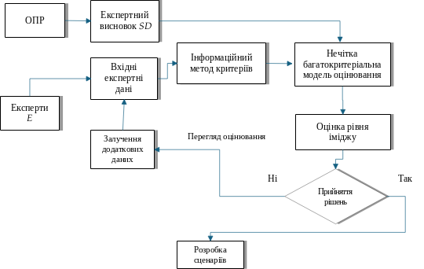
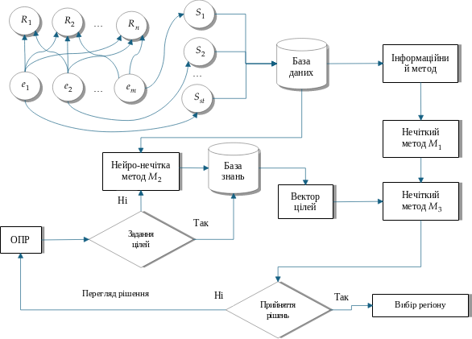
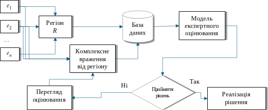
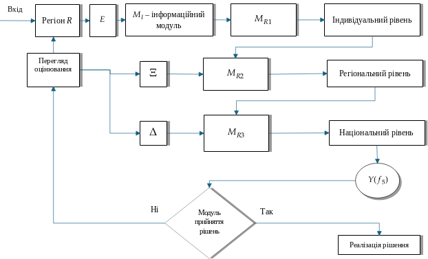
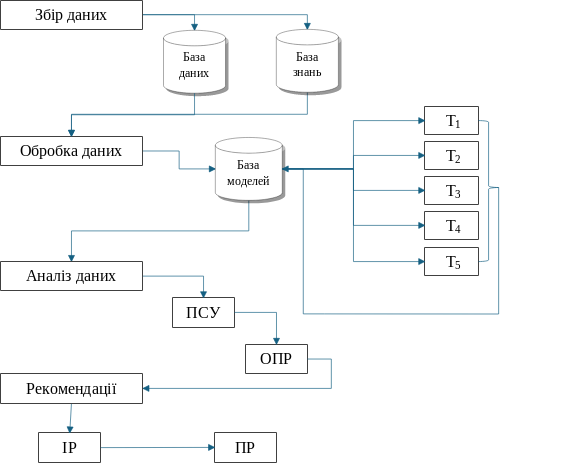
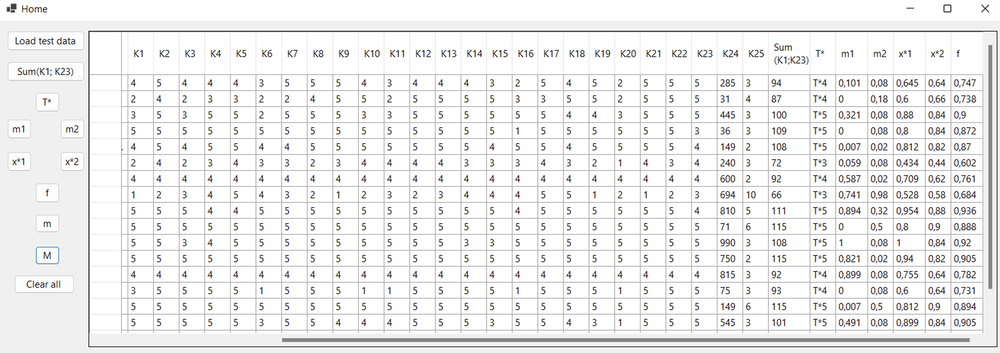

МІНІСТЕРСТВО ОСВІТИ І НАУКИ УКРАЇНИ

ДВНЗ «УЖГОРОДСЬКИЙ НАЦІОНАЛЬНИЙ УНІВЕРСИТЕТ»

Кваліфікаційна наукова праця

на правах рукопису

**ШАФАР АНДРІЙ АНДРІЙОВИЧ**

УДК 004.4:338.48:303.725

**ДИСЕРТАЦІЯ**

**МОДЕЛІ ТА ЗАСОБИ ЦИФРОВОЇ ТРАНСФОРМАЦІЇ**

**ТУРИСТИЧНОЇ ГАЛУЗІ**

Подається на здобуття наукового ступеня доктора філософії в галузі інформаційних технологій зі спеціальності 121 – Інженерія програмного забезпечення.

Дисертація містить результати власних досліджень. Використання ідей,
результатів і текстів інших авторів мають посилання на відповідне джерело.

\_\_\_\_\_\_\_\_\_\_\_\_\_\_\_\_\_\_\_\_\_ Шафар Андрій Андрійович

Науковий керівний – Білак Юрій Юрійович, кандидат фізико-математичних наук, доцент.

Ужгород − 2026

**АНОТАЦІЯ**

**Шафар А. А.****Моделі та засоби цифрової трансформації туристичної галузі – Рукопис**.

Дисертація на здобуття наукового ступеня доктора філософії в галузі інформаційних технологій зі спеціальності 121 – Інженерія програмного забезпечення. ДВНЗ «Ужгородський національний університет», Ужгород, 2026.

*Метою дослідження* розроблення моделей, методів і програмних засобів цифрової трансформації туристичної галузі, спрямованих на підвищення ефективності управління туристичними потоками, автоматизацію основних бізнес-процесів, персоналізацію послуг, оптимізацію операційної діяльності та підтримку прийняття рішень в умовах невизначеності. Дослідження орієнтоване на створення інтелектуально-аналітичних рішень для оцінювання ризиків безпеки туристичних подорожей, підвищення рівня задоволеності туристів та формування ефективної цифрової інфраструктури туризму. Запропоновані моделі сприяють забезпеченню сталого розвитку та підвищенню конкурентоспроможності регіонів.

*Вступ* обґрунтовує актуальність обраної теми дослідження, зосереджуючись на проблемах цифрової трансформації туристичної галузі в умовах глобальних змін і розвитку інформаційного суспільства. Наголошено, що стрімке впровадження цифрових технологій у сферу туризму потребує створення нових інструментів управління, автоматизації бізнес-процесів та персоналізації туристичних послуг, що забезпечують підвищення ефективності функціонування підприємств і конкурентоспроможності регіонів. Визначено, що сучасна туристична індустрія вимагає застосування інтелектуальних систем аналізу даних, штучного інтелекту, Інтернету речей, блокчейну та технологій великих даних для прогнозування попиту, оцінювання ризиків безпеки подорожей і підвищення рівня задоволеності туристів.

Особливу увагу приділено створенню моделей цифрової трансформації, здатних поєднати експертні знання з аналітичними методами обробки інформації в умовах невизначеності. Для України дослідження має практичне значення в контексті відновлення туристичної інфраструктури, цифровізації управлінських процесів і формування стратегії сталого розвитку на регіональному рівні.

У вступі показано взаємозв’язок роботи з науковими програмами та ініціативами в галузі інформаційних технологій і програмної інженерії. Сформульовано мету дослідження, визначено основні завдання, спрямовані на розроблення моделей, методів і програмних засобів цифрової трансформації туризму. Обґрунтовано наукову новизну, що полягає у створенні комплексних інтелектуально-аналітичних рішень для оцінювання туристичних процесів і прийняття управлінських рішень. Визначено практичне значення результатів, які можуть бути використані для підвищення ефективності цифрових платформ у сфері туризму.

Описано особистий внесок здобувача, результати публікацій і матеріали апробації, представлені на міжнародних науково-практичних конференціях. Наведено підсумок структури й обсягу дисертації, що включає п’ять розділів, висновки, список використаних джерел та додатки.

*У першому розділі* здійснено системний аналіз проблеми цифрової трансформації туристичної галузі та визначено роль програмної інженерії у створенні інноваційних рішень для управління туристичними процесами. Проаналізовано сучасні підходи до використання штучного інтелекту в оцінюванні туристичних потоків і підвищенні якості обслуговування. Узагальнено результати досліджень щодо багатокритеріального та нечіткого оцінювання туристичних дестинацій і задоволеності туристів. Визначено ключові виклики цифровізації – інформаційну невизначеність, потребу в інтеграції аналітичних систем та автоматизації управлінських процесів. Сформульовано задачу цифрової трансформації туристичної галузі як теоретико-множинну модель, що враховує регіональні особливості, поведінкові фактори та критерії ефективності цифрових рішень. Побудовано структурно-логічну схему дослідження, яка охоплює етапи аналізу, збору та обробки даних, розроблення моделей і формування практичних рекомендацій.

*У другому розділі* сформульовано дві взаємопов’язані задачі: розроблення моделей оцінювання та вибору туристичних дестинацій і побудову системи підтримки прийняття рішень для цифрової трансформації туристичної галузі. Розроблені моделі забезпечують комплексний підхід до аналізу туристичних потоків, прогнозування попиту й оцінювання привабливості регіонів, враховуючи інфраструктурні, поведінкові та соціально-економічні чинники.

Наведено інформаційну модель лінгвістичного оцінювання ставлення до аспектів туризму місця призначення та гібридну багатокритеріальну модель оцінювання рівня туристичної дестинації. Запропонована нейро-нечітка модель дозволяє враховувати відхилення між очікуваним та реальним досвідом туристів, прогнозувати їхні поведінкові реакції (повторне відвідування, рекомендації, рівень лояльності). Моделі поєднують методи нечіткої логіки, експертного оцінювання та машинного навчання, що підвищує точність прогнозів і обґрунтованість управлінських рішень.

*У третьому розділі* сформульовано задачі оцінювання та прогнозування рівня задоволеності туристів закладами розміщення та впливу людських ресурсів на якість туристичного досвіду. Запропоновані підходи спрямовані на удосконалення методів аналізу туристичних послуг із урахуванням об’єктивних характеристик закладів і суб’єктивного сприйняття клієнтів. Це забезпечує виявлення ключових чинників, що формують задоволення туристів, і створює підґрунтя для стратегічного управління якістю сервісу.

Отримав подальшого розвитку інформаційний метод оцінювання рівня задоволеності туристів від закладів розміщення з урахуванням соціального класу. Вперше введено поняття «вектора соціального класу», що враховує демографічні характеристики туристів і дозволяє здійснювати прогнозування рівня задоволеності різних груп відвідувачів. Розроблений нечіткий метод базується на фазифікації лінгвістичних оцінок і забезпечує перехід до нормованих кількісних показників, що підвищує точність оцінок і достовірність управлінських рішень.

Розроблено модель експертного оцінювання впливу людських ресурсів на задоволення туристів від місця призначення, яка враховує 17 критеріїв лояльності персоналу та 4 нечіткі твердження щодо загального враження від регіону. Модель побудована на основі теорії нечітких множин і дозволяє комплексно аналізувати взаємозв’язок між рівнем сервісу, людським фактором і загальною привабливістю туристичних регіонів. Отримані результати сприяють удосконаленню кадрової політики, підвищенню якості обслуговування та ефективності управління туристичними підприємствами.

*У четвертому розділі* розроблено інтелектуально-аналітичну платформу оцінювання ризиків безпеки туристичних подорожей, що об’єднує модулі збору, обробки даних та підтримки прийняття рішень на індивідуальному, регіональному й національному рівнях. Запропоновано інформаційний модуль для оцінювання рівня безпеки туристичної подорожі за 17 критеріями, згрупованими у три категорії – інфраструктурну, соціально-екологічну та медичну безпеку.

Розроблено три аналітичні модулі, які забезпечують комплексне оцінювання ризиків: модуль терм-оцінки ризику власної безпеки туриста, модуль оцінювання рівня почуття безпеки регіону та модуль інтегральної оцінки ризику туристичної подорожі. Вони поєднують експертні дані та лінгвістичні оцінки туристів, базуються на принципах нечіткої логіки та багатовимірних функціях належності, що дозволяє враховувати суб’єктивність сприйняття безпеки й підвищує достовірність аналізу.

Отримана система дає змогу формувати кількісні та якісні оцінки ризику безпеки подорожей, прогнозувати поведінку туристів щодо повторних відвідувань регіону й підвищувати ефективність управлінських рішень у сфері сталого та безпечного розвитку туризму.

*У п’ятому розділі* здійснено аналіз проблем побудови інформаційно-аналітичної системи, яка забезпечує комплексне оцінювання рівня туристичного руху на основі інтеграції сучасних методів та технологій. Розглянуто основи розробки системи, зокрема принципи проектування, які забезпечують ефективну взаємодію користувача із системою, а також обробку вхідних даних. Детально описано складові компоненти системи, серед яких: модулі збору, обробки, аналізу даних та формування висновків. Наведена структурна модель компонентів інформаційно-аналітичної системи для оцінювання рівня туристичного руху. Представлено структурні схеми розроблених моделей та методів інформаційної технології, які описують завдання оцінювання туристичного руху.

Наведено результати апробації на даних 327 респондентів, зібраних у Закарпатській, Львівській та Івано-Франківській областях з жовтня по грудень 2023 року. Респонденти заповнили анкету з 16 груп питань, загалом 320 запитань, що стосувалися туристичного досвіду. Тестування моделей підтвердило їх ефективність у аналізі туристичних потоків, прогнозуванні відвідуваності регіонів та прийнятті управлінських рішень, засвідчено високу точність оцінок та можливість застосування запропонованих методів для розвитку туристичної галузі в умовах невизначеності.

*У висновках* наведено основні результати дисертаційного дослідження та підсумки його виконання.

У дисертації розв'язано науково-прикладне завдання розробки моделей, методів і програмних засобів цифрової трансформації туристичної галузі, спрямованих на підвищення ефективності управління туристичними потоками, автоматизацію бізнес-процесів, персоналізацію послуг і підтримку прийняття рішень в умовах невизначеності. На основі проведених теоретичних та експериментальних досліджень отримано найважливіші результати:

*Вперше:*

− розроблено гібридну багатокритеріальну модель оцінювання рівня туристичного місця призначення, що інтегрує кількісні та лінгвістичні оцінки задоволеності туристів із урахуванням порогу сталого розвитку регіону, забезпечуючи підвищення точності й об’єктивності оцінювання іміджу дестинацій;

− розроблено нечіткий метод прогнозування рівня задоволеності закладами розміщення та модель експертного оцінювання впливу людських ресурсів на враження туристів від місця призначення, що з урахуванням соціального класу підвищує точність оцінок і обґрунтованість управлінських рішень завдяки використанню вектора соціального класу та нечіткої моделі лояльності персоналу;

− розроблено інформаційно-аналітичну платформу та програмний модуль оцінювання рівня безпеки туристичної подорожі, що інтегрує лінгвістичні оцінки туристів та експертні дані для багаторівневого аналізу ризиків. Модулі платформи забезпечують комплексне оцінювання безпеки з урахуванням інфраструктурних, соціально-екологічних і медичних факторів, дозволяє переходити від якісних суджень до кількісних показників оцінювання ризику безпеки туристичної подорожі;

− наведено структурну модель компонентів інформаційно-аналітичної системи, яка забезпечує комплексний підхід до розроблення інструменту підтримки прийняття рішень у процесі цифрової трансформації туристичної галузі та орієнтована на практичне використання отриманих результатів.

*Удосконалено*:

− нейро-нечітку модель оцінювання та вибору туристичного місця призначення, яка поєднує нечітку логіку з нейронною мережею для персоналізованого прогнозування цільових потреб туристів і підвищення точності оцінки привабливості регіонів.

*Отримало подальший розвиток:*

− інформаційні методи лінгвістичного оцінювання ставлення до аспектів туризму та задоволеності туристів закладами розміщення з урахуванням соціальних класів, що підвищує об’єктивність і адаптивність оцінок завдяки використанню відкритих множин критеріїв та фазифікації лінгвістичних даних.

*Практична цінність* дисертаційної роботи полягає у створенні моделей, методів, інформаційно-аналітичних та програмних засобів цифрової трансформації туристичної галузі, які забезпечують оцінювання рівня безпеки подорожей, задоволеності туристів, іміджу місць призначення та ефективності регіонального управління туризмом. Розроблені рішення дають змогу формувати обґрунтовані управлінські рішення, підвищувати конкурентоспроможність регіонів і якість туристичних послуг, а також сприяють сталому відновленню галузі, залученню інвестицій та розвитку цифрової інфраструктури туризму в Україні.

У результаті виконання дисертаційного дослідження розроблені моделі, методи та програмні засоби були верифіковані й апробовані на реальних даних 327 респондентів, зібраних у період з жовтня по грудень 2023 року в Закарпатській, Львівській та Івано-Франківській областях. Опитування охопило широкий спектр аспектів туристичного досвіду та включало 16 тематичних блоків із загальною кількістю 320 питань, що дозволило забезпечити повне відображення демографічних характеристик і багатовимірний аналіз досліджуваної проблематики.

Результати роботи апробовані в Управлінні економічного розвитку Ужгородської міської ради; КП “Агентство регіонального розвитку та транскордонного співробітництва “Закарпаття” Закарпатської обласної ради”; ДВНЗ “Ужгородський національний університет”.

Результати дисертаційного дослідження впроваджено в освітній процес під час проведення лекцій та лабораторних занять для студентів факультету інформаційних технологій ДВНЗ «Ужгородський національний університет», що підтверджено відповідними офіційними документами.

**Ключові слова:** інформаційні технології, експертне оцінювання, цифрова трансформація, багаторівнева модель, оптимізація, системний аналіз, моделі, прийняття рішень, нечітка логіка, нечіткі множини, регіональний туризм, складнi системи, нормалізація даних, невизначеність, багатокритеріальне оцінювання.

**СПИСОК ПУБЛІКАЦІЙ ЗДОБУВАЧА ЗА ТЕМОЮ ДИСЕРТАЦІЇ**

***Наукові праці, в яких опубліковані основні наукові результати дисертації:***

1. Поліщук В. В., Білак Ю. Ю., Шафар А. А., Шпак О. І. Гібридна математична модель оцінювання рівня іміджу місця призначення в контексті сталого розвитку регіону // Науковий вісник Ужгородського університету. Серія «Математика і інформатика», 2023. – 43(2). – С.144-154. [https://doi.org/10.24144/2616-7700.2023.43(2).144-154](https://doi.org/10.24144/2616-7700.2023.43%282%29.144-154%22%20%5Ct%20%22_new)

**(Наукове фахове видання України)**

(*Здобувачу належать провідна роль в формулюванні дизайну дослідження, реалізації етапів дослідження, розробці гібридної моделі оцінювання (50%); Білак Ю. Ю. (15%) та Шпак О. І. (15%) виконували системний аналіз наукових джерел за темою дослідження, формулювали його особливості; Поліщук В. В. виконував аналіз проблеми, оцінку вихідних даних, а також відповідав за процес підготовки та подачі рукопису до друку (20%)*)

**КЛЮЧОВІ СЛОВА**: гібридна модель, прийняття рішень, багатокритеріальне оцінювання, нечіткі множини, цифрова трансформація, сталий розвиток регіонів

1. Шафар А. А. Нейро-нечітка модель оцінювання та вибору місця призначення з урахуванням цільових потреб туриста // Computer Science and Applied Mathematics, 2024. – (2). – С.13-22. [https://doi.org/10.26661/2786-6254-2024-2-02](https://doi.org/10.26661/2786-6254-2024-2-02%22%20%5Ct%20%22_new)

**(Наукове фахове видання України)**

(*Здобувач самостійно реалізував повний цикл дослідницьких робіт і самостійно підготував матеріал до публікації*)

**КЛЮЧОВІ СЛОВА**: вибір місця призначення, нечітка математика, нейро-мережі, соціальний клас, багатокритеріальний вибір, цифрова трансформація

1. Білак Ю. Ю., Шафар А. А. Інформаційно-аналітична модель оцінювання рівня задоволеності туристами щодо закладів розміщення // Управління розвитком складних систем, 2024. – (57). – С.164-173. [https://doi.org/10.32347/2412-9933.2024.57.164-173](https://doi.org/10.32347/2412-9933.2024.57.164-173%22%20%5Ct%20%22_new)

**(Наукове фахове видання України)**

(*Здобувач відіграв ключову роль у розробленні дизайну дослідження, практичній реалізації всіх його етапів та розроблення інформаційно-аналітичної моделі оцінювання (60%); співавтор узагальнив наукові напрацювання за тематикою статті, здійснив аналітичне опрацювання та формулювання проблеми, а також координував процес підготовки й подання публікації до друку (40%)*)

**КЛЮЧОВІ СЛОВА**: цифрова трансформація, підтримка прийняття рішень, нечітке моделювання, інформаційно-аналітична система, туризм

1. Шафар А. Модель експертного оцінювання рівня впливу людських ресурсів на задоволення туристів від місця призначення // Herald of Khmelnytskyi National University. Technical Sciences, 2025. – 349(2). – С.474-480. <https://doi.org/10.31891/2307-5732-2025-349-69>

**(Наукове фахове видання України)**

(*Здобувач самостійно реалізував повний цикл дослідницьких робіт і самостійно підготував матеріал до публікації*)

**КЛЮЧОВІ СЛОВА**: підтримка прийняття рішень, експертне оцінювання, вплив людських ресурсів, розвиток регіонів, нечіткі множини, функції належності

1. 2025 на вересень (Вісник ТНТУ — науковий журнал Тернопільського національного технічного університету) https://visnyk.tntu.edu.ua/?about-us

***Наукові праці, які додатково відображають наукові результати дисертації:***

***Наукові праці, які засвідчують апробацію матеріалів дисертації:***

1. Шафар А.А. Постановка задачі цифрової трансформації туристичної галузі.  ХІV Міжнародної науково-практичної конференції "Пріоритетні напрями досліджень в науковій та освітній діяльності" (м. Львів, 19-20 лютого 2025 року). Львів : Львівський науковий форум, 2025. С. 50-52.

(*Здобувач самостійно здійснив дослідження та підготував роботу до друку*)

**ANNOTATION**

*Keywords:* complex system, methodology, information technology, software, factors, process control, uncertainty, risk assessment, expert experience, fuzzy knowledge, fuzzy model, decision support, management entity, mode of operation of the system.

ЗМІСТ

[ВСТУП 18](#_Toc203996656)

[Розділ 1. Системний аналіз проблеми цифрової трансформації туристичної галузі 19](#_Toc203996657)

[1.1. Аналіз сучасного стану цифрової трансформації в туристичній галузі 19](#_Toc203996658)

[1.2. Використання програмної інженерії для вирішення проблем цифрової трансформації 23](#_Toc203996659)

[1.3. Огляд досліджень багатокритеріального оцінювання місця призначення з використання нечіткої математики 25](#_Toc203996660)

[1.4. Огляд досліджень оцінювання та вибору місця призначення на основі систем штучного інтелекту 29](#_Toc203996661)

[1.5. Огляд досліджень систем підтримки рішень для безпеки туристів та оцінювання задоволеності туристів послугами й управлінням 35](#_Toc203996662)

[1.6. Постановка задачі цифрової трансформації туристичної галузі 41](#_Toc203996663)

[Висновки до розділу 1 46](#_Toc203996664)

[Розділ 2. Моделі цифрової трансформації оцінювання та вибору місця призначення 48](#_Toc203996665)

[2.1. Формальна постановка задач оцінювання та вибору місця призначення 48](#_Toc203996666)

[2.2. Інформаційна модель лінгвістичного оцінювання ставлення до аспектів туризму місця призначення 51](#_Toc203996667)

[2.3. Гібридна багатокритеріальна модель оцінювання рівня місця призначення 56](#_Toc203996668)

[2.4. Нейро-нечітка модель оцінювання та вибору місця призначення 64](#_Toc203996669)

[Висновки до розділу 2 74](#_Toc203996670)

[Розділ 3. Нечіткі моделі оцінювання рівня задоволеності туристами від об’єктів розміщення та суб’єктів управління 77](#_Toc203996671)

[3.1. Формальна постановка задач оцінювання закладів розміщення та вплив людських ресурсів на задоволення туристів від місця призначення 77](#_Toc203996672)

[3.2. Інформаційна модель оцінювання рівня задоволеності туристами від закладів розміщення 81](#_Toc203996673)

[3.3. Нечіткий метод прогнозування рівня задоволеності закладів розміщення потенційним туристом на основі соціального класу 85](#_Toc203996674)

[3.4. Модель експертного оцінювання рівня впливу людських ресурсів на задоволення туристів від місця призначення 87](#_Toc203996675)

[Висновки до розділу 3 95](#_Toc203996676)

[Розділ 4. Інтелектуально-аналітична платформа оцінки ризику безпеки туристичної подорожі 98](#_Toc203996677)

[4.1. Формальна постановка задачі оцінювання ризику безпеки туристичної подорожі 98](#_Toc203996678)

[4.2. Інформаційний модуль оцінювання рівня безпеки туристичної подорожі 101](#_Toc203996679)

[4.3. Модулі аналізу ризику безпеки туристичної подорожі на індивідуальному та регіональному рівнях 103](#_Toc203996680)

[4.4. Модуль підтримки прийняття рішень інтелектуально-аналітичної платформи 107](#_Toc203996681)

[Висновки до розділу 4 109](#_Toc203996682)

[Розділ 5. Інформаційно-аналітична система підтримки прийняття рішень цифрової трансформації туристичної галузі 111](#_Toc203996683)

[5.1. Вимоги до інформаційно-аналітичної системи 111](#_Toc203996684)

[5.2. Архітектура та компоненти інформаційно-аналітичної системи 114](#_Toc203996685)

[5.3. Розробка програмного модулю інтелектуально-аналітичної платформи оцінки ризику безпеки туристичної подорожі 118](#_Toc203996686)

[5.4. Верифікація та тестування інформаційно-аналітичної системи 119](#_Toc203996687)

[Висновки до розділу 5 134](#_Toc203996688)

[ВИСНОВКИ 136](#_Toc203996689)

[СПИСОК ВИКОРИСТАНИХ ДЖЕРЕЛ 140](#_Toc203996690)

[ДОДАТОК А. Список публікацій здобувача та відомості про апробацію результатів дисертації 142](#_Toc203996691)

[ДОДАТОК Б. Акти впровадження результатів дисертаційної роботи 146](#_Toc203996692)

#### **ВСТУП**

**Актуальність теми.** Розвиток туристичної галузі в умовах глобалізації та всеосяжної цифрової трансформації визначає нові вимоги до управління дестинаціями: потрібні точні оцінки привабливості та безпеки подорожей, персоналізація послуг, оперативне планування інфраструктури й прозора підтримка управлінських рішень за невизначеності. Туризм водночас є джерелом економічного зростання, каталізатором культурної інтеграції й важливим чинником регіональної стійкості, а зростання масштабів туристичних потоків посилює потребу в інтелектуальних інструментах їх аналізу та прогнозування.

Ключову роль у розв’язанні цих завдань відіграють сучасні інформаційні технології: інтелектуально-аналітичні системи, методи штучного інтелекту, великі дані, Інтернет речей, ГІС та блокчейн. Їх інтеграція у туризмі дає змогу збирати й обробляти різнорідні дані в реальному часі, моделювати поведінку туристів, прогнозувати попит, оцінювати ризики подорожей і підтримувати персоналізовані сервіси. Особливе значення мають гібридні багатокритеріальні, нечіткі та нейро-нечіткі моделі, які поєднують формальні алгоритми з експертними знаннями та лінгвістичними оцінками, забезпечуючи високу точність і пояснюваність рішень.

Для України тема набуває додаткової ваги в післявоєнний період: відновлення інфраструктури, зміни просторових потоків і зростання чутливості до питань безпеки потребують нових методів оцінювання привабливості дестинацій, якості послуг і ризику подорожей. Відповідно до оцінок Організації економічного співробітництва та розвитку, до 2040 року розвиток туризму визначатимуть чотири мегатренди: нарощення попиту відвідувачів, посилення сталості, поширення підтримувальних технологій і зростання мобільності подорожей. З огляду на це орієнтація на європейську даноорієнтовану політику та згадані мегатренди посилює запит на цифрові моделі, здатні об’єднати економічні, соціокультурні та екологічні аспекти розвитку туризму й підтримати інвестиційні рішення.

Дослідженнями проблематики цифрової трансформації у сфері туризмуу займалися: Akhour M., Albahri A. S., Audeh A. Y., Calero C., Ghraibeh L. L., Gaponenko H. I., Kushnir V., Lam J. F. I., Li C., Li X., Lin Z., Magableh A. A., Olkhova-Marchuk N., Shulha N. V., Zubehina T. та інші. У розвиток програмної інженерії у створенні інноваційних рішень для туристичної галузі та визначаються ключові аспекти розробки програмних систем значний вклад внесли: Dotsenko A., Dyachek O., Riabchenko K., Jakimi A., Khriss I., Mamad L., Mbow M., Komianos V., Kontopanagou K., Tsipis A. та інші. Багатокритеріальним оцінюванням місця призначення з використання нечіткої математики та систем штучного інтелекту займалися: Almeida-García F., Alrawadieh Z., Blancas F.J., Buhalis D., Femenia-Serra F., Firmansyah H.S., Gavurova B., Gretzel U., Herrera-Viedma E., Kou G., Liao H., Mariani M.M., Polishchuk V., Škare M., Wang W.-M., Zavadskas K.E. та інші. Огляд досліджень систем підтримки рішень для безпеки туристів та оцінювання задоволеності туристів послугами й управлінням займалися: Banaitis A., D’Urso P., Faraji Sabokbar H., Floyd M.F., Hosseini A., Li N., Martín J.C., Rasoolimanesh S.M., Vena-Oya J., Wu L. та інші.

Проведений аналіз наукових робіт засвідчує дефіцит комплексних рішень, які одночасно: (І) інтегрують суб’єктивні лінгвістичні оцінки туристів з експертною інформацією; (ІІ) забезпечують багаторівневе (індивідуальний-регіональний-національний) оцінювання безпеки подорожей; (ІІІ) враховують вплив людських ресурсів на задоволеність; (ІV) поєднують нейро-нечіткі та багатокритеріальні підходи для вибору й іміджу місця призначення; (V) реалізуються у вигляді масштабованих програмних засобів. Саме цю прогалину заповнює дисертаційне дослідження: воно пропонує гібридні моделі (включно з нейро-нечіткими), інформаційно-аналітичні модулі безпеки подорожей і задоволеності, механізми фазифікації/дефазифікації та автоматизоване налаштування ваг, об’єднані в інтелектуально-аналітичну платформу підтримки рішень.

Отже, розроблення моделей, методів і програмних засобів цифрової трансформації туристичної галузі, здатних забезпечити кількісно-якісне оцінювання процесів, прогнозування поведінкових реакцій і обґрунтовану підтримку управлінських рішень у реальному часі, є своєчасною й практично значущою науково-прикладною задачею для сталого, безпечного та конкурентоспроможного розвитку туризму.

**Зв’язок з науковими програмами, планами, темами.** Тематика дисертаційного дослідження узгоджується з положеннями Закону України «Про освіту» №2145-VIII від 05.09.2017; Закону України «Про наукову і науково-технічну діяльність» №848-VIII від 26.11.2015; Закону України «Про пріоритетні напрями розвитку науки і техніки» №2623-III від 11.07.2001; Закону України «Про Національну програму інформатизації» №2807-IX від 01.12.2022; Постанові Кабінету Міністрів України «Про затвердження переліку пріоритетних тематичних напрямів наукових досліджень і науково-технічних розробок на період до 2023 року» №942-2011-п від 12.05.2023; та пріоритетів наукової діяльності ДВНЗ «Ужгородський національний університет».

**Мета і завдання дослідження.** Метою дисертаційної роботи є розроблення моделей, методів і програмних засобів цифрової трансформації туристичної галузі, спрямованих на підвищення ефективності управління туристичними потоками, автоматизацію основних бізнес-процесів, персоналізацію послуг, оптимізацію операційної діяльності та підтримку прийняття рішень в умовах невизначеності. Для досягнення мети потрібно виконати наступні завдання:

- здійснити аналіз вітчизняних і зарубіжних наукових джерел, присвячених питанням цифрової трансформації туристичної галузі;

- розробити гібридну багатокритеріальну модель оцінювання рівня туристичного місця призначення;

- удосконалити нейро-нечітку модель оцінювання та вибору туристичного місця призначення;

- розробити нечіткий метод прогнозування рівня задоволеності закладами розміщення та модель експертного оцінювання впливу людських ресурсів на враження туристів від місця призначення;

- розробити інформаційно-аналітичну платформу та програмний модуль оцінювання рівня безпеки туристичної подорожі;

- розробити структурну модель компонентів інформаційно-аналітичної системи підтримки рішень цифрової трансформації туристичної галузі;

- розвинути інформаційні методи лінгвістичного оцінювання ставлення до аспектів туризму та задоволеності туристів закладами розміщення з урахуванням соціальних класів;

 - провести верифікацію та апробацію розроблених моделей, методів і програмних засобів цифрової трансформації туристичної галузі на основі реальних даних.

***Об’єктом дослідження*** є процеси цифрової трансформації туристичної галузі на основі впровадження інформаційно-аналітичних систем підтримки прийняття управлінських рішень.

***Предметом дослідження*** є моделі, методи та програмні засоби інформаційно-аналітичної підтримки прийняття рішень у процесі цифрової трансформації туристичної галузі.

**Методи дослідження.** У дисертаційній роботі використано: методи системного аналізу для побудови архітектури інформаційно-аналітичної системи підтримки прийняття рішень у процесі цифрової трансформації туристичної галузі; методи дослідження операцій для оптимізації процесів управління та вибору ефективних стратегій розвитку; методи інтелектуального аналізу даних і машинного навчання – для моделювання поведінкових аспектів туристів, обробки великих обсягів даних та прогнозування тенденцій туристичного руху; методи нечіткої логіки і теорії нечітких множин – для оцінювання ризиків безпеки подорожей, задоволеності туристів та ефективності управлінських рішень в умовах невизначеності; методи багатокритеріального аналізу – для визначення пріоритетних напрямів цифрової трансформації туристичної інфраструктури та оцінки сталого розвитку регіонів; методи експертного оцінювання – для формування бази знань і коригування параметрів моделей; статистичні методи – для перевірки достовірності результатів моделювання та верифікації розроблених рішень на основі реальних даних.

**Наукова новизна одержаних результатів.** У результаті виконаних теоретичних і прикладних досліджень у межах дисертаційної роботи здобуто низку нових наукових результатів:

*Вперше:*

− розроблено гібридну багатокритеріальну модель оцінювання рівня туристичного місця призначення, що інтегрує кількісні та лінгвістичні оцінки задоволеності туристів із урахуванням порогу сталого розвитку регіону, забезпечуючи підвищення точності й об’єктивності оцінювання іміджу дестинацій;

− розроблено нечіткий метод прогнозування рівня задоволеності закладами розміщення та модель експертного оцінювання впливу людських ресурсів на враження туристів від місця призначення, що з урахуванням соціального класу підвищує точність оцінок і обґрунтованість управлінських рішень завдяки використанню вектора соціального класу та нечіткої моделі лояльності персоналу;

− розроблено інформаційно-аналітичну платформу та програмний модуль оцінювання рівня безпеки туристичної подорожі, що інтегрує лінгвістичні оцінки туристів та експертні дані для багаторівневого аналізу ризиків. Модулі платформи забезпечують комплексне оцінювання безпеки з урахуванням інфраструктурних, соціально-екологічних і медичних факторів, дозволяє переходити від якісних суджень до кількісних показників оцінювання ризику безпеки туристичної подорожі;

− наведено структурну модель компонентів інформаційно-аналітичної системи, яка забезпечує комплексний підхід до розроблення інструменту підтримки прийняття рішень у процесі цифрової трансформації туристичної галузі та орієнтована на практичне використання отриманих результатів.

*Удосконалено*:

− нейро-нечітку модель оцінювання та вибору туристичного місця призначення, яка поєднує нечітку логіку з нейронною мережею для персоналізованого прогнозування цільових потреб туристів і підвищення точності оцінки привабливості регіонів.

*Отримало подальший розвиток:*

− інформаційні методи лінгвістичного оцінювання ставлення до аспектів туризму та задоволеності туристів закладами розміщення з урахуванням соціальних класів, що підвищує об’єктивність і адаптивність оцінок завдяки використанню відкритих множин критеріїв та фазифікації лінгвістичних даних.

**Практичне значення одержаних результатів***.* Робота дає прикладні інструменти цифрової трансформації туризму: інтелектуально-аналітичну платформу та сукупність моделей для (I) оцінювання задоволеності й іміджу дестинацій, (II) прогнозування повторних відвідувань, (III) експертної оцінки впливу людських ресурсів, (IV) вимірювання та прогнозу ризику безпеки подорожі, (V) обґрунтування доцільності фінансування туристичної інфраструктури. Рішення автоматизують збір/обробку даних, інтегрують лінгвістичні судження туристів з експертними та фактичними показниками, забезпечують роботу з невизначеністю і підвищують точність та порівнюваність оцінок між регіонами. Для України у період відновлення це означає доказове планування інвестицій, моніторинг безпекових ризиків, персоналізацію послуг і зростання привабливості регіонів.

Розроблені моделі та програмні засоби верифіковано й апробовано на реальних даних 327 респондентів (жовтень–грудень 2023 р., Закарпатська, Львівська та Івано-Франківська обл.; анкета: 16 блоків, 320 запитань); для окремих моделей зафіксовано низьку похибку (≈2,87–3,47%), що підтверджує їхню придатність для впровадження у практику органів влади та туристичного бізнесу.

**Реалізація результатів та впровадження.** Результати дисертації апробовано та впроваджено в таких організаціях і установах:

- Управлінні економічного розвитку Ужгородської міської ради;

- КП “Агентство регіонального розвитку та транскордонного співробітництва «Закарпаття» Закарпатської обласної ради”;

- ДВНЗ «Ужгородський національний університет».

Впроваджено у навчальний процес ДВНЗ «Ужгородський національний університет» під час викладання дисциплін: «Стартап проекти та їх оцінювання», «Проектування автоматизованих систем в управлінському та фінансовому обліку», «Адміністрування комп’ютерних мереж та операційних систем».

Дані про впровадження підтверджено відповідними документами.

**Особистий внесок здобувача.** Усі положення та висновки, подані до захисту, є результатом особистих досліджень автора. Роботи [3, 9, 15, 16] виконувалися без співавторів. У публікаціях, підготовлених у співавторстві, здобувачеві особисто належать такі результати: в [1, 9] запропоновано нечітку модель оцінювання рівня туристичного руху щодо інфраструктури та доступності; в [2] розроблено модель підтримки прийняття рішень щодо доцільності фінансування у розвиток туристичної інфраструктури; в [4] розроблено інформаційно-аналітичну платформу для моделювання сценаріїв розвитку туризму в кризових умовах; в [5] розроблено нечітку модель оцінювання привабливості туристичного напряму в контексті культурного туризму; в [6] розроблено інформаційну модель оцінювання цифрової трансформації туризму в регіоні; в [7, 10, 11, 12, 13] розроблено систему підтримки прийняття рішень щодо фінансування проєктів та нечітку модель оцінки безпеки процесів із урахуванням ризикових факторів, які можуть застосовуватися у сфері туризму; в [8, 14] розроблено підходи до формалізації даних для моделювання алгоритмів перетворення в системах підтримки рішень та оцінки втоми авіадиспетчерів за відеоспостереженням.

**Апробація результатів дисертації.** Основні результати дисертаційного дослідження неодноразово представлялися та обговорювалися на 9 міжнародних і національних наукових конференціях, зокрема:

– 3th International Scientific Symposium “Intelligent Solutions”, September 27–28, 2023, Kyiv-Uzhhorod, Ukraine;

– 14th International Scientific and Practical Conference “Scientific Research in XXI Century”, July 16-18, 2023, Ottawa, Canada;

– 7th International Workshop on Computer Modeling and Intelligent Systems, May 3, 2024, Zaporizhzhia, Ukraine;

– 19th IEEE International Scientific Conference New Trends in Aviation Development, November 28 - 29, 2024, The High Tatras - Stary Smokovec, Slovakia;

– І Всеукраїнська наукова конференція «Когнітивні дослідження: результати, виклики та перспективи», 24 травня, 2024, Київ, Україна;

– ХІІІ, ХІV Міжнародна науково-практична конференція "Пріоритетні шляхи розвитку науки і освіти", 19-20 жовтня, 2024, "Пріоритетні напрями досліджень в науковій та освітній діяльності", 19-20 лютого, 2025, Львів, Україна;

– Міжнародна науково-практична конференція “Інтеграція знань та інновацій у розвитку науки, освіти і суспільства: мультидисциплінарний підхід до вирішення сучасних викликів”, 29 березня, 2025, Рівне, Україна.

**Публікації**. Усього за результатами досліджень опубліковано 16 наукових праць. У тому числі до них належать: 1 стаття у періодичних виданнях, що входять до міжнародних наукометричних баз Scopus та Web of Science; 1 стаття у закордонному періодичному виданні; 6 статей у наукових фахових виданнях України, затверджених МОН України; 8 публікацій у збірниках наукових конференцій.

**Структура й обсяг дисертації.** Дисертаційна робота складається з анотацій, вступу, п’яти розділів, висновків, списку використаних джерел з 129 найменувань на 17 сторінках та 3 додатки на 20 сторінках. Загальний обсяг рукопису становить 205 сторінок, у тому числі 145 сторінок основного тексту, 8 рисунків та 10 таблиць.

# **Розділ 1. Системний аналіз проблеми цифрової трансформації туристичної галузі**

Розвиток туристичної галузі в умовах сучасного цифрового середовища потребує адаптації до нових викликів та можливостей, зумовлених поширенням інформаційних технологій. Цифрова трансформація стає основним інструментом для підвищення ефективності управління, оптимізації бізнес-процесів, забезпечення конкурентоспроможності та формування якісного туристичного досвіду. У межах програмної інженерії виникає потреба у створенні інноваційних рішень для аналізу, оцінювання та підтримки прийняття рішень у сфері туризму.

Цей розділ присвячено системному аналізу проблеми цифрової трансформації туристичної галузі, зокрема огляду сучасних досліджень і тенденцій, визначенню ключових викликів та можливостей, а також формулюванню основних завдань, що постають перед програмною інженерією. Проведення такого аналізу є важливим етапом для створення теоретичних і практичних основ розробки програмних систем, які здатні інтегрувати сучасні технології, зокрема штучний інтелект, нейромережі та IoT, для вирішення актуальних проблем галузі.

Розділ включає аналіз досліджень із впровадження цифрових рішень у сферу туризму, оцінювання рівня задоволеності туристів та управління об'єктами розміщення, а також формулювання задачі цифрової трансформації галузі. Це створює базис для розробки моделей і засобів, здатних сприяти розвитку сталого, безпечного та інклюзивного туризму.

# **Аналіз сучасного стану цифрової трансформації в туристичній галузі**

У цьому параграфі здійснюється огляд сучасних тенденцій та практик цифрової трансформації у сфері туризму. Описуються ключові технології, які сприяють розвитку галузі, включаючи системи бронювання, цифрові карти, платформи для аналізу даних і персоналізації обслуговування. Аналізується рівень впровадження інформаційних технологій у різних країнах, зокрема в Україні, а також виділяються основні виклики та можливості, які стоять перед туристичним сектором у контексті цифровізації.

Здійснюючи теоретико-множинний аналіз, можна виділити наступні сучасні технології у туристичній галузі [1-3].

1. Штучний інтелект (ШІ) та машинне навчання. Штучний інтелект суттєво трансформує туристичну галузь, завдяки здатності обробляти великі обсяги даних та пропонувати інноваційні рішення. Одним із ключових напрямків застосування ШІ є автоматизація клієнтського обслуговування: чат-боти, які працюють на базі ШІ, забезпечують миттєве реагування на запити клієнтів, надають інформацію про послуги та допомагають у бронюванні. Крім того, туристичні оператори активно використовують можливості ШІ для прогнозування попиту, аналізуючи історичні дані, сезонні тренди та поведінку клієнтів, що дозволяє оптимізувати пропозиції. Ще одним важливим аспектом є персоналізація: мобільні додатки, створені на основі ШІ, адаптують рекомендації щодо готелів, ресторанів та розваг відповідно до індивідуальних уподобань користувачів [4].

2. Блокчейн. Технологія блокчейн сприяє забезпеченню прозорості та безпеки транзакцій, що є критично важливим для туристичної галузі. Одним із її основних застосувань є створення довіри між клієнтами та постачальниками послуг завдяки можливості відстеження всіх транзакцій у реальному часі. Це запобігає шахрайству та підвищує надійність угод. Блокчейн також дозволяє створювати децентралізовані платформи бронювання, які усувають посередників, знижуючи вартість послуг і роблячи їх більш доступними для кінцевого споживача [5].

3. Інтернет речей (IoT). Технології IoT відкривають значні можливості для автоматизації процесів та підвищення рівня обслуговування у туристичній галузі. У готельному бізнесі активно впроваджуються "розумні" кімнати, які автоматично регулюють освітлення, температуру, а також дозволяють бронювати послуги за допомогою голосових команд. У транспортній сфері IoT забезпечує відстеження багажу, оптимізацію маршрутів та оперативне інформування пасажирів. Це покращує загальний досвід клієнтів, робить подорожі комфортнішими та мінімізує ризики втрат [5].

4. Віртуальна реальність (VR) та доповнена реальність (AR). Технології VR та AR відкривають нові горизонти у маркетингу та обслуговуванні туристів. Віртуальна реальність дозволяє клієнтам здійснювати віртуальні тури, "відвідуючи" готелі, ресторани чи туристичні локації перед бронюванням, що значно підвищує впевненість у виборі. Доповнена реальність надає інтерактивний контент, зокрема у вигляді додаткової інформації про визначні місця, музеї чи міські локації. Наприклад, туристи можуть отримувати мультимедійні підказки через смартфони або AR-окуляри, що покращує якість їхнього досвіду [4-5].

5. Великі дані (Big Data). Аналіз великих даних відкриває можливості для глибокого розуміння туристичних потоків і адаптації бізнес-стратегій до змін у попиті. Завдяки цьому можна визначати найпопулярніші напрямки та оптимізувати маркетингові кампанії, орієнтуючись на потреби різних категорій туристів. Крім того, великі дані допомагають прогнозувати глобальні тренди, такі як зміни у попиті через вплив зовнішніх факторів, наприклад, пандемій або економічних криз, що сприяє більш точному плануванню ресурсів і розвитку галузі [4-5].

У розвинених країнах, таких як США, Європа та Китай, рівень цифровізації туристичної галузі залишається високим. У США платформи Airbnb, Booking.com і TripAdvisor активно інтегрують Big Data, ШІ та IoT для персоналізації та оптимізації сервісів. У Китаї провідні компанії, наприклад, Trip.com, застосовують блокчейн для прозорості у бронюванні й AR для покращення туристичного досвіду. Європейський туристичний сектор використовує Big Data для аналізу поведінки туристів і прогнозування попиту [6].

У країнах, що розвиваються, таких як Індія, Бразилія та Південно-Східна Азія, цифровізація стрімко зростає завдяки мобільним додаткам, які розширюють доступ до туристичних послуг для широкого кола населення.

В Україні більшість туристичних компаній покладається на глобальні платформи, такі як Booking і Skyscanner, однак впровадження блокчейну, IoT та ШІ обмежене. Разом із цим активно розвиваються локальні сервіси, як-от Visit Ukraine, які сприяють підтримці внутрішнього туризму.

При цьому, цифровізація туристичної галузі супроводжується такими викликами, як кібербезпека, оскільки зростає ризик витоку конфіденційних даних через онлайн-операції. У країнах із середнім рівнем цифровізації фінансування інновацій часто обмежене. Також нерівномірний розвиток інфраструктури, зокрема відсутність швидкісного інтернету в окремих регіонах, перешкоджає доступу до сучасних технологій [4-6].

Цифрові технології відкривають нові можливості, серед яких персоналізація послуг завдяки аналізу великих даних, що покращує клієнтський досвід. Вони також сприяють сталому розвитку через оптимізацію маршрутів та підтримку екологічного туризму. Крім того, онлайн-платформи дозволяють малим компаніям виходити на глобальний ринок, розширюючи аудиторію та конкуруючи з великими гравцями.

З огляду на вище сказане можна сформулювати наступне визначення.

*Означення 1.* Цифрова трансформація в туристичній галузі – це впровадження сучасних технологій для покращення ефективності, клієнтського досвіду та конкурентоспроможності від рівня підприємств до регіону в цілому, що включає автоматизацію послуг, персоналізацію пропозицій з використанням моделей та методів штучного інтелекту, систем підтримки прийняття рішень та експертного оцінювання. Ці технології дозволяють створювати інноваційні продукти, оптимізувати бізнес-процеси, покращити взаємодію з клієнтами та сприяти сталому розвитку туризму.

# **Використання програмної інженерії для вирішення проблем цифрової трансформації**

Розглядається роль програмної інженерії у створенні інноваційних рішень для туристичної галузі та визначаються ключові аспекти розробки програмних систем, таких як масштабованість, інтеграція з IoT і ШІ, та безпека даних.

Програмна інженерія є основою для вирішення проблем цифрової трансформації в туристичній галузі, адже створення ефективних та інноваційних рішень передбачає комплексний підхід до розробки програмних систем. Одним із головних аспектів є масштабованість – здатність програмного забезпечення адаптуватися до змінюваних вимог та збільшення обсягів обробки даних. Це особливо важливо для туристичних платформ, які мають справу з великими обсягами інформації, зокрема даними про потоки туристів, замовлення та транзакції [7-8].

Інтеграція з IoT та ШІ також є критичним елементом. IoT дозволяє з'єднувати різні пристрої, наприклад, системи контролю доступу в готелях, датчики в транспортних засобах та інші об'єкти інфраструктури, що дає змогу отримувати реальну інформацію для моніторингу та оптимізації процесів. ШІ допомагає автоматизувати прийняття рішень на основі аналізу великих обсягів даних, передбачати потреби клієнтів та створювати персоналізовані пропозиції.

Безпека даних є ще одним важливим аспектом програмної інженерії, оскільки туристичні платформи працюють з чутливою інформацією користувачів, зокрема персональними даними, платіжними реквізитами та інформацією про подорожі. Використання сучасних методів шифрування та аутентифікації дозволяє захистити цю інформацію від потенційних загроз і гарантувати конфіденційність даних користувачів [9].

Особливу увагу приділяють розробці платформ для управління туристичними потоками, що включають в себе не лише стандартні функції бронювання та пошуку, але й інтеграцію з різними каналами комунікації, системами прогнозування попиту та аналізу ефективності турів. Алгоритми машинного навчання допомагають не тільки в аналізі поведінки споживачів, але й у прогнозуванні туристичних тенденцій, що дає змогу краще управляти ресурсами та оптимізувати пропозиції для різних сегментів клієнтів. Наприклад, аналіз великих даних дозволяє виявляти змінні в поведінці споживачів та налаштовувати платформи для надання відповідних рекомендацій та пропозицій, що покращують досвід користувачів [8].

Хмарні технології відіграють важливу роль у забезпеченні ефективної взаємодії компонентів програмних систем, надаючи можливість для масштабування ресурсів і покращення доступу до даних у режимі реального часу. Це також дозволяє знизити витрати на інфраструктуру, оскільки дані і обчислювальні потужності зберігаються і обробляються в хмарі, що забезпечує гнучкість і можливість швидко реагувати на зміни в обсягах роботи платформи, наприклад, під час туристичних піків або сезонних коливань попиту [7].

Отже, програмна інженерія є незамінним інструментом для розв'язання завдань цифрової трансформації в туристичній галузі, дозволяючи створювати ефективні, безпечні та масштабовані рішення, які задовольняють потреби сучасних туристичних платформ і оптимізують бізнес-процеси.

В загальному цифрова трансформація туристичної галузі є стратегічно важливим процесом, що змінює спосіб функціонування підприємств, організацій та індивідуальних гравців ринку. Завдяки впровадженню новітніх інформаційних технологій з'являється можливість оптимізувати бізнес-процеси, підвищувати конкурентоспроможність, забезпечувати персоналізований підхід до клієнтів та ефективніше використовувати доступні ресурси. Однак успішна інтеграція інновацій вимагає державної підтримки, розвитку цифрової інфраструктури та підвищення цифрової грамотності. Україна, з огляду на поточні тенденції, має значний потенціал для покращення цифровізації, що дозволить їй ефективніше інтегруватися у глобальний туристичний ринок.

# **Огляд досліджень** **багатокритеріального оцінювання місця призначення з використання нечіткої математики**

Зростаюча складність процесів прийняття рішень у туристичному секторі також стимулює потребу в застосуванні більш складних методів та алгоритмів прийняття рішень, що зумовлює розробку нових підходів. Варіативність проблем у сфері прийняття рішень у туризмі постійно збільшується, що вимагає врахування кількох аспектів одночасно. Проте на практичному рівні спостерігається значне різноманіття методів, що використовуються. Це зумовлено не лише складністю вирішуваної проблеми, а й доступністю даних, аналітичними вподобаннями осіб, що приймають рішення, а також можливістю інтерпретації та зручністю застосування результатів [10-11]. Методи багатокритеріального прийняття рішень (MCDM) активно використовуються в туристичній індустрії протягом більше ніж двадцяти років [12-14]. Їхні результати дедалі частіше використовуються для формулювання відповідної політики, розробки стратегічних сценаріїв, програм регіонального планування та планів дій. Вибір оптимальних методів в рамках MCDM залежить від кількох факторів, та значну роль у цьому процесі відіграють досвід та вподобання оцінювача, а також наявність результатів для прийняття рішень чи оцінювання [15].

Згідно з дослідженням [1], найбільш популярними методами в MCDM є аналітичний ієрархічний процес та метод TOPSIS. Це зумовлено їх застосуванням у сферах, де основними задачами є рейтинг та вибір напрямків або готелів. З процедурної точки зору ці методи мають перевагу завдяки своїй меншій методологічній складності. Це підтверджується дослідженням Мігуес та інших [16], яке було спрямоване на створення надійної моделі для оцінки стійкості готельних мереж на основі інформації з корпоративних новин та вебсайтів. Нечіткі методи MCDM в туризмі вимагають залучення зацікавлених сторін до кількох сценаріїв прийняття рішень. Адрія та ін. [15] застосували нечіткий підхід для оцінки туристичних місць з огляду на їх ефективність та стійкість. Автори рекомендують цей підхід для всіх зацікавлених сторін через його простоту та легкість у розумінні результатів. Навіть складніші концепції, як-от стійкість та інтелектуальність у туристичному секторі, можуть бути ефективно вивчені за допомогою нечіткої логіки [17], хоча багато дослідників зазначають методологічні труднощі вивчення цих концепцій через їх міждисциплінарний характер [18-21]. Це відкриває можливості для розвитку інших методів на основі нечіткої логіки або їх інтеграції з іншими сумісними методами [12-24].

Багато дослідників шукають оптимальні рішення для розвитку туризму, які сприяють регіональному прогресу, акцентуючи увагу на стійкості регіонального розвитку у контексті сталого туризму [25-27]. Це пояснюється тим, що економічна структура країн та туристичні ресурси регіону накладають певні обмеження на досягнення позитивних результатів регіонального розвитку [28-30]. Стійкість туризму також безпосередньо пов’язана з ризиками, які супроводжують туристичні напрямки. Ця сфера створює значні можливості для застосування методів, побудованих на основі нечітких підходів.

Оцінка туристичних ризиків вимагає сучасного аналізу дестинацій та прогнозування потенційних загроз [31-33]. Хоссейні та ін. [34] ідентифікували кілька ключових критеріїв для оцінки ризиків туризму з урахуванням соціо-культурних, екологічних, фінансових аспектів, а також питань безпеки та захисту. Для усунення ризиків вони застосували гібридний модифікований нечіткий метод ВІКОР, рекомендуючи його як дієвий інструмент для менеджерів і політиків у сфері туризму, орієнтованих на сталий регіональний розвиток.

Стійкий розвиток можна також досліджувати в нових галузях туризму, таких як фермерський туризм, де стійкість аналізується разом із еволюцією цієї форми діяльності. Окампо [35] запропонував індикатори стійкості фермерського туризму та використав метод повної узгодженості й зваженої суми на основі нечіткої інформації для оцінки стійкості. Завдяки цьому підходу вдалося виділити найбільш значущі показники. Пунцо та ін. [36] наголошують на використанні інтегрованих показників сталого туризму, акцентуючи увагу на трьох головних аспектах: економічному, соціальному та екологічному. Лозано-Ойола та ін. [37], Мазіота та Парето [38], Омрані та ін. [39] детально вивчають ці аспекти, встановлюючи причинно-наслідкові зв’язки між структурними компонентами регіонального розвитку.

Ці дослідження окреслюють нові виклики для багатовимірних процесів прийняття рішень, впливаючи на розвиток регуляторних та стабілізаційних механізмів у межах політик, спрямованих на розвиток туризму та забезпечення його стійкості в різних екосистемах. Де Паула та ін. [40] критично аналізують проблеми, пов’язані з неправильним визначенням концепцій сталого розвитку та їх впливом на політичні рішення. Ефективне управління сталим туризмом та регіональним розвитком вимагає концептуального розуміння цих процесів та створення дієвих сценаріїв для багатовимірного прийняття рішень.

Методи, засновані на нечіткій логіці, рекомендовані багатьма авторами як ефективний інструмент для управління невизначеністю та полегшення процесу прийняття рішень. Ванг і Пенг [41] також обрали цей підхід, виходячи з припущення про невизначені характеристики та суб’єктивність ціннісних суджень у дослідженнях сталого розвитку. Вони застосували нечітку багатокритеріальну систему оцінювання для аналізу поточного стану та формулювання рекомендацій для політиків.

Махдаві та ін. [42] запропонували нечіткий багатокритеріальний підхід як оптимальний інструмент для вибору відповідного місця для екотуризму. Вдалий вибір дестинації не лише підтримує її імідж, але й сприяє регіональному розвитку. Зіядін та ін. [43] використовували підхід нечіткої логіки для визначення стратегічних напрямів сталого туризму, інтегруючи цей підхід з екологічними та соціальними показниками. Бан [44] підкреслює важливість застосування точніших методів дослідження атрибутів іміджу дестинації, орієнтуючись на їхню значущість та очікування туристів. Це дозволяє коректно визначати критерії та підкритерії, необхідні для нечітких та додаткових методів прийняття рішень.

Алмейда-Гарсія та ін. [45] доповнюють ці висновки, зазначаючи, що імідж дестинації формується когнітивними та афективними компонентами, які слід аналізувати одночасно. Географічні аспекти також відіграють важливу роль у формуванні та оцінці іміджу місця призначення. Планування майбутнього розвитку дестинації у контексті сталого розвитку також можливо завдяки методам нечіткої логіки. Джадері та ін. [46] створили нечіткий індекс стійкості для порівняння різних підсистем стійкості. Використовуючи нечітку логіку, вони розробили динамічну модель, яка дозволяє не лише проводити модифікації, але й здійснювати прогнозування стійкості місцевості.

Вулур та Сутапа [47] рекомендують застосування нечітких методів для оцінки задоволеності туристів у готелях. Такі методи підвищують точність вимірювань та можуть бути використані для покращення якості обслуговування, що, у свою чергу, позитивно впливає на імідж дестинації та її лояльність. Дослідження Ву [48] підтверджує цей взаємозв’язок, аналізуючи вплив іміджу дестинації, рівня задоволеності та лояльності через концептуальну модель. Якісний порівняльний аналіз нечітких множин показав міцний взаємозв’язок між цими ключовими аспектами.

Цифрова трансформація туристичної галузі стимулює активне впровадження інноваційних методів аналізу та прийняття рішень, серед яких особливе місце займають методи багатокритеріального прийняття рішень на основі нечіткої логіки. Зростаюча кількість цифрових даних та необхідність їх швидкої й комплексної обробки визначають важливість використання таких підходів для оцінки туристичних дестинацій та підтримки стратегічного планування.

Нечіткі моделі MCDM відкривають нові можливості для аналізу складних взаємозв’язків між іміджем дестинації, задоволеністю туристів, їхньою лояльністю та конкурентоспроможністю місць розміщення. Вони також дозволяють інтегрувати різноманітні цифрові дані, включаючи інформацію з онлайн-відгуків, соціальних мереж, вебаналітики та інших джерел, у процес прийняття рішень. Це значно покращує точність прогнозів та сприяє адаптації туристичних стратегій до сучасних викликів.

У контексті сталого розвитку регіонів цифровізація сприяє автоматизації оцінки ключових показників, таких як економічна, соціальна та екологічна сталість. Використання нечіткої логіки у цифрових рішеннях дозволяє ефективно враховувати невизначеність та суб’єктивність оцінок, що є характерним для туристичного сектору. Крім того, такі підходи сприяють розробці інтерактивних інструментів для залучення зацікавлених сторін до процесів оцінки та планування.

Незважаючи на значний прогрес, бракує досліджень, які б систематично інтегрували оцінку іміджу дестинації з показниками сталого розвитку, враховуючи вплив цифрової трансформації. Це створює нові можливості для розробки моделей, що враховують сучасні цифрові тренди, такі як великі дані, штучний інтелект та Інтернет речей, у контексті управління туристичними дестинаціями.

Отже, цифрова трансформація туристичної галузі та використання методів на основі нечіткої логіки відкривають перспективи для підвищення ефективності стратегій сталого розвитку, конкурентоспроможності дестинацій та задоволення туристів. Це забезпечує більш гнучкий і адаптивний підхід до управління туристичною діяльністю у швидкозмінному цифровому середовищі [49].

# **Огляд досліджень оцінювання та вибору місця призначення на основі систем штучного інтелекту**

Цифрова трансформація туристичної галузі значно прискорюється завдяки використанню систем штучного інтелекту (ШІ). Сучасні алгоритми ШІ, такі як машинне навчання, нейронні мережі та обробка природної мови, активно застосовуються для аналізу великих обсягів даних із соціальних медіа, онлайн-відгуків та геолокаційних сервісів. Це дає змогу глибше розуміти уподобання туристів і створювати персоналізовані рекомендації щодо вибору дестинацій, оптимізувати туристичні потоки та підвищувати конкурентоспроможність регіонів. Особливу роль відіграють системи рекомендацій, які враховують уподобання користувачів, бюджет, сезонність і динамічні тренди [50].

ШІ також впливає на стійкий розвиток туризму, забезпечуючи аналіз впливу туристичної діяльності на екосистеми та місцеві спільноти. Наприклад, предиктивні моделі дозволяють оцінювати ризики перенавантаження туристичних локацій і прогнозувати потенційні загрози. Інтеграція ШІ з іншими цифровими технологіями, такими як великі дані й Інтернет речей, відкриває нові можливості для вдосконалення управління туризмом. Такі підходи сприяють підвищенню ефективності управлінських рішень і створенню інноваційних сценаріїв розвитку галузі в умовах цифрової трансформації.

Дослідження показують, що окремі напрямки та країни вже почали впроваджувати ініціативи зі створення розумних туристичних напрямків, однак більшість із них не розробили системного підходу до інтеграції розумних технологій із підвищенням конкурентоспроможності [51-52]. Основна проблема полягає в тому, що значна увага приділяється технічним інструментам, тоді як інші важливі аспекти, такі як управлінські, експериментальні та технологічні виміри, залишаються недооціненими [53].

Алравадіех та співавт. [54] підкреслюють необхідність вивчення впливу технологічних інновацій на подолання бар’єрів цифровізації. Автори також рекомендують враховувати переваги цих інновацій у розробці бізнес-моделей для розумного туризму, що дозволить оптимізувати процеси та посилити синергію між технологіями і туристичною екосистемою.

Ку та ін. [55] запропонували концептуальну модель конкурентоспроможності розумного туристичного напряму, акцентуючи увагу на необхідності поєднання розумних технологій з іншими ключовими факторами. Їхня модель інтегрує традиційні концепції порівняльних та конкурентних переваг із сучасними ресурсами та атракторами. Подібну думку висловлюють Бугаліш та Амарангана [56], а також Цімбалевіч [57], які розглядають розумний туризм, як інструмент для підвищення конкурентоспроможності, рекомендуючи використовувати переваги розумних міст через концепції розумних туристичних напрямків.

Феменіа-Сера [58] наголошує на недооцінці туристів, як важливого елемента екосистеми розумного туризму, визначаючи їх роль через поведінку та ставлення у контексті розумного місця призначення. Баджо та ін. [59] підкреслюють важливість ефективної реструктуризації операційних і організаційних процесів для успішної реалізації розумних проектів. Грецель та ін. [53] описують розумний туризм як синергію інноваційних підходів до збору та використання даних з фізичної інфраструктури, соціальних зв’язків та державних ресурсів. На думку Грецель та ін. [60], розумний туризм слід відрізняти від електронного: якщо електронний туризм зосереджується на цифрових зв’язках, то розумний туризм інтегрує фізичну та цифрову складові для підвищення ефективності, стійкості та туристичного досвіду [61].

Ключовими факторами, що визначають задоволеність туристів у рамках розумного туризму, є персоналізація, інтерактивність та інформативність. Соціальні медіа відіграють важливу роль у формуванні стратегій та рішень для підтримки ініціатив у сфері розумного туризму, фіксуючи значні зміни в поведінкових моделях туристів [62]. Розвиток інформаційно-комунікаційних технологій та аналітика великих даних забезпечують основу для створення інтелектуальних пропозицій, спрямованих на підвищення конкурентоспроможності туристичних напрямків [63-64]. Застосування штучного інтелекту дозволяє обробляти великі масиви даних, надаючи цінну інформацію для розуміння потреб споживачів і прогнозування поведінки [65-66]. Це сприяє не лише оптимізації маркетингових та управлінських процесів, а й покращенню аналізу впливу сезонності туризму на економічне, соціальне та екологічне середовище [67-68].

Попри очевидні переваги, цифрова трансформація в туризмі стикається з низкою викликів. Недостатньо досліджені впливи розумних напрямків на управління дестинаціями, маркетингові стратегії та задоволення туристів [69]. Залишається відкритим питання ролі організацій з маркетингу напрямків у контексті цифрових інновацій [70]. Крім того, ризики цифрової трансформації включають структурну залежність і контроль даних, що може призвести до цифрового колоніалізму [71-72]. Необхідно зосередитися на розвитку цифрової робочої сили, розбудові інфраструктури та підвищенні цифрових компетенцій серед працівників [73-76].

Впровадження інформаційно-комунікаційних технологій у процеси інтелектуального та електронного туризму відкриває значний потенціал для збору даних та створення багатовимірних аналізів та сценаріїв, а також для розробки алгоритмів прийняття рішень. Незважаючи на постійний розвиток нових інструментів для розумного туризму, інформаційна невизначеність залишається важливою проблемою. Багато досліджень підтверджують ефективність нечітких підходів у розв'язанні багатокритеріальних завдань, що мають високий рівень невизначеності в інтелектуальному туризмі [77-79]. Мохаммед та ін. [80] пропонують застосування нечітких наборів та багатоатрибутного аналізу рішень (MADA) для подолання проблем неоднозначності та невизначеності. Аламуді та ін. [81] розширюють метод нечітких рішень за допомогою нових нечітких середовищ, які дозволяють усунути проблеми порівняльного аналізу додатків. Вони застосували систематичний огляд, аналіз чутливості та порівняльний аналіз для оцінки надійності. Точно так само Крішнан та інші [82] використовували багатокритеріальне прийняття рішень для порівняльного аналізу додатків для управління даними в інтелектуальному електронному туризмі, інтегруючи методи оцінки типу 2 трапецієподібно-нечіткого зваженого з нульовою неузгодженістю та метод VIKOR для оптимізації процесів управління.

Сю та ін. [83] застосували нечіткі підходи для оцінки сталого розвитку туризму в контексті розумного туризму, використовуючи метод ентропійної ваги та неструктурну модель теорії нечітких множин. Це дозволило їм виявити ключові фактори сталого розвитку дестинацій. Мілошевич та ін. [84] порівнювали два методи нечіткої аналітики для аналізу результатів двох груп зацікавлених сторін і виявили, що трапецієподібний нечіткий аналітичний ієрархічний процес демонструє вищу стабільність порівняно з трикутним. Хем та ін. [85] підтвердили, що готовність компаній до застосування інформаційно-комунікаційних технологій є критичним фактором розвитку конкурентоспроможного інтелектуального туризму. Аббате та ін. [86] використали якісний порівняльний аналіз для вивчення різноманітних випадків, а також для роз'яснення причинно-наслідкових зв'язків у бізнес-моделях Інтернету речей. Кастеллано та ін. [87] застосували непараметричний метод аналізу для оцінки впливу інвестицій у цифрові та комунікаційні технології, що дозволило розробити пропозиції щодо управління критичними інвестиціями для підвищення конкурентоспроможності портів. Для розробки нових систем рекомендацій у туристичній індустрії Фороузандех та інші [88] запропонували поєднання алгоритму штучної колонії бджіл та методу Fuzzy TOPSIS, що дозволяє здійснювати пошук серед напрямків і рекомендувати найкраще місце для туристів.

Багато міжнародних напрямків впровадили ініціативи розумного туризму для підвищення конкурентоспроможності та стійкості [89]. Для розумного туризму та розумних міст критично важливо забезпечити екологічну, економічну та соціальну стійкість. Сталість напрямків безпосередньо пов'язана з концепцією розумного розвитку туризму. Інформаційні технології відіграють ключову роль у розумному туризмі, сприяючи передачі інформації та знань [90-91], підвищенню конкурентоспроможності напрямків та інноваційному розвитку туризму [92-93]. Вони також сприяють розробці маркетингових стратегій з персоналізованими пропозиціями [94] та створенню нових бізнес-моделей для напрямків [60].

Попри тривалий розвиток розумних концепцій, досі відсутні дослідження, що вивчають відповідні "розумні" напрямки (регіони) з точки зору їхнього потенціалу для розвитку. Це також пояснює брак інструментів, які б підтримували процеси прийняття рішень для менеджерів та політиків, що займаються розвитком розумних напрямків у контексті цифрової трансформації. Окрім того, немає інструментів, які б допомагали туристам у виборі оптимальних розумних напрямків. Нечіткі підходи є одними з найефективніших інструментів штучного інтелекту, оскільки вони здатні моделювати, імітувати та керувати багатьма процесами людського мислення [95-96]. Розробка інтелектуальних систем для моделювання та управління процесами прийняття рішень у розумних напрямках передбачає створення моделей поведінки на основі конкретних правил прийняття рішень, які відображають важливу і причинно-наслідкову динаміку досліджуваних процесів. Ці правила базуються на досвіді експертів або даних вимірювань.

Таким чином, цифрова трансформація в туристичній галузі активно реалізується через застосування систем штучного інтелекту [97], які аналізують великі дані про уподобання туристів. Це дозволяє створювати персоналізовані рекомендації, оптимізувати туристичні потоки і підвищити конкурентоспроможність напрямків. Інтеграція ШІ з іншими цифровими технологіями відкриває нові можливості для покращення управлінських процесів та розвитку інновацій у туризмі [98-99].

Незважаючи на ці досягнення, існує брак системного підходу до інтеграції розумних технологій у маркетинг та управління. Це також створює проблему відсутності інструментів для підтримки прийняття рішень для менеджерів і політиків, а також для допомоги туристам у виборі оптимальних напрямків. Тому важливо розвивати інтелектуальні системи, які враховують різні фактори сталого розвитку та інтереси туристів у рамках цифрової трансформації.

# **Огляд досліджень систем підтримки рішень для безпеки туристів та оцінювання задоволеності туристів послугами й управлінням**

Цифрова трансформація має значний вплив на індустрію туризму, змінюючи як саму структуру туристичного споживання, так і взаємодію між різними соціальними групами. З розвитком новітніх технологій, таких як мобільні додатки, онлайн-платформи для бронювання та соціальні медіа, з'являються нові можливості для вивчення соціальної стратифікації в контексті туризму [100-101]. Зокрема, зміна споживчих моделей, підвищення доступу до інформації та послуг для різних соціальних класів дозволяє глибше аналізувати соціально-економічні фактори, які впливають на туристичну поведінку та рівень задоволеності. Цей процес перетворює традиційні підходи до дослідження туристичних практик та стимулює створення більш персоналізованих та технологічно адаптованих стратегій маркетингу в туристичній галузі [100, 102-103].

Оцінка задоволеності туристів є важливим процесом для вимірювання ефективності туристичних напрямків, оскільки вона тісно пов’язана з майбутньою поведінкою туристів та їхньою лояльністю. Результати таких оцінок мають значний вплив на маркетинг туристичних продуктів і послуг, що, в свою чергу, позначається на процесах стратегічного планування в туристичному секторі [104-105]. Туристи вибирають різні заклади розміщення та туристичні атракції, залежно від численних факторів, серед яких соціальний клас є одним із основних. Соціальний клас визначає позицію індивіда в суспільстві та включає такі елементи, як освіта, дохід, професія, що також впливає на класифікацію осіб [106-107]. Хоча існує значна кількість досліджень, що вивчають відмінності між соціальними класами туристів щодо культурних, покупних і споживчих практик, лише кілька робіт досліджували взаємозв'язок між сприйнятою цінністю, соціальною стратифікацією та рівнем задоволення туристів.

Соціальна стратифікація відображає відмінності між членами та групами суспільства, що виникають через різний доступ до соціальних ресурсів [108]. У дослідженнях, які фокусується на різних соціальних групах, зазвичай використовуються різні виміри, такі як економічні показники, соціальний статус, спосіб життя, демографічні характеристики, рівень споживання та культура тощо.

Туризм пов’язаний не лише з поведінкою споживачів, а й з процесами створення та зміцнення соціальних позицій індивідуумів [106]. Соціальні цінності людей також впливають на їх споживчу поведінку. Раніше соціальна стратифікація застосовувалася переважно для аналізу туристичного споживання, але в останні роки почали більш детально вивчати, як комбіновані фактори, такі як освіта, стать, професія та дохід, впливають на туристичну поведінку. Дохід є важливим фактором, що визначає туристичні вибори, оскільки він впливає на прийняття рішень, а також на оцінку туристичних напрямків, оскільки високий дохід корелює з більшими витратами на подорожі [109]. Стать разом із доходом є важливими факторами в прийнятті туристичних рішень, а також спостерігається тісний зв'язок між професією та рівнем освіти [110]. Це обґрунтовує необхідність вивчення поєднання цих факторів (професія, освіта та дохід), оскільки вищий рівень доходу і освіти пов'язаний із більш активною туристичною поведінкою і вибором розкішніших варіантів проживання. Дохід також взаємопов'язаний з посадою в цілому, впливаючи на туристичні цінності, спосіб життя та споживчі звички [111]. Це підкреслює важливість дослідження цих характеристик як основних атрибутів соціального класу.

Для дослідження задоволеності туристів необхідно зрозуміти структуру сприйнятої цінності та її причинно-наслідкові зв’язки. Як зазначають Расоліманеш та інші [112], сприйнята цінність є інтегрованою концепцією, яка складається з функціональних, соціальних та емоційних аспектів. Ямалі та інші [113] стверджують, що сприймання цінності туристами залежить не лише від функціональних, а й від емоційних та емпіричних аспектів. Сприймана цінність є багатовимірною, а в контексті туризму її часто розглядають як концепцію, що виникає після споживання, з різними точками зору щодо її вимірів [113-114]. Дослідження Бурдук та інші [115] показало, що між соціальними та емоційними аспектами туристичної поведінки існує тісний зв'язок, особливо у контексті демографічних показників.

Наразі бракує досліджень, що визначають соціальні класи як важливий аспект класифікації туристів та вивчають їх взаємозв'язок із задоволеністю туристів від проживання. Це обмежує можливості для виявлення нових детермінант, що впливають на процеси та результати оцінки туристичної задоволеності.

Нечіткі підходи до вимірювання споживчої поведінки туристів відкривають нові можливості для оцінки та покращення якості обслуговування в туристичній індустрії, зокрема в контексті таких абстрактних аспектів, як рівень задоволеності. Вони є особливо корисними при вивченні нематеріальних аспектів, таких як якість послуг. За словами Нгуен [116], для підвищення якості обслуговування заклади розміщення повинні приділяти увагу системному визначенню пріоритетних факторів, що сприяють задоволеності, а нечіткі моделі виступають ефективним інструментом для цього. Важливість нечітких підходів підтверджується і в процесах бенчмаркінгу в туризмі [117], де вони допомагають оцінювати та вдосконалювати різні аспекти якості обслуговування.

Мартін та ін. [118] застосували нечітку багатокритеріальну модель для оцінки задоволеності туристів за різними сегментами, включаючи стать, вік та рідну мову, виявивши значні відмінності у рівнях задоволеності за статтю. Лі та ін. [119] рекомендують використовувати нечіткі алгоритми для вивчення переваг туристів та покращення якості обслуговування готелів. Окрім цього, нечіткі підходи використовуються для оцінки ефективності туристичних політик та стратегій, а також для кількісного визначення впливу задоволеності на поведінку туристів, зокрема їх витратні звички [120]. Багато досліджень вказують на необхідність застосування нечітких методів для усунення неоднозначностей в оцінках індивідуальних вражень та для вирішення проблем оптимізації туристичних систем [121-123].

Проте, незважаючи на широке використання нечітких методів в оптимізації та прийнятті рішень, ці підходи ще не застосовувалися для оцінки задоволеності туристів з огляду на соціальні класи. Відсутність такого дослідження з погляду соціально-економічних аспектів є значним прогалиною в поточних наукових роботах.

Сприйняття туристичного ризику часто розглядається як дорогий і обмежувальний процес, хоча деякі можуть вважати його захоплюючим. У той час як численні дослідження вивчають вплив ризиків безпеки на туризм, менше досліджують фактори, які впливають на сприйняття ризику туристами та його вплив на прийняття рішень [124]. Когнітивні здібності відіграють вирішальну роль у формуванні об’єктивного сприйняття туристами ризику [125]. Пандемія Covid-19 ще більше підкреслила важливість розуміння туристичного сприйняття ризику та його впливу на процеси прийняття рішень [126]. Він також підкреслив роль ризиків для здоров’я у формуванні поведінки туристів, а постпандемічні зміни у сприйнятті впливають на плани подорожей [127].

Нечіткі підходи все частіше використовуються для вирішення як індивідуальних, так і складних проблем у туристичній індустрії. Вони не лише доповнюють традиційні методи, а й часто замінюють їх, завдяки своєму потужному потенціалу в умовах ризику та невизначеності. Багато досліджень підкреслюють, що традиційні схеми оцінки ризиків безпеки в туризмі часто призводять до значних помилок у оцінці, що викликає потребу в переоцінці цих методів. Гуо [128] запропонував модель оцінки ризиків безпеки для систем управління туризмом на основі нейронних мереж PSO-BP, яка ефективно оцінює ризики безпеки в туристичних системах управління. Фу і Тзенк [129] розробили нову процедуру на основі нечітких багатокритеріальних підходів для дослідження ризиків безпеки, інтегруючи нечіткість з мовною шкалою для перетворення суб’єктивних знань груп експертів на об’єктивні індикатори управління безпекою готелів із гарячими джерелами.

Фараджі Сабокбар та інші [130] досліджували фактори ризику подорожей, включаючи внутрішні та зовнішні ризики за сімома критеріями: політичним, економічним, культурно-соціальним, технологічним, екологічним, медичним та функціональним. Вони запропонували нечітку експертну систему, яка за допомогою бази знань може бути використана для прогнозування ризиків і негативних впливів на розвиток туристичних напрямків. Дослідження ефектів ризиків і їх взаємодії має велике значення для майбутнього розвитку туристичних напрямків.

Ризики безпеки можна також оцінювати через кліматологічні параметри, що було розглянуто в дослідженні [131]. Автори запропонували процес нечіткої аналітичної ієрархії (FAHP) для оцінки прибережних і кліматичних параметрів, що є частиною контрольованих ризиків безпеки туристів. Ця модель може допомогти запобігти нещасним випадкам і небезпечним ситуаціям.

Туристичні напрямки повинні розробити стратегії управління ризиками не тільки для найбільш імовірних ситуацій, але й для найгірших сценаріїв. Нечітка логіка, у поєднанні з іншими методами, все частіше використовується для визначення пріоритетів факторів ризику та дослідження варіацій у сприйнятті ризику серед різних груп населення та соціально-демографічних категорій відвідувачів. Чжу та інші [132] рекомендують застосовувати нечіткі підходи для оцінки пріоритетів ризиків. У своєму дослідженні вони використовували метод Fuzzy AHP\_PROMETHEE для оцінки ринкових ризиків нових круїзних суден, що сприятиме сталому розвитку річкового судноплавства.

Деякі дослідники вважають важливим вивчення факторів ризику для конкретних туристичних напрямків, щоб забезпечити їх сталий розвиток. В таких дослідженнях використовуються нечіткі моделі для оцінки ризиків безпеки в різних регіонах. Наприклад, Госейні та інші [133] досліджували критерії ризиків у сферах соціокультури, навколишнього середовища, фінансів та безпеки, застосовуючи метод FDEMATEL для створення карти зв’язків нечіткої впливової мережі. Ризики безпеки мали найбільший вплив, в той час як соціально-культурні, фінансові та екологічні ризики мали менший вплив. Ву та ін. [134] застосували нечіткий підхід для оцінки ризиків у сільському туризмі, поширюючи метод ВІКОР на багатоатрибутне прийняття рішень за допомогою інтервальних інтуїціоністських нечітких чисел (IVIFN). Перевага IVIFN полягає в здатності враховувати обмежену раціональність тих, хто приймає рішення. Інші дослідження також вивчають безпекові ризики як частину регіонального розвитку, підтверджуючи важливість нечітких підходів для регіональних політиків.

Ранджан Дебата та ін. [135] застосували нечіткий підхід для створення комплексної структури, що дозволяє визначити та класифікувати ключові фактори, які сприяють розвитку медичного туризму. Вони розробили інтегрований метод, що поєднує інтерпретаційне структурне моделювання з нечіткою матрицею впливу для класифікації основних чинників медичного туризму. Аналіз матриці дозволяє дослідити взаємозв'язки між різними факторами, що дає можливість виявити приховані аспекти, які в майбутньому можуть вплинути на розвиток та стати значними ризиками для медичного туризму. Вена-Оя та ін. [136] відзначають ефективність нечітких підходів у розробці методів для забезпечення стабільних і надійних сценаріїв усунення ризиків для здоров'я, таких як наслідки пандемії Covid-19. Нечіткі когнітивні карти підтримують побудову гнучких і адаптивних сценаріїв, які є більш ефективними порівняно з традиційними економетричними моделями.

Підводячи підсумки, цифрова трансформація значно змінює туристичну індустрію, зокрема в аспектах безпеки та задоволеності туристів. Ці зміни надають можливість глибше вивчати соціальну стратифікацію, що дозволяє більш точно аналізувати туристичну поведінку та ефективність маркетингових стратегій.

Одним з важливих аспектів є застосування нечітких підходів для вимірювання задоволеності туристів. Нечіткі методи, зокрема нечіткі когнітивні карти та багатокритеріальний аналіз, дозволяють з більшою точністю оцінити складні та абстрактні аспекти туристичного досвіду, такі як якість обслуговування та соціальна цінність. Це відкриває нові можливості для персоналізації послуг та підвищення рівня задоволеності туристів. Вони також ефективно використовуються для оцінки ризиків безпеки, особливо у періоди невизначеності, як це було під час пандемії Covid-19.

Однак незважаючи на успіхи в застосуванні цифрових технологій, існують прогалини у вивченні взаємозв'язку між соціальними класами туристів та їхньою задоволеністю послугами, що є важливим напрямком для подальших досліджень. Врахування соціально-економічних факторів дозволяє глибше зрозуміти споживчі вподобання та створити стратегії, які будуть ефективними для різних груп туристів. Цифрові технології, що базуються на нечітких підходах, можуть стати потужним інструментом для розробки адаптованих та ефективних стратегій управління ризиками, що є важливим для забезпечення безпеки та сталого розвитку туризму.

# **Постановка задачі цифрової трансформації туристичної галузі**

Задача цифрової трансформації туристичної галузі в досліджуваному регіоні полягає в розробці інноваційних моделей та методів для автоматизації, покращення ефективності управлінських процесів, оптимізації та вдосконалення процесів оцінювання, планування та управління туристичною діяльністю. Це включає в себе не тільки автоматизацію процесів бронювання та обслуговування клієнтів, але й інтеграцію з інноваційними рішеннями для збору та аналізу даних, що дозволяє більш точно прогнозувати потреби споживачів та адаптувати пропозиції відповідно до їхніх уподобань.

Особливу увагу слід приділити створенню платформ для інтеграції різноманітних сервісів – від систем бронювання до інструментів для моніторингу потоку туристів, що дозволяє забезпечити безперебійність роботи туристичної інфраструктури.

Завдяки цифровим рішенням, туристичні підприємства можуть значно покращити взаємодію з туристами, персоналізувати свої послуги, підвищити ефективність маркетингових кампаній та забезпечити високу конкурентоспроможність на глобальному ринку. Водночас, регіон може створити інноваційні моделі бізнесу, які допоможуть залучити нові ринки і сприятимуть розвитку місцевої економіки через розширення туристичних можливостей та покращення загальної інфраструктури.

Задача цифрової трансформації туристичної галузі є важливою для моніторингу та оптимізації туристичної діяльності, формування маркетингових стратегій та забезпечення стійкого розвитку регіону в умовах змінних соціально-економічних обставин. Далі формально представляється дана задача.

Формальна постановка задачі цифрової трансформації туристичної галузі полягає в розробці та впровадженні комплексних цифрових рішень, які забезпечують автоматизацію основних бізнес-процесів, інтеграцію новітніх технологій (штучний інтелект, Інтернет речей, великі дані, блокчейн тощо) для оптимізації управління туристичними потоками, персоналізацію послуг, підвищення ефективності операційної діяльності та покращення клієнтського досвіду, з одночасним забезпеченням високого рівня безпеки даних, сталого розвитку та конкурентоспроможності на глобальному ринку.

Системна теоретико-множинна модель задачі цифрової трансформації туристичної галузі передбачає опис процесу за допомогою множин, елементів яких взаємодіють для досягнення оптимальних результатів у контексті цифрових змін. Модель складається з кількох ключових компонентів, що взаємоповʼязані та можна представити наступним чином [137]:

(1.1)

Відомими є:

1. Об'єкт дослідження – регіон для оцінювання туристичного руху, що є основою для аналізу та розробки рішень у межах цифрової трансформації. Цей обʼєкт включає різні аспекти інфраструктури, туристичних потоків, культурних та природних ресурсів.
2. Суб'єкти дослідження – множина туристів (респондентів), які оцінюють різні аспекти туризму в регіоні . Ці субʼєкти надають дані, що будуть використані для створення моделей цифрової трансформації, зокрема для аналізу потреб та уподобань споживачів.
3. Критерії оцінювання – множина критеріїв, що описує аспекти туризму, які оцінюються туристами. Кожен критерій ​ відповідає за оцінку конкретного аспекту туристичного досвіду (наприклад, якість обслуговування, доступність інформації, безпека тощо).
4. Моделі та засоби цифрової трансформації – множина моделей та технологічних засобів, що сприяють впровадженню цифрових рішень в туристичній галузі. Ці моделі розробляються на основі критеріїв та цілей , включаючи аналітики даних, багатокритеріального оцінювання, експертного оцінювання, систем підтримки прийняття рішень, систем штучного інтелекту системи для управління потоками туристів, персоналізації пропозицій, розробки рекомендацій урядам та інше.
5. Цілі – множина цілей, заданих ОПР. Цілі включають покращення ефективності роботи туристичної інфраструктури, оптимізацію ресурсів, підвищення рівня безпеки та зручності для туристів, розвиток сталого туризму, конкурентоспроможність на глобальному ринку тощо.
6. Параметри цифрової трансформації – множина параметрів, що описують технологічні аспекти цифрової трансформації. До таких параметрів належать масштабованість, інтеграція з IoT та ШІ, безпека даних, управління змінами, інтероперабельність систем та інші.

Результати оцінювання залишаються невідомими: *Y* – кількісна оцінка та лінгвістичний рівень туристичного руху стосовно різних аспектів дослідження туризму в регіоні.

У межах цієї моделі, задачі цифрової трансформації вирішуються шляхом взаємодії множин , , , та , що дозволяє створити ефективні рішення для покращення туристичного досвіду, оптимізації процесів та забезпечення сталого розвитку туристичної індустрії в конкретному регіоні.

Запропоновано та розв’язані наступні задачі цифрової трансформації [137]:

* – гібридне багатокритеріальне оцінювання рівня місця призначення;
* – оцінювання та вибору місця призначення засобами штучного інтелекту;
* – оцінювання та прогнозування рівня задоволеності туристами щодо закладів розміщення;
* – оцінювання впливу людських ресурсів на задоволення туристів від місця призначення;
* – оцінювання ризику безпеки туристичної подорожі.

Розв’язок задачі цифрової трансформації туристичної галузі може зацікавити широкий спектр зацікавлених сторін, зокрема:

1. туристичні компанії та оператори – для оптимізації своїх послуг, покращення взаємодії з клієнтами, автоматизації процесів бронювання та надання більш персоналізованих пропозицій;
2. державні органи та місцеві адміністрації – для розробки ефективних політик та стратегій розвитку туристичної інфраструктури, збору та аналізу даних про туристичні потоки, що сприяє плануванню та управлінню національними та регіональними туристичними ресурсами;
3. постачальники технологічних рішень – для створення інноваційних продуктів та послуг, які відповідають потребам туристичної індустрії та забезпечують високу конкурентоспроможність на ринку;
4. клієнти та туристи – для полегшення процесу планування подорожей, отримання актуальної інформації про туристичні місця, зручного доступу до онлайн-сервісів та відгуків, що дозволяє зекономити час і ресурси;
5. логістичні компанії та сервісні підприємства – для покращення процесів транспортування, доставки, обслуговування туристів та створення інтегрованих систем для покращення досвіду подорожуючих.

Отже сформульовано задачу цифрової трансформації туристичної галузі, у вигляді системній теоретико-множинній моделі. На основі отриманих вихідних оцінок можна створювати нові можливості для партнерства та взаємодії між різними секторами та зацікавленими сторонами, сприяючи сталому розвитку та інноваціям у туристичній індустрії.

Структурно-логічна схема дослідження цифрової трансформації туристичної галузі може бути представлена як послідовність таких етапів:

1. Формулювання мети та завдань дослідження
   * Визначення цілей оцінювання для цифрової трансформації.
   * Постановка основних задач, що охоплюють аналіз місця призначення, закладів розміщення, впливу людських ресурсів та ризику безпеки туристичної подорожі.
2. Збір та підготовка вхідних даних
   * Вибір регіону для оцінювання.
   * Визначення критеріїв оцінювання.
   * Визначення множини цілей.
3. Розробка моделей та засоби цифрової трансформації туристичної галузі
   * Побудова теоретико-множинної моделі дослідження.
   * Побудова та впровадження моделей та засобів цифрової трансформації обробки вхідних даних –
   * Розробка інформаційно-аналітичної системи управління інноваціями туризму.
   * Верифікація та тестування інформаційно-аналітичної системи.
4. Аналіз результатів та формування рекомендацій
   * Розробка стратегічних та тактичних рішень для цифрової трансформації туристичної галузі, що включає впровадження новітніх технологій для покращення обслуговування туристів, оптимізації процесів бронювання та розвитку цифрових платформ для маркетингу.
   * Пропозиції щодо підвищення привабливості регіону через інтеграцію цифрових рішень, покращення інфраструктури за допомогою смарт-технологій та впровадження ефективних систем управління туристичними потоками з використанням аналітики даних і штучного інтелекту.

# **Висновки до розділу 1**

1. Здійснено системний аналіз проблеми цифрової трансформації туристичної галузі. Зроблений аналіз сучасного стану цифрової трансформації в туристичній галузі. Проаналізовано використання програмної інженерії для цифрової трансформації в туристичній галузі. Отримано, що комплексний підхід до цифровізації, включаючи аналіз потреб клієнтів, розробку інноваційних рішень, автоматизацію та інтеграцію з глобальними платформами, сприяє розвитку галузі, оптимізує витрати й підвищує задоволеність клієнтів, забезпечуючи сталий розвиток у цифровій економіці. Сформульовано визначення цифрова трансформації в туристичній галузі.

2. Здійснено огляд досліджень багатокритеріального оцінювання місця призначення з використанням нечіткої математики. Показано, що нечітка логіка підвищує точність рішень, інтегруючи кількісні й якісні критерії, що сприяє оптимізації маркетингових стратегій та покращенню конкурентоспроможності туристичних регіонів.

3. Проаналізовано дослідження оцінювання та вибору місця призначення на основі систем штучного інтелекту. Встановлено, що використання технологій машинного навчання, нейронних мереж та обробки великих даних дозволяє автоматизувати процес аналізу уподобань туристів, визначати тренди та персоналізувати рекомендації. Це забезпечує точність вибору, підвищує задоволеність клієнтів та сприяє ефективному управлінню туристичними ресурсами. Використання штучного інтелекту дозволяє значно оптимізувати процеси планування подорожей, створюючи конкурентні переваги для туристичних компаній та регіонів.

4. Здійснено огляд досліджень систем підтримки рішень для безпеки туристів та оцінювання задоволеності туристів послугами й управлінням. Встановлено, що цифрова трансформація значно змінює туристичну індустрію, зокрема в аспектах безпеки та задоволеності туристів. Вона створює нові можливості для оцінки та вдосконалення туристичних послуг, завдяки широкому використанню мобільних технологій, онлайн-платформ, соціальних мереж та інтелектуальних систем для підтримки прийняття рішень. Також цифрова трансформація надає можливість глибше вивчати соціальну стратифікацію, що дозволяє більш точно аналізувати туристичну поведінку та ефективність маркетингових стратегій.

5. Сформульовано задачу цифрової трансформації туристичної галузі, у вигляді системній теоретико-множинній моделі, яка враховує ключові аспекти розвитку галузі, такі як технологічна інтеграція, управління ресурсами, задоволеність клієнтів і конкурентоспроможність на ринку. Визначено основні моделі, які забезпечують комплексний підхід до цифрової трансформації туристичної галузі, а саме: моделі оцінювання та вибору місця призначення, моделі оцінювання рівня задоволеності туристами від об’єктів розміщення та суб’єктів управління, моделі оцінювання безпеки туристичних подорожей. Розроблено структурно-логічну схему дослідження, яка охоплює етапи постановки задачі, збирання та обробки даних, створення моделі, проведення оцінювання та підготовки рекомендацій.

# **Розділ 2. Моделі цифрової трансформації оцінювання та вибору місця призначення**

Цифрова трансформація в туризмі відкриває нові можливості для аналізу, оцінювання та вибору місць призначення, забезпечуючи високий рівень точності й адаптивності в ухваленні рішень. У цьому розділі представлено системний підхід до моделювання та аналізу даних, що враховує різноманітні аспекти оцінки туристичних напрямків і уподобань відвідувачів.

Запропоновані моделі включають як багатокритеріальні підходи, так і нейро-нечіткі алгоритми, які дозволяють інтегрувати великий обсяг інформації та проводити її лінгвістичне оцінювання. Завдяки цьому забезпечується можливість створення універсальних і масштабованих інструментів для підтримки управлінських рішень у туристичній сфері.

Комплексний підхід, розроблений у цьому розділі, спрямований на підвищення ефективності аналізу туристичних даних, оптимізацію маркетингових стратегій і підтримку сталого розвитку туристичних напрямків, враховуючи динамічні зміни у вимогах сучасних туристів.

**2.1.** **Формальна постановка задач оцінювання та вибору місця призначення**

У цьому параграфі розглядається формальна постановка задач оцінювання та вибору місця призначення в контексті сталого туризму. Оцінка ефективності туристичних напрямків є складним завданням, яке вимагає врахування різноманітних факторів, таких як екологічні, соціальні та економічні показники. Для цього розробляються математичні моделі, що дозволяють здійснити обʼєктивний аналіз та порівняння різних регіонів за ключовими критеріями, що визначають їхню привабливість як туристичних напрямків. Визначення оптимального місця призначення туристами вимагає врахування численних факторів та застосування методів багатокритеріального оцінювання, що забезпечують обґрунтовані рішення щодо вибору. У зв’язку із цим пропонуються наступні задачі:

– гібридне багатокритеріальне оцінювання рівня місця призначення;

– оцінювання та вибору місця призначення засобами штучного інтелекту.

Вводяться наступні суб’єкти управління для поставленої задачі:

*респонденти* – туристи (експерти), які висловлювалися після відвідування місця призначення стосовно різних туристичних аспектів;

*системний аналітик* – це особа, яка налаштовує всі процеси оцінювання на основі множини критеріїв оцінювання та запропонованих моделей;

*особа, що приймає рішення (ОПР)* – це особи, що приймають подальші управлінські рішення щодо впровадження майбутніх сценаріїв для розвитку цифрової трансформації регіонального та державного туризму.

Далі наводиться формальна постановка задачі наступним чином.

Нехай розглядається деяка множина , місць призначення (регіонів) щодо вибору їх для подорожі. Позначимо – множину експертів (туристи), що відвідали місця призначення та оцінюють рівень його іміджу. Кожний регіон оцінюється експертами на основі *IM* – інформаційної моделі лінгвістичного оцінювання ставлення до аспектів туризму місця призначення. В основу даної моделі *KI* покладено набір критеріїв оцінювання іміджу місця призначення . Крім цього, наявний експертний висновок – *EV*. Даний експертний висновок отримується спеціалістами туристичної галузі. Наприклад, такий висновок може бути наступний: рівень сталого розвитку регіону щодо захисту інтересів майбутніх поколінь через призму здорового та безпечного довкілля.

Для даної задачі формально представляється гібридна багатокритеріальна модель оцінювання рівня місця призначення у вигляді теоретико-множинної моделі наступним чином:

(2.1)

В результаті отримуються вихідна оцінка , що складається з: – оцінку рівня місця призначення на основі задоволеності туристами; – лінгвістичний рівень іміджу місця призначення відповідного регіону.

Використовуючи вихідну оцінку здійснюється розробка майбутніх сценаріїв для цифрової трансформації туристичної галузі у контексті сталого розвитку регіонів. Такі сценарії можуть бути, як з боку бізнеса для інвестування туристичної галузі регіонів, або з боку держави для швидкого розвитку та підтримки регіонів через призму здорового та безпечного довкілля.

Аналогічно пропонується формальна постановка задачі .

Нехай розглядається – множина місць призначення. Множина туристів (респондентів) , що вже відвідали місця призначення (регіон) та оцінюють його використовуючи критерії оцінювання, що задають тренди пріоритетності місць призначення у майбутньому. Множина критеріїв оцінювання розбита на групи . Критерії оцінювання, разом із системою оцінювання, представляють собою інформаційну модель *IM* оцінювання та вибору місця призначення, враховуючи соціальний клас *S* туристів. *P* – потенційний турист, для якого буде виведений ранжувальний ряд місць призначення (регіонів), з метою прийняття рішення щодо подорожі, враховуючи його цільові потреби.

Для даної задачі пропонується нейро-нечітка модель оцінювання та вибору місця призначення у вигляді теоретико-множинної моделі:

. (2.2)

Тут вводяться такі моделі керовані даними:

– нечіткий метод оцінювання рівня задоволеності туристом місця призначення (регіону);

– нейро-нечіткий метод виведення цільових потреб туристів відносно їх соціальних класів;

– нечіткий метод оцінювання та вибору місць призначення.

В результаті отримується вихідна оцінка, що складається з:

– ранжувальний ряд місць призначення (регіонів) відносно цільових потреб туристів, враховуючи їх соціальний клас;

– альтернативний варіант розумного напрямку для потенційного туриста при плануванні подорожі.

У цьому параграфі розглянуто формальну постановку задач оцінювання та вибору місця призначення. Запропоновано дві основні моделі: гібридну багатокритеріальну модель та нейро-нечітку модель, які враховують різні критерії оцінки ефективності туристичних напрямків. Формально задані задачі дозволяють оцінювати рівень іміджу місця призначення, враховуючи екологічні, соціальні та економічні показники, а також розробляти сценарії для цифрової трансформації туристичної галузі. Результати цих моделей допоможуть у подальшому розвитку та підтримці регіонів через призму сталого розвитку, що важливо для прийняття обґрунтованих управлінських рішень.

**2.2. Інформаційний метод лінгвістичного оцінювання ставлення до аспектів туризму місця призначення**

Розглядається інформаційний метод лінгвістичного оцінювання ставлення до аспектів туризму місця призначення. Модель базується на використанні лінгвістичних змінних для оцінки ставлення експертів до різних аспектів туристичного досвіду, таких як інфраструктура, екологічна ситуація, соціальні умови та загальний імідж місця. Пропонується множина критеріїв оцінювання туристичних аспектів регіону, що подані у вигляді відповіді на питання:

Яке ваше ставлення до наступних тверджень стосовно туристичних аспектів у місці призначення, що відвідали?

Кожен показник оцінюється експертом за допомогою лінгвістичної змінної –“Зовсім не погоджуюсь”; – “Не погоджуюсь”; – “Ні погоджуюсь, ні не погоджуюсь”; – “Погоджуюсь”; – “Цілком погоджуюсь”}.

Експертам потрібно надати відповідь згідно питань, що стосуються досліджуваних туристичних аспектів .

Наприклад, якщо оцінювати рівень іміджу місця призначення, тоді можна сформулювати наступне питання:

Яке ваше ставлення до наступних тверджень стосовно безпеки та стійкості місця призначення, що відвідали?

А множина критеріїв оцінювання буде така [49]:

– місце призначення мало якісну інфраструктуру (дороги, аеропорт, комунальні служби);

– місце призначення мало хорошу мережу туристичної інформації (центри туристичної інформації);

– житло, запропоноване пунктом призначення, було достатнім;

– місце призначення мало високий рівень гігієни та чистоти;

– місце призначення було безпечним;

– місце призначення пропонувало хороші можливості для покупок;

– у місці призначення була гарна природа (парки, ліси, стежки);

– місце призначення мало гарний краєвид;

– місце призначення мало гарний клімат;

– місце призначення пропонувала цікаві культурні заходи (фестивалі, концерти);

– місце призначення пропонувало цікаві історичні пам’ятки (музеї, галереї, мистецькі центри);

– проживання в місці призначення було прийнятним;

– місце призначення було не дорогим;

– співвідношення ціни та якості продуктів було хорошим у місці призначення;

– місце призначення запропонувало прийнятну вартість моїх витрат на подорож;

– у мене була можливість вибору з кількох цінових рівнів;

– місце призначення було приємним місцем;

– місце призначення було веселим місцем;

– місце призначення було захоплюючим місцем;

– місцем призначення було незвідане місце;

– наявне бажання найближчим часом знову відвідати місце призначення;

– рекомендую місце призначення майбутнім туристам.

Інший приклад, наводиться *IM* – інформаційний метод оцінювання та вибору місця призначення, на основі сучасних туристичних тенденцій та враховується їх соціальний клас *S*. Тут пропонуються наступні критерії оцінювання, які розбиті на 3 групи.

– безпека місця призначення: – зрозумілі інформаційні таблиці щодо попередження про небезпеку; – достатня кількість пристроїв, для контролю безпеки туристів; – відсутність екологічного забруднення туристичного місця; – належний рівень безпеки дорожнього руху; – належний рівень безпеки якості місцевих продуктів та їжі; – належний рівень безпеки помешкання; – добре ставлення місцевих працівників до туристів; – добре ставлення місцевих жителів до туристів; – низька ​​загроза здоров'ю в цілому;

– якість туристичної інфраструктури: – якісна інфраструктура у місці призначення; – добре розвинена мережа туристичної інформації; – високий рівень гігієни та чистоти; – у місці призначення добре розвинена торгівельна інфраструктура; – у місці призначення добре розвинена зелена інфраструктура; – у місці призначення сприятливий клімат; – місце призначення щедре на культурні заходи; – місце призначення щедре на історичні пам’ятки; – місце призначення було не дорогим.

– загальні враження від місце призначення: – місце призначення здавалося приємним місцем; – місце призначення було веселим; – місце призначення здавалося захоплюючим; – високе бажання знову відвідати місце призначення у майбутньому; – високе бажання рекомендувати місце призначення потенційним туристам.

Таким чином, для оцінювання експерту потрібно, на основі власного досвіду, вибрати варіант відповіді на питання по запропонованих критеріях оцінювання з множини лінгвістичних змінних *L*. Системний аналітик завжди може добавити інші показники при новому оцінювані учасників туристичного руху, оскільки наведена множина критеріїв є відкритою, а модель не залежить від їх кількості.

В результаті, після відвідування деякого регіону *R*, вхідні експертні дані будуть наступні, таблиця 2.1.

Таблиця 2.1.

Вхідні експертні дані

|  |  |  |  |  |  |  |  |
| --- | --- | --- | --- | --- | --- | --- | --- |
| Назва  критерію |  | | … |  | | | |
|  |  | … |  | … |  |  |
|  |  |  | … |  | … |  |  |
|  |  |  | … |  | … |  |  |
| … | … | … | … | … | … | … | … |
|  |  |  | … |  | … |  |  |

Де – змінна з терм-множини за *f*-м критерієм, для *i*-го експерта у *j*-му регіоні, j.

Даний інформаційний метод дозволяє збирати дані від туристів та використовувати їх задоволеність для оцінки іміджу місця призначення.

Також від туристів збираються дані щодо їх демографічних характеристик. Комбінація значень демографічних характеристик представляє собою деякий соціальний клас – *S*, який дозволяє класифікувати респондентів за віковими, статевими, соціально-економічними та іншими ознаками. Це дає змогу більш точно оцінювати, як різні соціальні групи сприймають та оцінюють місця призначення, а також враховувати специфічні потреби та уподобання кожної категорії туристів при розробці маркетингових стратегій або в плануванні розвитку туристичних напрямків. Оцінка на основі соціальних класів дозволяє створити більш персоналізовані та ефективні сценарії для задоволення потреб потенційних туристів.

Наприклад, пропонуються найпоширеніші демографічні характеристики, а також підходи їх формалізації:

– кількість років учаснику туристичного руху.

Для формалізації пропонується використати трапецієподібну функцію належності, за наступною логікою: люди у віці від 21 до 37 років найбільше подорожують. Тоді функція належності буде мати вигляд:

(2.3)

– соціально-економічний статус (cтудент; працевлаштований; безробітний; відпустка у зв'язку з вагітністю та пологами / опіка; пенсіонер). За допомого характеристичної функції присвоюється деяка кількісна оцінка:

(2.4)

– рівень освіти (повна загальна середня освіта; професійно-технічна освіта; вища освіта ступінь бакалавр/вища освіта ступінь магістр). Аналогічно пропонується присвоїти кількісну оцінку за допомогою наступної характеристичної функції:

(2.5)

– середньомісячний дохід (до 6700 грн; 6700 – 10000 грн; 10000 – 14000 грн; 14000 – 18000 грн; 18000 – 22000 грн; 22000 – 26000 грн; 26000 – 30000 грн; 30000 – 34000 грн; більше 34000 грн). Використовується наступна характеристична функція для порівняння даних:

(2.6)

У результаті представлення інформаційної моделі лінгвістичного оцінювання ставлення до аспектів туризму місця призначення, визначено, що така модель є потужним інструментом для аналізу туристичних уподобань та задоволеності. Використання лінгвістичних змінних дозволяє точно оцінити різні аспекти туристичного досвіду, включаючи інфраструктуру, екологічну ситуацію та соціальні умови, що дозволяє створювати детальну картину сприйняття місця призначення. Оцінка на основі множини критеріїв сприяє більш точному визначенню факторів, які впливають на рішення туристів, а також враховує соціальні та демографічні характеристики респондентів. Завдяки такому підходу можна здійснювати персоналізовану оцінку і вдосконалювати туристичні напрямки з урахуванням різних соціальних груп.

**2.3. Гібридна багатокритеріальна модель оцінювання рівня місця призначення**

Гібридна багатокритеріальна модель оцінювання рівня місця призначення формально представлена у вигляді формули (2.1). Для ілюстрації представляється структурна схема, рис. 2.1.

Рис. 2.1. Структурна схема багатокритеріальної моделі оцінювання

Рис. 2.1. відображає структурну схему гібридної багатокритеріальної моделі оцінювання рівня місця призначення. Після оцінювання будується ранжувальний ряд досліджуваних регіонів та йде прийняття рішення ОПР щодо вибору регіонів та розробки майбутніх сценаріїв для інноваційного розвитку туристичної галузі у контексті сталого розвитку регіону. Якщо ранжувальний ряд не задовольняє ОПР, тоді є можливість переглянути оцінювання, рівні експертного висновку щодо сталого розвитку регіонів, або залучити додаткові інші критерії. Отже на виході моделі, для розробки майбутніх сценаріїв інноваційного розвитку туристичної галузі у контексті сталого розвитку регіонів, маємо оцінку рівня іміджу місця призначення, ранжувальний ряд регіонів та лінгвістичний рівень іміджу місця призначення.

Перш за все, розглядається інформаційний метод критеріїв оцінювання рівня іміджу місця призначення, через призму здорового та безпечного довкілля. Для цього використовуються запропоновані критерії оцінювання іміджу регіону згідно яких експертам було запропоновано надати відповідь.

Крім цього, експертам буде запропоновано критерії оцінювання, де відповідь на питання, буде кількісні оцінки :

– кількість витрачених коштів під час відвідування місця призначення? У даний показник враховується сума наступних витрат: витрати на проживання; витрати на харчування та напої (магазин); витрати на харчування та напої (ресторани); транспортні витрати (у місці призначення); транспортні витрати (до місця призначення); витрати на культуру; представницькі витрати; витрати на алкоголь і сигарети; витрати на наркотики (або інші незаконні товари); витрати на подарунки та сувеніри.

– кількість днів перебування (відпустки).

Представляється гібридна багатокритеріальна модель оцінювання рівня місця призначення, яка складається з двох етапів. На першому етапі потрібно здійснити фазифікацію вхідних даних, що представляють собою, як лінгвістичні висновки, так і кількісні оцінки, після цього перейти до однієї нормованої оцінки рівня місця призначення у розрізі експертів. На другому етапі потрібно здійснити дефазифікацію даних для одержання однієї агрегованої оцінки рівня іміджу місця призначення в межах регіону, визначити лінгвістичний рівень іміджу місця призначення та побудувати ранжувальний ряд регіонів.

*Перший етап.*

Нехай здійснюється перехід від лінгвістичних міркувань експертів по кожному критерію до однієї результуючої лінгвістичної оцінки. Для цього кожній лінгвістичній змінні присвоюється деяка кількісна оцінка *t*:

якщо – «Зовсім не погоджуюсь» тоді =1;

якщо – «Не погоджуюсь» тоді =2;

якщо – «Ні погоджуюсь, ні не погоджуюсь» тоді =3;

якщо – «Погоджуюсь» тоді =4;

якщо – «Цілком погоджуюсь» тоді =5.

Чим більша задоволеність учасників туристичного руху щодо іміджу місця призначення, тим більше значення кількісної оцінки *t*.

Далі знаходиться результуюча терм оцінку по критеріях оцінювання, як сума значень кількісних оцінок по відповідному експерту:

, j. (2.7)

Для виведення результуючої терм оцінки пропонується наступна характеристична функція:

j. (2.8)

Звісно, у класичній теорії нечітких множин використовуються системи нечіткого логічного виводу для отримання результуючих термів. Також можна застосовувати і нечіткі логічні правила, по яких будуються бази знань. Це підходить для задач, коли є можливість застосувати методи навчання для різних комбінацій лінгвістичних змінних по критеріях. У нашому випадку, враховується сумарна задоволеність учасників туристичного руху, тому не є необхідності у конструюванні складних баз знань. А запропонований підхід дозволить швидко відтворити дослідження іншими зацікавленими особами для інших регіонів.

Існує залежність між витратами (критерій ) та задоволеності відвідування місця призначення. Таку залежність також потрібно враховувати для оцінювання рівня іміджу регіону. Для формалізації даної залежності використовується інтелектуальний аналіз знань та функції належності. Наприклад, таку залежність виражаємо за допомогою гармонійного S-сплайну:

(2.9)

Де – кількісні оцінки для *i*-го експерта у *j*-му регіоні,.

Також, враховується кількість днів перебування (). Чим довше триває подорож, тим глибше пізнається місцевість, а в результаті – оцінки експертів будуть близькі до істини. Для формалізації даної залежності застосовується квадратичний S-сплайн. Нехай в середньому тривалості подорожей складає від 2 до 10 днів, тоді:

. (2.10)

Де – кількісні оцінки для *i*-го експерта у *j*-му регіоні.

Далі потрібно результуючі терми визначити на числовому проміжку. Оскільки обчислення відбувається у нормованому просторі оцінок, тоді числовий проміжок – [0; 1]. Так, як для розв’язуваної задачі всі експерти вважаються рівноважними, тому розбиття проміжків беруться однакової величини: – [0; 0,2], – (0,2; 0,4], – (0,4; 0,6], – (0,6; 0,8], – (0,8; 1].

Залежність результуючої терм оцінки задоволеності учасників туристичного руху та залежності між витратами та кількості днів перебування природно розглядати, як твердження функцій належності “значення *х* більше”. Це пояснюється логічним твердження: якщо подорож тривала досить довго, витрачених коштів багато, а людина отримує розчарування з місця призначення, тоді вихідна оцінка буде прямувати до 0. Логічне виведення налаштовується за допомогою S-подібної функції належності.

Оскільки, значення залежностей між витратами та кількістю днів перебування відомо, а також відомо інтервали числових значень для , тоді виражається залежність із S-подібної функції належності по кожному експерту у відвідуваному регіоні для всіх отриманих результуючих термів відповідно:

(2.11)

(2.12)

(2.13)

(2.14)

(2.15)

Де *g j* а вибір формул (2.11)–(2.15) залежить від значення результуючих термів відповідно.

Таким чином, у результаті фазифікації вхідних даних отримуються дві нормованої оцінки та . Для отримання однієї агрегованої оцінки рівня місця призначення окремо по експертах пропонується застосувати багатовимірні функції належності в змісті інтелектуального аналізу знань. Оскільки наявне моделювання невизначеностей виду «середнє значення» в двох вимірному просторі оцінок [0; 1], тоді пропонується конусоподібна або пірамідальна функція належності. Вони визначається тим, що коли значення прямує до максимальних величин, тоді результат прямує до 1. Наприклад пірамідальна функція належності в двовимірному просторі буде мати вигляд:

(2.16)

Де j, масштабування за координатами – , центр основи – .

Таким чином, отримується агрегована оцінка рівня місця призначення [0; 1] окремо по експертах, що обумовлюють рівень місця призначення на основі задоволеності учасників, ґрунтуючись на інформаційній моделі критеріїв оцінювання рівня іміджу місця призначення.

*Другий етап*

На другому етапі потрібно врахувати експертний рівень сталого розвитку регіону та здійснити дефазифікацію даних для одержання однієї вихідної агрегованої оцінки рівня місця призначення в межах регіону. Для цього виведеться одне узагальнене значення на основі значень агрегованих оцінок рівня місця призначення щодо міркувань експертів, кількості витраченого часу та коштів у досліджуваному регіоні . Вважається, що всі експерти є рівноважними, тоді:

(2.17)

Де – кількість експертів у регіоні . Агрегована оцінка в межах регіону характеризує місце призначення, який був оцінений реальним досвідом учасників туристичного руху враховуючи витрати та період перебування.

На наступному кроці особи, що приймають подальші управлінські рішення щодо сценаріїв підтримки регіонального туризму висловлюють висновки щодо сталого розвитку регіону. Такий висновок має лінгвістичну природу , де:

– високий рівень сталого розвитку регіону;

– рівень сталого розвитку регіону вище середнього;

– середній рівень сталого розвитку регіону;

– низький рівень сталого розвитку регіону;

– дуже низький рівень сталого розвитку регіону.

Отримання даного висновку – це складна багатофакторна задача, яка має враховувати концепцію сталого розвитку досліджуваного регіону, складові концепції сталого розвитку (економічна, соціальна, екологічна, їх узгодження), індикатори сталого розвитку та інші фактори. Такі висновки можуть давати тільки фахівці конкретного досліджуваного регіону.

Далі враховується експертний висновок рівня сталого розвитку регіону для оцінки рівня місця призначення . Для цього, вихідні оцінки та експертний висновок об’єднуються за допомогою наступної функції належності:

(2.18)

Де *к* – степінь, що залежить від експертного висновку . Експериментально пропонується наступні значення порогу: *k* для ; *k* – ; *k1* – ; *k* – ; *k* – .

Значення порогів були отримані на основі реальних даних від 327 респондентів, що збиралися з жовтня по грудень 2023 року в Закарпатській, Львівській та Івано-Франківській областях [49, 138].

Таким чином, отримується оцінка рівня місця призначення на основі задоволеності учасників туристичного руху та сталого розвитку регіонів.

Для визначення лінгвістичного рівня іміджу місця призначення відповідного регіону () отримане значення за формулою (2.18) зіставляється до одної з змінної терм-множин покладаючи наступний зміст рівня іміджу місця призначення:

(0,8; 1] – = «високий»;

(0,6; 0,8] – = «вище середнього»;

(0,4; 0,6] – = «середній»;

(0,2; 0,4] – = «низький»;

[0; 0,2] – = «дуже низький».

На останньому кроці гібридної багатокритеріальної моделі оцінювання рівня місця призначення, здійснюється побудова ранжувального ряду регіонів. Для цього, на основі величин будується ранжувальний ряд регіонів :

. (2.19)

Представлена гібридна багатокритеріальна модель розроблена таким чином, що не залежать від кількості критеріїв оцінювання, експертів, регіонів. Це зроблено для того, щоб її можна було легко відтворити іншими дослідниками, залучаючи своїх експертів та розширюючи географію дослідження.

Використано адекватний апарат нечітких множин, нечітке логічне виведення, багатовимірні функції належності, інтелектуальний аналіз знань та системний аналіз, що уможливлює підвищити ступінь обґрунтованості управлінських рішень щодо майбутніх сценаріїв. Особливістю дослідження є те, що воно враховує експертні оцінки учасників туристичного руху щодо відвідування місця призначення через призму здорового та безпечного довкілля; враховується залежність між витратами, кількістю днів перебування та задоволеності відвідування місця призначення; включає експертні висновки рівня сталого розвитку регіонів, як показник між задоволенням сучасних потреб туристичного руху та захистом інтересів майбутніх поколінь через призму здорового та безпечного довкілля. На основі вихідних оцінок підвищується ступінь обґрунтованості рішень щодо розробки майбутніх сценаріїв для інноваційного розвитку туристичної галузі у контексті сталого розвитку регіону.

**2.4.** **Нейро-нечітка модель оцінювання та вибору місця призначення**

Для ілюстрації нейро-нечіткої моделі оцінювання та вибору місця призначення та легкого впровадження її у програмний засіб цифрової трансформації туристичної галузі, представляється структурна схема, рис. 2.2.

Рис. 2.2. Структурна схема нейро-нечіткої моделі оцінювання та вибору місця призначення

Рис. 2.1. відображає структурну схему нейро-нечіткої моделі. Де наявні респонденти , які відносяться до деякого соціального класу та відвідали місця призначення (регіони) . Отримані дані опрацьовуються за допомогою *IM* – інформаційної моделі оцінювання та вибору місця призначення, на основі сучасних туристичних тенденцій та враховується їх соціальний клас *S*. Всі дані збираються та формуються у базі даних. ОПР має можливість ввести власні цільові потреби сучасних туристичних тенденцій, або їх спрогнозувати за допомогою – нейро-нечіткого методу виведення цільових потреб туристів та відповідною базою знань. Такі цільові потреби представляються у блоці вектор цілей. Після цього, відбувається обчислення – нечітким методом оцінювання рівня задоволеності туристом місця призначення (регіону). На основі отриманих результатів та вектору цілей відбувається обчислення – нечітким методом оцінювання та вибору місць призначення. В результаті, на основі оцінок регіонів будується їх ранжувальний ряд. Після цього йде прийняття рішення ОПР щодо вибору регіону. Якщо отримане рішення не задовольняє ОПР, тоді є можливість його переглянути, шляхом налаштування параметрів нейро-нечіткої моделі , чи зміни способу задання цільових потреб сучасних туристичних тенденцій або їх корегування [138].

Нейро-нечітка модель представляється у чотирьох етапах. Перші три етапи – рівні даних та знань, а на останньому етапі відбувається безпосереднє оцінювання та вибір місця призначення (регіону) використовуючи базу даних, базу знань та розроблені методи та моделі.

На першому етапі здійснюється збір даних від респондентів за допомогою інформаційної моделі *–* *IM*.

Респонденти висловлюють своє враження від місця призначення щодо критеріїв, які представлені у вигляді питань. Пропонуються критерії оцінювання, що представлені вище, які розбиті на 3 групи: – безпека місця призначення; – якість туристичної інфраструктури; – загальні враження від місце призначення.

Також від туристів збираються дані щодо їх демографічних характеристик: – кількість років учаснику туристичного руху; – соціально-економічний статус; – рівень освіти; – середньомісячний дохід. Комбінація значень демографічних характеристик представляє собою деякий соціальний клас – *S*.

Далі наводяться математичні методи у загальному вигляді, що не залежать від кількості критеріїв чи демографічних характеристик.

На другому етапі здійснюється обробка даних від респондентів, за допомогою нечіткого методу оцінювання рівня задоволеності туристом місця призначення *–*

Туристи оцінюють регіон на основі своїх вражень та досвіду, використовуючи критерії оцінювання, які впливають на їх вподобання та задають пріоритетність місць призначення у майбутньому. В результаті отримується набір вхідних лінгвістичних змінних. Для порівняння даних здійснюється перехід від лінгвістичних міркувань туристів по кожному критерію, до однієї агрегованої нормованої оцінки за групами критеріїв. Для цього присвоюється деяка кількісна оцінка кожній лінгвістичній змінній за допомогою наступної характеристичної функції [138]:

*.* (2.20)

Для порівняння даних, потрібно отримати нормовані оцінки окремо для груп критеріїв в розрізі туристів. Пропонується це здійснити на основі теорії нечітких множин та функцій належності. Наприклад, квадратичний S-сплайн буде задаватися наступною формулою:

(2.21)

Де – агрегована кількісна оцінка в розрізі туристах : , *.*, кількість критеріїв у – вій групі критеріїв.

Таким чином, для кожної групи факторів , у розрізі по туристах, у деякому місці призначення , отримуються нормовані оцінки ; , що уможливлюють розкривати суб’єктивізм експертних висновків.

Для виведення загального рівня задоволеності туристами місця призначення (регіону) щодо знаходиться зважена сума в розрізі по групах критеріїв:

, *,* . (2.22)

Нормовані оцінки вказують на загальний рівень задоволеності туристами від відвідування місця призначення (регіону) відповідно по групах критеріїв оцінювання щодо сучасних туристичних тенденцій. Чим більший рівень, тим вища задоволеність туристів від подорожі.

На третьому етапі здійснюється обробка даних демографічних характеристик потенційних туристів та прогнозуються їх цільові потреби щодо місця призначення. Це здійснюється за допомогою нейро-нечіткого методу *–*

Нехай на вхід нейро-нечіткого методу подаються оцінки демографічних характеристик потенційного туриста,що в сукупності представляють собою деякий соціальний клас . Розглядається об’єкт виду для якого зв’язок “входи – вихід ” подаються у вигляді продукційних правил нечіткої бази знань:

ЯКЩО з вагою ) ТА з вагою ) ТА …ТА з вагою ) ТОДІ

Де ) – це цільові потреби сучасних туристичних тенденцій, що співвідносяться із групами критеріїв оцінювання .

Згідно представленої інформаційної моделі потрібно побудувати базу нечітких знань цільових потреб туристів, що складається з систем логічних висловлювань – “Якщо – Тоді, Інакше”, які пов’язують значення вхідних лінгвістичних цільових потреб () з одним із можливих кількісних значень :

ЯКЩО та та… та ТОДІ ІНАКШЕ…  Пропонується нечітка база знань цільових потреб наступним чином.

– безпека місця призначення: якщо тоді мінімальна потреба у безпеці (); якщо тоді незначна потреба у безпеці (); якщо тоді значна потреба у безпеці (); якщо тоді пріоритетна потреба у безпеці (); якщо тоді найвища пріоритетна потреба у безпеці ().

– якість туристичної інфраструктури: якщо тоді мінімальна потреба у якісній туристичній інфраструктурі (); якщо тоді незначна потреба у якісній туристичній інфраструктурі (); якщо тоді значна потреба у якісній туристичній інфраструктурі (); якщо тоді пріоритетна потреба у якісній туристичній інфраструктурі (); якщо тоді найвища пріоритетна потреба у якісній туристичній інфраструктурі ().

– загальні враження від місця призначення: якщо тоді мінімальна потреба щодо вражень від місця призначення (); якщо тоді незначна потреба щодо вражень від місця призначення (); якщо тоді значна потреба щодо вражень від місця призначення (); якщо тоді пріоритетна потреба щодо вражень від місця призначення (); якщо тоді найвища пріоритетна потреба щодо вражень від місця призначення ().

База знань є відкрита, не залежить від кількості правил у цільових потребах. Особа, яка налаштовує всі процеси оцінювання завжди може її корегувати, шляхом зміни кількісних рівнів, або правил у цільових потребах.

Для виведення прогнозованого рівня цільових потреб сучасних туристичних тенденцій для потенційного туриста, який має свій набір демографічних характеристик, представляється чотири шаровий нейро-нечіткий метод. Причому, кількість нейро-мереж буде відповідати кількості цільових потреб , а відрізнятися вони будуть синаптичними вагами, що отримуються у процесі навчання нейро-мережі, окремо по цільових потребах.

Далі представляються формалізовані кроки, що здійснюються на кожному шарі нейро-нечіткої мережі [138].

*1-й шар.* У нейронах першого шару відбувається операція фазифікації з використанням теорії нечітких множин. Фазифікація представляє собою розкриття нечіткості вхідних даних. Для цього кожному вхідному значенню було поставлено у відповідність значення функцій належності , .

*2-й шар.* На другому шарі відбувається агрегування функцій постсинаптичного потенціалу по демографічних характеристиках. Другий шар містить таку кількість нейронів, яка відповідає кількості демографічних характеристик. У процесі навчання нейро-нечіткої мережі отримуються синаптичні ваги з інтервалу , для кожної окремої цільової потреби. Кількість наборів синаптичних ваг буде відповідати кількості цільових потреб.Далі обчислюються функції постсинаптичного потенціалу нейронів другого шару:

(2.23)

Де – кількість демографічних характеристик.

*3-й шар*. На третьому шарі відбувається коригування нейронів другого шару відносно важливості тієї, чи іншої демографічної характеристики. У цьому випадку, для кожної демографічної характеристики ОПР задає синаптичні ваги відповідно з деякого інтервалу . Обчислення функції постсинаптичного потенціалу нейронів третього шару відбувається наступним чином:

; ;…; . (2.24)

Вихідні нейрони другого та третього шару будуть нормовані.

*4-й шар*.На четвертому шарі здійснюється дефазифікація даних за допомогою наступної функції активації:

(2.25)

Отриману оцінку можна співставити до лінгвістичного трактування () цільових потреб, що наведені вище.

Оскільки представлене дослідження має достатню кількість зібраних реальних даних від респондентів в Закарпатській, Львівській та Івано-Франківській областях, тому навчання нейро-нечіткого методу було здійснено методом зворотного поширення похибки для підбору синаптичних ваг окремо для цільових потреб [138].

В результаті отримуються синаптичні ваги для кожної окремої цільової потреби:

: ; ,911; ,824; ,953.

: ; ,831; ,7; 0,882.

: 0,882; ,851; ,721; 0,89.

Проведено порівняння результатів дослідження, отриманих за різними методами визначення синаптичних ваг, із реальними даними та розрахунком похибки. Виявлене відхилення склало 2,87%, що підтверджує достовірність і ефективність розробленої нейро-нечіткої моделі.

На четвертому етапі моделі здійснюється багатокритеріальне оцінювання місць призначення (регіонів) на онові загального рівня задоволеності туристами від відвідування регіону та враховуючи цільові потреби потенційного туриста, або демографічні характеристики потенційного туриста. Тут пропонується наступний нечіткий метод оцінювання та вибору місць призначення –

Розглядається множина місць призначення (регіонів), як альтернативних варіантів для їх вибору ОПР. Дані місця призначення були оцінені за допомогою – нечіткого методу та отримано нормовані оцінки , *,* . З іншого боку наявні цільові потреби ОПР сучасних туристичних тенденцій ) у розрізі груп факторів. Цільові потреби можуть бути отримані шляхом задання ОПР побажання кількісними значенням з інтервалів [0; 1] враховуючи лінгвістичні трактування . Іншим чином – по заданим демографічним характеристикам потенційного туриста, що відноситься до деякого соціального класу використовується розроблений нейро-нечіткий метод для прогнозування набору цільових потреб ).

Для кожного місця призначення (регіону), знаходяться нормовані оцінки, на основі яких визначається найкраща альтернатива для подорожі, враховуючи соціальний клас, або безпосередні побажання туристів щодо їх цільових потреб.

Так, як маємо задачу оцінювання та вибору альтернатив відносно цільових потреб, тоді позначаються вектори , …, . Вони проектуються на *l*-вимірну систему координат. По кожному альтернативному варіанту, отримуються координати за цільовими потребами ) у наступному вигляді: , ,…, .

Далі вводиться у розгляд *l*-вимірний “вектор задоволення” вимог ОПР який враховує побажання ОПР щодо значення місця призначення (регіону)згідно цільових потреб ) . “Вектор задоволення” називається уявним альтернативним місцем призначення (регіоном), в якому оцінки координат за цільовими потребами задовольняють особу, що приймає рішення.

Тоді моделюється “вектор задоволення”, як об’єкт із *l* входами та одним виходом:

*.* (2.26)

Де ‒ вектор вихідної оцінки , компоненти його приймають значення із інтервалу [0; 1], ‒ вхідні лінгвістичні змінні, а для їх оцінювання використовуються якісні терми відповідно: *,…,*

Нехай вектор вихідної кількісної та нормованої оцінки , що отримується на основі лінгвістичного побажання ОПР, або за допомогою нейро-нечіткого методу виведення цільових потреб, позначається відповідно *.* Такий вектор містить знання “вектору задоволення” . Далі для побудови ранжувального ряду місць призначення (регіонів) пропонується наступний підхід.

Спочатку знаходяться відносні оцінки близькості місць призначення (регіонів) до “вектору задоволення” за кожною окремою цільовою потребою :

(2.27)

Де , функції належності близькості місць призначення (регіонів) до “вектору задоволення”, які обчислюються наступним чином:

(2.28)

Далі ОПР задає вагові коефіцієнти за кожною групою критеріїв оцінювання з інтервалу . Їх нормування наступне:

(2.29)

Для побудови ранжувального ряду місць призначення (регіонів) отримуються агреговані оцінки альтернативних варіантів:

(2.30)

На основі отриманих оцінок будується ранжувальний ряд місць призначення (регіонів) та вибирається альтернативний варіант для потенційного туриста при плануванні подорожі:

(2.31)

Тим самим, найкраще альтернативне рішення буде найближчим до “вектору задоволення” за цільовими потребами туриста та враховуючи його соціальний клас.

Так, як поставлена задача представляє собою складну систему оцінювання, тому вона не може бути розв’язана відомими формальними підходами, що використовуються для розв’язування задач одного класу. У зв’язку з цим, нейро-нечітка модель поєднує у собі ряд нечітких методів та підходів. Для формалізації даних використовується математичний апарат експертного оцінювання, теорії нечітких множин, нечіткої логіки, інтелектуального аналізу знань, нейро-мереж та багатокритеріального оцінювання альтернатив.

**Висновки до розділу 2**

1. Наведено формальну постановку задач оцінювання та вибору місця призначення. Для цього сформульовано дві задачі: гібридне багатокритеріальне оцінювання рівня місця призначення; оцінювання та вибору місця призначення засобами штучного інтелекту. Розвʼязок цих задач забезпечує комплексний підхід до аналізу туристичних напрямків, що дозволяє враховувати як кількісні, так і якісні аспекти оцінки. Гібридна багатокритеріальна модель дозволяє систематично враховувати множину ключових показників, таких як інфраструктура, екологічність, безпека та загальний комфорт, забезпечуючи точність та об’єктивність оцінювання. У свою чергу, нейро-нечітка модель інтегрує знання експертів та обробку великих обсягів даних для формування рекомендацій, адаптованих до індивідуальних уподобань туристів та їхніх соціально-демографічних характеристик. Такий підхід сприяє формуванню ефективних сценаріїв цифрової трансформації туристичної галузі, забезпечуючи зростання її конкурентоспроможності, побудову позитивного іміджу та підвищення рівня задоволеності туристів. Додатково, він створює можливості для оптимізації маркетингових стратегій, орієнтованих на різні аудиторії, з використанням сучасних цифрових інструментів, а також підтримує сталий розвиток туризму за рахунок інтеграції інноваційних технологій у процеси планування та управління.

2. Набув подальшого розвитку інформаційний метод лінгвістичного оцінювання ставлення до аспектів туризму місця призначення. Метод базується на використанні лінгвістичних змінних для оцінки ставлення експертів до різних аспектів туристичного досвіду, таких як інфраструктура, екологічна ситуація, соціальні умови та загальний імідж місця. Оцінка здійснюється за допомогою п’яти рівнів згоди, що дає змогу виявити нюанси ставлення туристів до визначених характеристик місця призначення. Набори критеріїв залишаються відкритими, що забезпечує незалежність моделі від їхньої кількості. Системні аналітики завжди мають можливість додати інші важливі показники за потреби. Така модель дозволяє отримати об’єктивні дані, що використовуються для подальших моделях та засобах цифрової трансформації туристичної галузі.

3. Розроблено гібридну багатокритеріальну модель оцінювання рівня місця призначення, на основі задоволеності учасників туристичного руху. Модель складається з двох етапів. На першому етапі здійснюється фазифікація вхідних даних, що представляє собою, як лінгвістичні висновки, так і кількісні оцінки. Після цього отримується одна нормована оцінка рівня іміджу місця призначення у розрізі експертів. На другому етапі враховується експертний рівень сталого розвитку регіону та здійснюється дефазифікація даних для одержання однієї агрегованої оцінки рівня іміджу місця призначення в межах регіону. На основі агрегованої оцінки визначається лінгвістичний рівень іміджу місця призначення. Багатокритеріальна модель базується на реальних експертних даних учасників туристичного руху та дає можливість здійснити фазифікацію вхідних даних, враховуючи залежність між витратами, кількістю днів перебування та задоволеності відвідування місця призначення, після цього перейти до однієї нормованої оцінки рівня іміджу місця призначення, використовуючи власну розроблену систему логічного виведення. Це дозволяє розкривати невизначеність вхідних експертних міркувань, враховувати рівень сталого розвитку досліджуваних регіонів, шляхом введення «порогу можливості сталого розвитку регіону». Всі отримані параметри характеристичних функцій та функцій належності отримані та верифіковані на реальних даних.

4. Удосконалено нейро-нечітку модель оцінювання та вибору місця призначення з урахуванням цільових потреб туриста, його соціальний клас та сучасні туристичні тенденції.Цінність моделі в тому, що: враховує враження від місць призначення (регіонів) окремих туристів, після цього здійснюється оцінювання та виводиться загальний рівень задоволеності туристами даного місця призначення, в розрізі по групах критеріїв, що задають тренди пріоритетності місць призначення у майбутньому; здійснюється обробка даних демографічних характеристик респондентів та прогнозуються їх цільові потреби щодо місця призначення, на основі нейро-нечіткої мережі. На виході отримується ранжувальний ряд для вибору розумного напрямку місць призначення (регіонів) для потенційного туриста враховуючи його цільові потреби або його соціальний клас. Було здійснено навчання нейро-нечіткого методу на реальних даних, за допомогою методу зворотного поширення похибки для підбору синаптичних ваг окремо для цільових потреб. Проведено порівняння результатів дослідження, отриманих за різними методами визначення синаптичних ваг, із реальними даними та розрахунком похибки. Виявлене відхилення склало 2,87%, що підтверджує достовірність та ефективність розробленої нейро-нечіткої моделі.

# **Розділ 3. Нечіткі моделі оцінювання рівня задоволеності туристами від об’єктів розміщення та суб’єктів управління**

Цифрова трансформація в туризмі відкриває широкі можливості для аналізу, оцінки та вибору туристичних напрямків, забезпечуючи високу точність і гнучкість у процесі ухвалення рішень. У цьому розділі представлено системний підхід до моделювання та обробки даних, що враховує ключові аспекти оцінювання закладів розміщення відповідно до соціального класу та оцінювання рівня впливу людських ресурсів на задоволення туристів від місця призначення.

Запропоновані моделі базуються на багатокритеріальних нечітких методах, які дозволяють здійснювати якісну лінгвістичну обробку даних. Це створює передумови для розробки універсальних та масштабованих інструментів підтримки управлінських рішень у сфері туризму. Розроблений комплексний підхід спрямований на підвищення ефективності аналізу даних, оптимізацію маркетингових стратегій та підтримку сталого розвитку туристичних об’єктів, з урахуванням динамічних змін у потребах та очікуваннях сучасних туристів.

**3.1. Формальна постановка задач оцінювання закладів розміщення та вплив людських ресурсів на задоволення туристів** **від місця призначення**

У цьому параграфі розглядається постановка задачоцінювання закладів розміщення за соціальним класом, а також аналіз впливу людських ресурсів на рівень задоволення туристів від місця призначення. На основі вихідних оцінок пропонованих моделей підвищується ступінь обґрунтованості використання різних сценаріїв підтримки прийняття рішень, різними суб’єктами управління. Такі сценарії можуть бути: з боку туриста для покращення якості планування подорожі, з боку комерційних компаній для підвищення якості надання своїх послуг, з боку органів державної влади для розуміння рівня розвитку закладів розміщення.

Пропонуються наступні задачі:

– оцінювання та прогнозування рівня задоволеності туристами щодо закладів розміщення;

– оцінювання впливу людських ресурсів на задоволення туристів від місця призначення.

Формальна постановка задачі наступним чином.

Нехай розглядається – множина регіонів для оцінювання рівня задоволеності туристами місця призначення стосовно закладів розміщення. Туристи відвідали місця призначення та оцінюють рівень його закладів розміщення на основі вибраних критеріїв . Причому критерії разом із системою оцінювання представляють собою інформаційну модель оцінювання рівня задоволеності туристами від закладів розміщення, відносно соціальних класів .  – нечіткий метод оцінювання рівня задоволеності туристом від закладів розміщення. – нечіткий метод прогнозування рівня задоволеності закладів розміщення потенційним туристом на основі соціального класу.

У вигляді оператора формально представляється інформаційно-аналітичної модель оцінювання рівня задоволеності туристами щодо закладів розміщення відповідно до їх соціального класу:

(3.1)

В результаті отримуються вихідна оцінка , що складається з: – оцінка рівня задоволеності туристами щодо закладів розміщення на основі соціального класу;  – прогнозована оцінка рівня задоволеності закладами розміщення потенційним туристом (соціальним класом) відповідного регіону.

Вихідна оцінка, що містить зміст рівня задоволеності туристами щодо їх закладів розміщення на основі соціального класу. Базуючись на такій оцінці, здійснюється аналіз рівня закладів розміщення у місці призначення в досліджуваному регіонів, в розрізі задоволеності соціальних класів. На другому етапі, отримується прогнозована агрегована оцінка рівня задоволеності закладами розміщення у місці призначення потенційним туристом у відповідному регіоні. Така прогнозна оцінка може бути використаним для різних майбутніх сценаріїв підтримки прийняття рішень, різними суб’єктами управління. Наприклад: з боку туриста – покращити якість планування подорожі; з боку комерційних компаній (тур операторів, тур агенцій, платформ бронювання та інших фірм) – підвищити якість надання своїх послуг; з боку органів державної влади – зрозуміти рівень розвитку закладів розміщення, як одного із ключових елементів розвитку туристичної галузі у регіоні.

Описується інформаційно-аналітична модель оцінювання та прогнозування рівня задоволеності туристами щодо закладів розміщення у вигляді двох етапів. На першому етапі представляється інформаційний метод на основі якої відбувається оцінювання рівня задоволеності туристами від закладів розміщення, відносно соціальних класів. На другому етапі на основі “вектору соціального класу”, як потенційного туриста, прогнозується ступінь його задоволеності закладами розміщення у місці призначення деякого регіону.

Аналогічно пропонується формальна постановка задачі .

Нехай, для експертного оцінювання рівня впливу людських ресурсів на задоволення туристів від місця призначення, розглядається деякий регіон . Туристи (респонденти), позначаються множиною . Для отримання знань щодо важливості людських ресурсів, потрібно мати базу даних досвіду туристів. Таку базу даних формують відгуки респондентів згідно різних аспектів впливу людських ресурсів. Одними із таких аспектів можуть бути ставлення відносно лояльності працівників у закладах розміщення. Туристи відвідали місце призначення та висловлюють своє ставлення згідно множини критеріїв оцінювання , після цього отримані дані опрацьовуються згідно моделі експертного оцінювання впливу людських ресурсів на задоволення туристів від місця призначення – .

Формально модель експертного оцінювання може бути представлена у вигляді оператора:

(3.2)

В результаті отримуються вихідна оцінка , що складається з:  – кількісної оцінки лояльності працівників у закладі розміщення; – лінгвістичного рівня лояльності суб’єктів туристичного бізнесу до клієнтів у регіоні.

Рівень впливу допоможе визначити лояльність клієнтів до туристичних напрямків, що безпосередньо впливає на їх задоволення від подорожі, бажання повторно відвідати, репутацію місця призначення та конкурентні переваги закладів розміщення.

У цьому параграфі розглянуто формальну постановку задач оцінювання закладів розміщення за соціальним класом, а також аналіз впливу людських ресурсів на рівень задоволення туристів від місця призначення. Запропоновано дві задачі: оцінювання та прогнозування рівня задоволеності туристами щодо закладів розміщення; оцінювання рівня впливу людських ресурсів на задоволення туристів від місця призначення. Формально задані задачі дозволяють оцінювати рівень якості обслуговування в закладах розміщення з урахуванням соціального класу клієнтів та факторів, що впливають на їхнє загальне враження. Крім того, ці задачі сприяють прогнозуванню можливих змін у рівні задоволення туристів у залежності від зміни умов обслуговування, що може бути важливим інструментом для покращення управлінських рішень у сфері туризму.

**3.2. Інформаційний метод оцінювання рівня задоволеності туристами від закладів розміщення**

Наводиться інформаційний метод оцінювання рівня задоволеності туристами від закладів розміщення, відносно соціальних класів. Пропонується множина критеріїв оцінювання закладів розміщення які оцінюються туристами за допомогою лінгвістичних змінних, аналогічно  –“Зовсім не погоджуюсь”; – “Не погоджуюсь”; – “Ні погоджуюсь, ні не погоджуюсь”; – “Погоджуюсь”; – “Цілком погоджуюсь”}.

Множина критеріїв містить ставлення та враження учасників туристичного руху відносно закладів розміщення у місці призначення. Множина пропонованих критеріїв складається із тверджень, що виходять із питання: Як Ви ставитеся до наступних тверджень щодо закладів розміщення, де ви зупинялися під час останньої відпустки чи багатоденного перебування? Вона є відкритою, а модель не залежить від їх кількості. Для представлення інформаційної моделі сформульовано наступні твердження:

– приміщення було оснащене сучасним обладнанням;

– матеріальне оснащення було візуально привабливим;

– працівники були одягнені доречно та виглядали приємно;

– зовнішній вигляд матеріальних приміщень відповідав виду послуг, що надавалися;

– коли працівники обіцяли щось зробити до певного часу, вони це виконали;

– співробітники були доброзичливими та заспокоювали, коли у клієнтів виникали проблеми;

– персонал був надійний;

– співробітники надали свої послуги в той час, коли вони це обіцяли;

– співробітники вели точний облік (записи / адміністрація);

– від працівників можна очікувати, що вони повідомлять клієнтам, коли саме будуть надаватися послуги;

– клієнти могли реально розраховувати на швидке обслуговування;

– від працівників можна очікувати, що вони завжди допомагатимуть клієнтам;

– персонал не був надто зайнятий, щоб швидко реагувати на запити клієнтів;

– клієнти могли довіряти співробітникам;

– клієнти могли почуватися в безпеці під час своїх операцій (платежів) зі співробітниками;

– персонал був ввічливим;

– на мою думку працівники мали належну підтримку з боку керівництва, щоб вони могли добре виконувати свою роботу;

– співробітники підходили до клієнтів індивідуально;

– особливу увагу працівники приділяли клієнтам;

– співробітники знали, які потреби їхніх клієнтів;

– у центрі інтересу співробітників були клієнти;

– розклад роботи був прийнятний для всіх клієнтів.

Кожен турист відноситься до деякого соціального класу – . Під соціальним класом будемо розуміти деякий набір значень, що представляють собою демографічні характеристики туристів. До демографічних характеристик туристів пропонуються віднести наступні, наприклад:

– вік респондента (– показник, що оцінюється в роках).

– первинний соціально-економічний статус.

Лінгвістична оцінка складається з одного із терму {студент; працевлаштований; безробітний; відпустка у зв'язку з вагітністю та пологами / опіка; пенсіонер}. Перехід від лінгвістичної до кількісної оцінки відбувається за формулою (2.4) та отримується .

– освіта.

Лінгвістична оцінка складається з одного із терму {повна загальна середня освіта; професійно-технічна освіта; вища освіта}. Перехід від лінгвістичної до кількісної оцінки відбувається за формулою (2.5) для отримання значення .

– середньомісячний чистий дохід. Показник оцінюється в грошових одиницях, аналогічно за формулою (2.6). Після цього отримується .

– сімейний стан.

Лінгвістична оцінка складається з одного із терму {неодружений/незаміжня; одружений/заміжня; розлучений/розлучена; вдівець/вдова}. Перехід від лінгвістичної до кількісної оцінки відбувається за допомого функції:

(3.3)

Зазначимо, що інформаційно-аналітична модель прогнозуватиме задоволеність соціального класу за допомогою міри близькості. Це означає, що перехід від лінгвістичної оцінки до кількісної не передбачає змістовного тлумачення, а здійснене співставлення використовується виключно для проведення обчислень. Іншими словами, величина кількісної оцінки не служить для оцінки респондентів і не дає жодних висновків щодо їхніх демографічних характеристик. Нас цікавить рівень задоволеності туристів щодо закладів розміщення залежно від соціального класу, і на основі цього буде визначено прогнозований рівень задоволеності для різних комбінацій демографічних характеристик.

Таким чином, після відвідування деякого регіону , вхідні експертні дані від респондентів будуть наступні, таблиця 3.1.

Таблиця 3.1.

Вхідні експертні дані від респондентів

|  |  |  |  |  |
| --- | --- | --- | --- | --- |
|  |  |  | … |  |
|  |  |  | … |  |
|  |  |  | … |  |
| *…* | *…* | … | … | … |
|  |  |  | … |  |
|  |  |  | … |  |
|  |  |  | … |  |
| … | … | … | … | … |
|  |  |  | … |  |

Де – змінна з терм-множини за *s*-м критерієм, для *i-*го експерта;  – набір значеньдемографічних характеристик респондентів для *i-*го експерта,*.*

Далі за допомогою нечіткого методу буде виведено – оцінку рівня задоволеності туристами щодо закладів розміщення на основі соціального класу. Спочатку здійснюється перехід від лінгвістичних висновків респондентів по кожному критерію до кількісної оцінки, шляхом присвоєння деякої кількісної оцінки , за формулою (2.20): – =1; – =2; – =3; – =4; – =5. Значення кількісної оцінки зростає із зростанням рівнем задоволеності туристами від закладів розміщення*.*

Далі здійснюється перехід до однієї нормованої оцінки рівня задоволеності туристами закладів розміщення у розрізі експертів:

, *.* (3.4)

Таким чином, отримується агрегована оцінка рівня задоволеності туристами закладів розміщення окремо по туристах, що обумовлює рівень місця призначення на основі задоволеності респондентів, ґрунтуючись на інформаційній моделі.

На заключному етапі отримується одна агрегована оцінка рівня задоволеності туристами закладами розміщення в межах регіону. Для цього виведеться одне узагальнене значення на основі агрегованих оцінок рівня задоволеності туристами закладів розміщення у досліджуваному регіоні :

(3.5)

Де – кількість респондентів у регіоні . Агрегована оцінка в межах регіону , що характеризує рівень задоволеності туристами від закладів розміщення, який був оцінений реальним їх досвідом.

Особливістю моделі є те, що воно враховує експертні оцінки задоволеності туристами щодо закладів розміщення, а всі параметри отримано шляхом верифікації її на реальних даних. На основі вихідних оцінок здійснюється аналіз рівня закладів розміщення у місці призначення в досліджуваному регіонів, в розрізі задоволеності соціальних класів.

**3.3. Нечіткий метод прогнозування рівня задоволеності закладів розміщення потенційним туристом на основі соціального класу**

На другому етапі, отримується прогнозована агрегована оцінка рівня задоволеності закладами розміщення у місці призначення потенційним туристом у відповідному регіоні, на основі соціального класу. Пропонується нечіткий метод .

Кожен турист, який відноситься до певного соціального класу, після відвідування закладу розміщення у деякому регіоні отримує нормовану оцінку рівня задоволеності від закладів розміщення. Вхідні дані для другого етапу моделі представимо у вигляді таблиці 3.2.

Далі вводиться в розгляд уявний турист або соціальний клас, для якого прогнозується рівень задоволеності щодо закладів розміщення у деякому вибраному регіоні . Уявного туриста будемо позначати – «вектор соціального класу».

Таблиця 3.2.

Вхідні дані для другого етапу моделі

|  |  |  |  |  |
| --- | --- | --- | --- | --- |
| *R* |  |  | … |  |
|  |  |  | … |  |
|  |  |  | … |  |
|  |  |  |  |
|  |  |  |  |
|  |  |  |  |

Будується матриця рішень, що складається із елементів демографічних характеристик туристів у деякому вибраному регіоні наступним чином:

(3.6)

Далі потрібно побудувати ранжувальний ряд туристів у деякому регіоні, де на першому місці будуть ті туристи, що найближче підходять до «вектору соціального класу» і для цього використовується наступний підхід.

Коли відома матриця рішень (3.6) та заданий “вектор соціального класу” потенційного туриста, тоді визначається множина величин, які є відносними оцінками близькості елемента матриці (3.6) до відповідного елемента “вектору соціального класу” [100]:

. (3.7)

Елементи матриці характеризують по стовпцях відносні оцінки близькості туриста до “вектору соціального класу” потенційного туриста по кожній конкретній демографічній характеристиці.

ОПР задає вагові коефіцієнти кожній демографічній характеристиці із інтервалу [1; 10]. Після цього визначаються нормовані вагові коефіцієнти:

; (3.8)

Наступним кроком є побудова ранжувального ряду туристів за допомогою середньої згортки:

. (3.9)

На основі оцінок будується ранжувальний ряд туристів: . Далі, з метою підвищення якості рішення, із даного ряду вибираються перші три позиції респондентів та їх відповідні нормовані оцінки рівня задоволеності від закладів розміщення . Це позначимо відповідно:

Для виведення прогнозованої оцінки рівня задоволеності закладами розміщення потенційним туристом відповідного регіону , на основі соціального класу, використовується інтелектуальний аналіз знань на основі багатовимірних функцій належності. В трьох вимірному просторі потрібно змоделювати невизначеності виду «середнє значення». Для такого виду невизначеності можна використовувати конусоподібну функцію належності. Де значення центру основи буде одиничний вектор, а масштабування за координатами :

(3.10)

Де:

Вибір виду функції належності покладається на системного аналітика та інколи, може привести до незначних неоднозначносте у кінцевих результатах, але в цілому це не впливає на їх достовірність.

Представлена інформаційно-аналітична модель оцінювання рівня задоволеності туристами щодо закладів розміщення відповідно до соціального класу розроблена таким чином, що не залежать від кількості критеріїв оцінювання та регіонів. На виході отримуються: оцінку рівня задоволеності туристами щодо закладів розміщення на основі соціального класу; прогнозовану оцінку рівня задоволеності щодо закладів розміщення потенційним туристом (соціальним класом).

**3.4. Модель експертного оцінювання рівня впливу людських ресурсів на задоволення туристів від місця призначення**

Модель експертного оцінюваннярівня впливу людських ресурсів на задоволення туристів від місця призначення представляється у вигляді трьох етапів. На першому відбувається виведення – кількісну оцінку лояльності працівників у закладах розміщення. Спочатку здійснюється операція фазифікації вхідних лінгвістичних міркувань експертів по критеріях оцінювання. Після чого відбувається перехід до однієї нормованої оцінки лояльності працівників у закладах розміщення у розрізі експертів. На основі такої оцінки можна побудувати ранжувальний ряд закладів розміщення. На другому етапі буде виведено узагальнену оцінку задоволення туристів людськими ресурсами туристичного бізнесу у межах регіону. На основі такої оцінки можна побудувати ранжувальний ряд регіонів щодо лояльності працівників закладів розміщення туристичного бізнесу. На заключному етапі отримується лінгвістичний рівень лояльності субʼєктів туристичного бізнесу до клієнтів в регіоні [139].

Структурна схема моделі експертного оцінювання впливу людських ресурсів на задоволення туристів від місця призначення наведена на рис. 3.1.

Рис. 3.1. Структурна схема моделі експертного оцінювання

Рис. 3.1. відображає структурну схему моделі експертного оцінювання, де на вході наявна множина туристів , що відвідали регіон для оцінювання . Вони висловлюються щодо лояльності працівників у закладах розміщення згідно критеріїв оцінювання та комплексного враження від регіону, щодо задоволення людськими ресурсами туристичного бізнесу. У результаті формується база даних дослідження, інформація з якої опрацьовується згідно нечіткої моделі експертного оцінювання. В результаті, отримуються оцінки експертів, як для закладів розміщення , так і для регіону в цілому. Використовуючи вихідні дані йде прийняття рішення ОПР щодо його реалізації. Якщо результат не задовольняє ОПР, тоді йде перегляд різних етапів оцінювання.

Нехайпредставляється множина критеріїв оцінювання лояльності працівників до туристів у закладах розміщення. Туристи на основі власного досвіду, по кожному критерію оцінювання, висловлюють своє ставлення щодо лояльності працівників. Отриманий експертний висновок формалізується за допомогою терм-множини лінгвістичних змінних . Для моделі експертного оцінювання пропонуються та не обмежуються наступні критерії оцінювання.

– працівники завжди виконували свої обіцянки щось зробити;

– працівники були доброзичливими та заспокоювали клієнтів у проблематичних ситуаціях;

– персонал був надійний;

– персонал свої послуги надавав вчасно;

– працівники вели точний облік (записи / адміністрація);

– від працівників можна очікувати, що вони повідомлять клієнтам, коли саме будуть надаватися послуги;

– клієнти могли розраховувати на швидке обслуговування;

– працівники були надійними та завжди допомагали клієнтам;

– працівники не були надто зайняті та швидко реагувати на запити клієнтів;

– клієнти могли довіряти співробітникам;

– клієнти могли почуватися в безпеці під час платежів зі співробітниками;

– загальне враження, що персонал був ввічливим;

– здавалося, що працівники мали належну підтримку з боку керівництва, для доброго виконання своїх обов’язків;

– відчувався індивідуальний підхід співробітників до клієнтів;

– відчувалося, що працівники приділяли особливу увагу клієнтам;

– співробітники завжди знали, які потреби у їхніх клієнтів;

– відчувалося, що у центрі зацікавленості співробітників були клієнти.

Звісно, що множина критеріїв є відкритою, а подальші обчислення не залежать від кількості груп чи критеріїв.

Також туристи висловлюють своє комплексне враження від регіону щодо задоволення людськими ресурсами туристичного бізнесу. На практиці, люди звикли висловлювати власні думки деякими інтервальними значеннями, наприклад: “оцінка враження від регіону повинна бути близька до деякого числа“, або “оцінка враження від регіону скоріш за все буде в деяких межах” і т. д. Тому, оцінки доцільно задати в деякому інтервалі чисел, наприклад природньо це робити .

Туристам пропонується висловлювати своє комплексне враження від регіону, щодо задоволення людськими ресурсами туристичного бізнесу, згідно одного із нечітких тверджень ={; ; ; }, де: ={оцінка людських ресурсів туристичного бізнесу в регіоні в межах від до }; ={оцінка людських ресурсів туристичного бізнесу в регіоні близька до числа ; ={оцінка людських ресурсів туристичного бізнесу в регіоні не більша за число }; ={оцінка людських ресурсів туристичного бізнесу в регіоні не менша за число . Звісно, що множина нечітких тверджень також є відкритою, тому при потребі вона легко налаштовується.

Після відвідування деякого регіону , вхідні експертні дані від туристів будуть наступні, таблиця 3.3.

Таблиця 3.3.

Вхідні дані від туристів у регіоні

|  |  |  |  |  |
| --- | --- | --- | --- | --- |
|  |  |  | … |  |
|  |  |  | … |  |
|  |  |  | … |  |
| *…* | *…* | … | … | … |
|  |  |  | … |  |
|  | () | () | … | () |

Де – змінна з терм-множини за *i*-м критерієм, для *j-*го туриста, – нечітке твердження з ={A; B; C; D}, – оцінки *j-*го туриста з інтервалу , *.*

Після отримання вхідних даних відбувається оцінювання рівня впливу людських ресурсів на задоволення туристів від місця призначення, що складається із трьох етапів.

На першому етапі відбувається фазифікація вхідних лінгвістичних міркувань шляхом присвоєння деякої кількісної оцінки , за формулою (2.20): – =1; – =2; – =3; – =4; – =5. Значення кількісної оцінки зростає із зростанням рівнем лояльності працівників у закладах розміщення до туристів*.*

Далі в межах множини критеріїв обчислюється сума значень кількісних оцінок в розрізі по експерту :

, *j.* (3.11)

Для представлених вище критеріїв оцінювання маємо, що .

Для отримання нормованої кількісної оцінки лояльності працівників у закладах розміщення, потрібно змоделювати невизначеність виду “значення більше”. Таке моделювання здійснюється на основі інтелектуального аналізу знань з використанням функцій належності. Для невизначеності такого виду використовуються S-подібні функції належності, такі як: S-лінійна, гармонійний S-сплайн, квадратичний S-сплайн та інші [139]. Наприклад, гармонійний S-сплайн для цього задається наступною аналітично формулою:

*j* (3.12)

Оцінки будуть прямувати до 1, коли по всіх критеріях оцінювання туристи будуть задоволені щодо лояльності працівників у закладі розміщення. Звісно, що при потребі, на основі такої оцінки можна побудувати ранжувальний ряд закладів розміщення для їх вибору, наприклад потенційними туристами.

Далі на другому етапі здійснюється виведення узагальненої оцінки задоволення туристами людськими ресурсами туристичного бізнесу у межах регіону. Для цього, всі нечіткі твердження описуються за допомогою інтелектуального аналізу знань, використовуючи функції належності критеріїв.

Твердження ={оцінка людських ресурсів туристичного бізнесу в регіоні в межах від до } пропонується розглядати, як нечітку множину, що описується за допомогою трапецієподібної функції належності [139]:

(3.13)

За допомогою трикутної функції належності пропонується описувати твердження ={оцінка людських ресурсів туристичного бізнесу в регіоні близька до числа [139]:

(3.14)

Твердження ={оцінка людських ресурсів туристичного бізнесу в регіоні не більша за число }, пропонується розглядати у вигляді Z-лінійної функції належності [139]:

(3.15)

Твердження ={оцінка людських ресурсів туристичного бізнесу в регіоні не менша за число моделюється за допомогою S-лінійної функції належності [139]:

(3.16)

Таким чином, висловлювання туристів щодо людських ресурсів туристичного бізнесу в регіоні будуть представляти не дискретні значення, а інтервали значень, згідно вибраного правила .

Далі для фазифікації даних знаходиться зважена сума, що уможливлює визначити агрегований експертний висновок в межах деякого регіону:

(3.17)

Де – нормований ваговий коефіцієнт для експерта . У випадку, якщо не має необхідності задавати вагові коефіцієнти, тоді експертів вважаємо рівно-важливими, а , *j*

Для регіону отримується неперервний набір значень на інтервалі точок оцінок Далі вибирається максимальне значення функції належності зваженої суми у межах регіону:

(. (3.18)

Де характеризує зважене значення задоволення туристів людськими ресурсами туристичного бізнесу у межах регіону із значенням функції належності .

Узагальнена оцінка задоволення туристів людськими ресурсами туристичного бізнесу у межах регіону обчислюється за наступною формулою:

. (3.19)

Таким чином, отримується колективна оцінка міркувань туристів щодо задоволеності людськими ресурсами туристичного бізнесу у відвідуваному регіоні. Зауважимо, що у випадку дослідження декількох регіонів, можна побудувати їх ранжувальний ряд, на основі отриманих оцінок .

На заключному етапі моделі отримується – лінгвістичний рівень лояльності субʼєктів туристичного бізнесу до туристів в регіоні. Для цього, отримане узагальнене значення регіону зіставляється до одної з змінної терм-множин покладаючи наступний зміст в межах регіону:

. (3.20)

Де = “високий рівень лояльності субʼєктів туристичного бізнесу”; = “рівень лояльності субʼєктів туристичного бізнесу вище середнього”; = “середній рівень лояльності субʼєктів туристичного бізнесу ”; = “низький рівень лояльності субʼєктів туристичного бізнесу”; = “дуже низький рівень лояльності субʼєктів туристичного бізнесу”.

Рівні прийняття рішень системний аналітик може змінювати. На основі реальних даних, використовуючи інструментарій нейронних мереж можна здійснити виведення рівнів із застосуванням машинного навчання. Такі рівні відповідатимуть географії дослідження.

Представлена модель – це складова системи підтримки прийняття рішень щодо вибору місця призначення, або діяльності спрямованої на підвищення іміджу регіону з метою цифрової трансформації туристичної галузі. На виході отримується кількісна оцінка лояльності працівників у закладі розміщення,узагальнена оцінка задоволення туристів людськими ресурсами туристичного бізнесу у межах регіону, лінгвістичний рівень лояльності субʼєктів туристичного бізнесу до туристів в регіоні.

**Висновки до розділу 3**

1. Наведено формальну постановку задач оцінювання закладів розміщення та вплив людських ресурсів на задоволення туристів від місця призначення. Для цього сформульовано дві задачі: оцінювання та прогнозування рівня задоволеності туристами щодо закладів розміщення; оцінювання впливу людських ресурсів на задоволення туристів від місця призначення. Розвʼязок цих задач забезпечує комплексний підхід до до аналізу якості туристичних послуг, враховуючи як об’єктивні характеристики закладів розміщення, так і суб’єктивне сприйняття клієнтів. Це сприяє виявленню ключових чинників, що впливають на задоволення туристів, оптимізації управління людськими ресурсами та прийняттю стратегічно обґрунтованих рішень для підвищення конкурентоспроможності туристичного бізнесу. Крім того, впровадження цих моделей є важливим етапом цифрової трансформації туристичної галузі. Воно дозволяє автоматизувати процеси збору, обробки та аналізу даних, покращуючи точність прогнозування та оперативність управлінських рішень. Це забезпечує більш ефективне використання даних для розробки інноваційних послуг та зміцнення позицій туристичних підприємств у цифрову епоху.

2. Отримав подальшого розвитку інформаційний метод оцінювання рівня задоволеності туристами від закладів розміщення, відносно соціальних класів. Туристи, як споживачів індивідуальної та колективної психології, розглядаються через призму соціального класу. Для цього запропоновано п’ять демографічних характеристик. Множини критеріїв та демографічних характеристик є відкритими, тому формалізована нечітка модель не залежить від їх кількості. Також відбувається фазифікація вхідних лінгвістичних висновків та оцінювання рівня задоволеності туристами щодо закладів розміщення, відносно соціальних класів.

3. Розроблено нечіткий метод прогнозування рівня задоволеності закладів розміщення потенційним туристом на основі соціального класу. Отримується прогнозована агрегована оцінка рівня задоволеності закладами розміщення у місці призначення потенційним туристом (соціальним класом) у відповідному регіоні. Для прогнозування рівня задоволеності щодо закладів розміщення у деякому вибраному регіоні вперше вводиться в розгляд «вектор соціального класу». «Вектор соціального класу» використовує міри близькості, та дозволяє вивести прогнозований рівень задоволеності для різних комбінацій демографічних характеристик. На виході моделі, використовується інтелектуальний аналіз знань для виведення прогнозованої оцінки рівня задоволеності закладами розміщення потенційним туристом відповідного регіону. Отримані вихідні оцінки підвищують ступінь обґрунтованості прийнятих рішень. В сукупності інформаційний метод оцінювання рівня задоволеності туристами від закладів розміщення та нечіткий метод прогнозування рівня задоволеності закладів розміщення потенційним туристом на основі соціального класу разом представляють інформаційно-аналітична модель оцінювання та прогнозування рівня задоволеності туристами щодо закладів розміщення.

4. Розроблено модель експертного оцінювання впливу людських ресурсів на задоволення туристів від місця призначення. Для цього запропоновано множину з 17 критеріїв оцінювання лояльності працівників у закладах розміщення та 4 нечітких тверджень для комплексного враження від регіону щодо задоволення людськими ресурсами туристичного бізнесу. Вхідні дані представляють собою лінгвістичні змінні щодо місця призначення та комплексні твердження щодо регіону, отримані від туристів на основі їх враження після відвідування регіону. Дослідження базується на сучасних математичних методах теорії нечітких множин, які ефективно дозволяють враховувати невизначеність у міркуваннях туристів, аналізувати лінгвістичні дані та отримувати результати у вигляді порівнювальних оцінок. Такий підхід сприяє підвищенню обґрунтованості управлінських рішень. Унікальність моделі полягає в її здатності комплексно аналізувати питання лояльності туристів – від закладів розміщення до функціонування галузі в межах цілого регіону. Важливо, що всі параметри моделі були налаштовані й протестовані на основі реальних даних.

# **Розділ 4. Інтелектуально-аналітична платформа оцінки ризику безпеки туристичної подорожі**

У цьому розділі розроблено інтелектуально-аналітичну платформу оцінки ризику безпеки туристичної подорожі, що є засобом, який сприяє підвищенню рівня безпеки та зниженню ризиків для туристів за допомогою аналізу даних, автоматизації процесів та використання передових технологій. Така платформа дозволяє здійснювати комплексну оцінку ризиків, пов’язаних з різними аспектами туристичної подорожі, включаючи безпеку транспорту, готельних послуг, природні катастрофи, соціально-політичну ситуацію та інші фактори, які можуть вплинути на безпеку туриста.

Таким чином, інтелектуально-аналітична платформа – це потужний інструмент для забезпечення безпеки туристів, підвищення ефективності управління ризиками та розвитку туристичної галузі в умовах змінного середовища.

**4.1. Формальна постановка задачі оцінювання ризику безпеки туристичної подорожі**

У межах дослідження, спрямованого на підвищення рівня безпеки туристичної діяльності, важливим етапом є формалізація задачі оцінювання ризику, що дозволяє перейти від описового аналізу до математично обґрунтованої моделі. Така постановка задачі створює основу для розробки інтелектуально-аналітичної платформи, здатної інтегрувати суб’єктивні оцінки учасників туристичного руху, експертні висновки, а також інформацію про стан туристичного середовища в окремому регіоні. Надалі подається формальна інтерпретація задачі – оцінювання ризику безпеки туристичної подорожі.

Для проведення оцінювання рівня ризику, пов’язаного з безпекою туристичної подорожі, розглядається певний регіон, що позначається як . Множина осіб, які беруть участь у туристичному русі, позначається як . Ці учасники вже відвідали визначений регіон та надали свої суб’єктивні оцінки щодо загального враження, рівня занепокоєння та відчуття загрози з точки зору власної безпеки. Оцінювання здійснюється відповідно до набору критеріїв ризику, які згруповані у категорії , кожна з яких відображає певний аспект безпеки туристичного середовища.

Для розв’язання задачі – оцінювання ризику безпеки туристичної подорожі – пропонується створити інтелектуально-аналітичну платформу, яка складатиметься з модулів збору даних, обробки даних та модуля підтримки прийняття рішень.

Інтелектуально-аналітична платформа оцінки ризику безпеки туристичної подорожі формально представляється у вигляді оператора:

(4.1)

Де – оператор, який на основі вхідних даних виводить вихідну оцінку :кількісна оцінка та лінгвістична оцінка ризику безпеки туристичної подорожі . Вхідні величини наступні: прогнозований рівень щодо повторного відвідування регіону учасниками туристичного руху; експертний рівень безпеки регіональних туристичних систем; – інформаційний модульоцінювання рівня безпеки туристичної подорожі; – модуль визначення терм-оцінки ризику власної безпеки туристичної подорожі (індивідуальний рівень); – модуль оцінювання рівня почуття безпеки регіону (регіональний рівень); – модуль оцінювання ризику безпеки туристичної подорожі (національний рівень).

Інтелектуально-аналітична платформа представляється у вигляді структурної схеми, рис. 4.1.

Рис. 4.1. відображає структурну схему інтелектуально-аналітичної платформи оцінювання ризиків безпеки туристичної подорожі. На основі вхідних даних по регіону оцінювання та учасниках туристичного руху йде обчислення в інформаційному модуліоцінювання рівня безпеки туристичної подорожі – . Опрацьовані дані попадають на – модуль визначення терм-оцінки ризику власної безпеки туристичної подорожі, що представляє собою індивідуальний рівень. Далі вводиться прогнозований рівень щодо повторного відвідування регіону учасниками туристичного руху та дані переходять на – модуль оцінювання рівня почуття безпеки регіону (регіональний рівень).

Рис. 4.1. Структурна схема інтелектуально-аналітичної платформи оцінювання ризиків безпеки туристичної подорожі

Після цього використовується – експертний рівень безпеки регіональних туристичних систем для обробки даних на – модуль оцінювання ризику безпеки туристичної подорожі (національний рівень). Вихідні дані потрапляють на модуль прийняття рішення. Якщо ризик безпеки туристичної подорожі в розрізу регіонів не задовольняє ОПР, тоді є можливість переглянути оцінювання, шляхом налаштування параметрів платформи.

Здійснено формалізацію задачі оцінювання ризику безпеки туристичної подорожі, що стало важливим кроком у переході від описового аналізу до побудови математично обґрунтованої моделі. Представлено оператор *T₅*, який на основі вхідних даних – характеристик регіону, суб’єктивних оцінок учасників туристичного руху, експертних висновків та прогнозів – забезпечує кількісне та лінгвістичне оцінювання ризику. Описано структуру інтелектуально-аналітичної платформи, яка включає модулі збору, обробки даних та підтримки прийняття рішень на індивідуальному, регіональному й національному рівнях. Такий підхід дозволяє комплексно аналізувати безпекові ризики й адаптувати оцінювання відповідно до змін у туристичному середовищі.

**4.2. Інформаційний модульоцінювання рівня безпеки туристичної подорожі**

Розглядається множина критеріїв оцінювання власної безпеки в місці призначення, що позначається як Ці критерії структуровані у вигляді l логічних груп, що позначаються як , кожна з яких охоплює певний аспект безпеки. Кожен учасник туристичного руху надає оцінки по кожному з критеріїв, використовуючи набір лінгвістичних змінних , що відображають рівень його суб’єктивного сприйняття безпеки та очікувань стосовно умов перебування в туристичному регіоні. Пропонується інтерпретувати лінгвістичні змінні таким чином: – “Зовсім не погоджуюсь”; – “Не погоджуюсь”; – “Ні погоджуюсь, ні не погоджуюсь”; – “Погоджуюсь”; – “Цілком погоджуюсь”}.

Множина критеріїв оцінювання охоплює ключові аспекти сприйняття особистої безпеки з боку учасників туристичного руху, зокрема їхні враження, рівень занепокоєння та ступінь стурбованості щодо умов перебування та ризиків у місці призначення. Ці критерії також враховують очікування туристів стосовно якості безпечного середовища.

З метою більш чіткої структуризації інформаційного модулю, усі критерії об'єднано у декілька логічно обґрунтованих груп оцінювання, кожна з яких відображає окремий аспект безпеки туристичної подорожі. Пропонується наступна класифікація [140]:

– група ризиків безпеки інфраструктури місця відвідування.

– інформація, розміщена на інформаційних табличках, була для мене недостатньо зрозумілою або нечіткою;

– на мою думку, у регіоні бракує інфраструктури або органів, які здійснюють контроль за безпекою туристів;

– відчував занепокоєння через хаотичний дорожній рух і можливі ризики для безпеки на дорогах;

– був занепокоєний рівнем безпеки житла або помешкання, в якому перебував під час подорожі;

– під час поїздки автомобілем я відчував страх або тривогу щодо можливості дорожньо-транспортної пригоди.

– група ризиків соціальної та екологічної безпеки туризму.

– відчував занепокоєння через серйозне екологічне забруднення у туристичному місці;

– через побоювання пограбування з боку місцевих торговців я надавав перевагу покупкам у супермаркетах або спеціалізованих магазинах;

– відчував страх або дискомфорт через велику кількість людей у популярних туристичних локаціях;

– мене непокоїло недружнє або зневажливе ставлення місцевих працівників до туристів;

– відчував тривогу через вороже або неприязне ставлення місцевого населення до туристів;

– переймався через можливість випадкового порушення місцевих традицій, культурних норм або неписаних правил;

– був стурбований тим, що місцеві жителі неохоче приймають туристів у свої громади.

– група медичної безпеки туристичної подорожі.

– переймався станом інфраструктури, оскільки вона могла становити ризик для мого здоров’я;

– відчував небезпеку для здоров’я, яку могло спричинити навколишнє природне середовище;

– хвилювався через ймовірність захворювання на вірусні інфекції під час подорожі;

– мене турбувала загроза здоров'ю під час перебування у місці призначення;

– відчував занепокоєння щодо якості та безпечності місцевих продуктів харчування.

Звісно, що група критеріїв є відкритою, а інформаційний модуль не залежить від кількості груп чи критеріїв.

**4.3. Модулі аналізу ризику безпеки туристичної подорожі на індивідуальному та регіональному рівнях**

– *модуль визначення терм-оцінки ризику власної безпеки туристичної подорожі (індивідуальний рівень)*

На основі оцінок туристів щодо відвіданого регіону, їхньої стурбованості власною безпекою та очікувань у місці призначення формується набір вхідних лінгвістичних змінних. На першому етапі, за допомогою правил належності та бази знань, визначається узагальнена терм-оцінка для кожної групи критеріїв ризику. На другому етапі, використовуючи отримані оцінки , для кожного туриста *e* обчислюється агрегована оцінка ризику безпеки подорожі [140].

Для переходу від лінгвістичних оцінок до числових значень кожній змінній присвоюється оцінка τ: – =1; – =2; – =3; – =4; – =5. Значення кількісної оцінки зростає із зростанням рівнем задоволеності туристами від закладів розміщення.

Далі в межах групи критеріїв ризику знаходиться сума значень кількісних оцінок по деякому експерту :

, *.* (4.2)

кількість критеріїв у групі .

Для обчислення підсумкової терм-оцінки кожної групи критеріїв ризику застосовується відповідна характеристична функція:

*.* (4.3)

Далі здійснюється визначення агрегованої оцінки ризику власної безпеки туристичної подорожі. Для цього нехай аналізується об’єкт із входами та одним виходом:

. (4.4)

Де: − вихідна результуюча терм-оцінка для групи критеріїв ризику ; − вхідні лінгвістичні оцінки відповідно по експерту . − оператор, що ставить у відповідність вихідну результуючу терм-оцінку , при вхідних змінних (правило логічного виводу). Нехай пропонується наступна терм-множина лінгвістичних змінних ризику власної безпеки туристичної подорожі: , L –«низький ризик»; BA – «ризик нижче середнього»; A – «середній ризик»; AA – «ризик вище середнього»; H – «високий ризик».

Наступним кроком є побудова правил належності результуючих термів. Ці правила формуються у вигляді логічних конструкцій типу "Якщо–Тоді–Інакше", які встановлюють зв’язок між термами вхідних змінних та одним із можливих значень вихідної змінної . Для цього можна скористатися відомими підходами, а саме методами нечіткої логіки, зокрема використанням функцій належності та операцій над ними. Зокрема, в якості основних інструментів можна застосовувати такі техніки, як методи Мамдані або Цзянга, які дозволяють створити правила, що відображають складні залежності між вхідними змінними і результатами на основі нечітких множин. Це дає змогу моделювати невизначеність і нечіткість, що присутні у реальних системах.

Наприклад, правила належності для агрегації оцінки ризику власної безпеки туристичної подорожі визначаються наступним чином: 1) Якщо кількість результуючої терм-оцінки за групами критеріїв не нижче: 1 із термом та 2 із термом , то агрегація дає L – «низький ризик»; 2) Якщо кількість результуючої терм-оцінки за групами критеріїв не нижче: 1 із термом , 1 із термом , та 1 із термом , то ризик визначається як BA – «ризик нижче середнього»; 3) Якщо кількість результуючої терм-оцінки за групами критеріїв не нижче: 1 із термом , 1 із термом , та 1 із термом , то агрегація дає A – «середній ризик»; 4) Якщо кількість результуючої терм-оцінки за групами критеріїв не нижче: 2 із термом , та 1 із термом , то оцінка ризику буде AA – «ризик вище середнього»; 5) Для всіх нижчих випадків результатом є H – «високий ризик».

Таким чином, на виході модулі *–* виводиться агрегована терм-оцінка  ризику власної безпеки туристичної подорожі для експерта у відвідуваному регіоні .

– *модуль оцінювання рівня почуття безпеки регіону (регіональний рівень)*

Таким чином, на основі попереднього модуля, по кожному експерту отримується агрегована терм-оцінка ризику власної безпеки туристичної подорожі: .

Спочатку обчислюється загальне значення ризику безпеки туристичної подорожі в досліджуваному регіоні . Усі учасники туристичного руху, що беруть участь у дослідженні, вважаються рівнозначними. Якщо необхідно, ОПР може розподілити їх за рівнем компетенції шляхом введення вагових коефіцієнтів. Агреговану терм-оцінку ризику зазвичай визначають за допомогою відсоткової шкали (0-100%), де кожному з можливих значень присвоюється діапазон з певного проміжку , наприклад: *L* – [0; 15], *BA* – [15; 30], *A* – [30; 50], *AA* – [50; 80], *H* – [80; 100].

Далі вводиться наступна величина для подальшого аналізу:

, де  (4.5)

– кількість учасників туристичного руху у регіоні , Узагальнене значення ризику безпеки туристичної подорожі, отримане для конкретного регіону, відображає оцінку рівня безпеки в цьому регіоні з точки зору учасників туристичного руху. Чим більше це значення, тим вищий ризик безпеки туристичної подорожі, а рівень безпеки в регіоні відповідно знижується. Цю залежність можна розглядати як невизначеність типу «мала кількість», яка виражається через Z-подібні функції належності. Наприклад, квадратичний Z-сплайн для цієї задачі матиме наступний вигляд:

(4.6)

Отримане значення [0; 1], представляє собою нормоване узагальнене значення ризику безпеки туристичної подорожі. Коли значення прямує до 1, тоді ризик туристичної подорожі у досліджуваному регіоні мінімальний.

Нехай для досліджуваного регіону існує прогнозований рівень щодо повторного відвідування регіону учасниками туристичного руху ([0; 1]). Значення такого рівня обумовлює потенційну можливість повторного відвідування регіону та/або залучення нових споживачів туристичних послуг [140]. Чим більше значення , тим більший рівень бажання туристів повернутися в регіон. В рамках нашого дослідження припускається, що коли учасники туристичного руху мають намір повторно відвідати регіон, це свідчить про їхнє задоволення попередньою подорожжю та відчуття безпеки в регіоні.

Для визначення рівня почуття безпеки регіону з боку учасників туристичного руху пропонується застосувати інтелектуальний аналіз знань, використовуючи багатовимірні функції належності. Оскільки величини в просторі оцінок [0; 1] характеризуються невизначеністю типу «середнє значення», можна використовувати конусоподібні або пірамідальні функції належності. Наприклад, конусоподібна функція належності, з основою в точці (1;1) та масштабуванням за координатами (2;2), матиме такий вигляд:

(4.7)

Отримане значення є нормованим та характеризує рівень почуття безпеки регіону з боку учасників туристичного руху.

**4.4. Модуль підтримки прийняття рішень інтелектуально-аналітичної платформи**

Нехай у контексті даного дослідження регіональна туристична система визначається як складна система, що формується на регіональному рівні під впливом туристичних потоків, основною метою якої є інноваційний та сталий розвиток туристичної сфери регіону. На сучасному етапі головним напрямом розвитку туристичної сфери є забезпечення безпеки туризму. Для оцінювання ризику безпеки туристичної подорожі на національному рівні розглядається модуль – .

Вводиться експертний рівень безпеки регіональних туристичних систем, який представляє собою національно-порівнювальну оцінку в межах регіону. Для встановлення цього рівня ОПР проводить аналіз регіону з точки зору інноваційного та сталого розвитку під впливом туристичних потоків, а потім формулює висновки у вигляді лінгвістичних змінних з відповідної тем-множини , де:

={Низький рівень безпеки регіональних туристичних систем};

={Рівень безпеки регіональних туристичних систем нижче середнього};

={Середній рівень безпеки регіональних туристичних систем};

={Рівень безпеки регіональних туристичних систем вище середнього};

={Високий рівень безпеки регіональних туристичних систем}.

На першому кроці виконується операція фазифікації вхідних гібридних даних. Для цього кожному вхідному значенню  ставиться у відповідність значення функції належності *.* Для цього, необхідно побудувати правила належності, щоб отримати нормовану оцінку вхідних даних. Нехай терм-множина лінгвістичних змінних представлена на деякому числовому проміжку, для розмежування термів: Значення розбиття проміжків можуть налаштовуватись та змінюватись, на основі реальних даних. Далі за допомогою характеристичної функції обчислюються величини ω:

(4.8)

Це дасть можливість об’єднати кількісні оцінки та думки ОПР. В результаті, отримується об’єктивна оцінка щодо безпеки туристичної подорожі в регіоні, а це призведе до обґрунтованості прийняття рішень.

Для коректної інтерпретації взаємозв’язку між рівнем почуття безпеки регіону, сформованого учасниками туристичного руху, та експертними оцінками ОПР щодо безпеки регіональних туристичних систем, необхідно провести нормалізацію отриманих значень. З метою порівняння цих даних доцільно застосувати правило належності, представлене у вигляді S-подібної функції належності [140]:

. (4.9)

Функція належності, побудована таким чином, відображає, що значення наближається до 1 у разі мінімального рівня ризику безпеки туристичної подорожі. Це дозволяє врахувати суб’єктивність експертних оцінок та забезпечити перехід від нечітких лінгвістичних і кількісних суджень до нормованих, зіставних показників.

Далі по отриманій нормованій оцінці ризику безпеки туристичної подорожі представляється лінгвістичне трактування за допомогою темр-множини  наступним чином:

* ‒ : дуже високий ризик туристичної подорожі;
* ‒ : високий ризик туристичної подорожі;
* ‒ : середній ризик туристичної подорожі;
* ‒ : низький ризик туристичної подорожі;
* ‒ : дуже низький ризик туристичної подорож.

Рівні прийняття рішень системний аналітик має можливість коригувати з урахуванням актуальних даних про учасників туристичного руху та специфіку регіонального туризму в конкретній країні. Такий підхід дозволяє адаптувати модель до реальних умов і забезпечити більш точну та релевантну підтримку управлінських рішень [140].

**Висновки до розділу 4**

1. Наведено формальну постановку задачі оцінювання ризику безпеки туристичної подорожі. Для цього запропоновано сконструювати інтелектуально-аналітичну платформу, яка складатиметься з модулів збору даних, обробки даних та модуля підтримки прийняття рішень. Описано структуру інтелектуально-аналітичної платформи, яка включає модулі збору, обробки даних та підтримки прийняття рішень на індивідуальному, регіональному й національному рівнях. Такий підхід дозволяє комплексно аналізувати безпекові ризики й адаптувати оцінювання відповідно до змін у туристичному середовищі.

2. Розроблено інформаційний модуль для оцінювання рівня безпеки туристичної подорожі, що охоплює 17 критеріїв оцінки власної безпеки у місці призначення. Ці критерії згруповано в три основні категорії, а саме: група ризиків безпеки інфраструктури місця відвідування; група ризиків соціальної та екологічної безпеки туризму; група медичної безпеки туристичної подорожі. Модуль дозволяє враховувати суб’єктивність експертних суджень та забезпечує перехід від нечітких лінгвістичних оцінок до нормованих та порівнювальних.

3. Розроблено три аналітичні модулі, що охоплюють рівні від індивідуального до національного: модуль терм-оцінки ризику власної безпеки туристичної подорожі; модуль оцінювання рівня почуття безпеки регіону; модуль оцінювання ризику безпеки туристичної подорожі. Вхідні дані представлені у вигляді лінгвістичних змінних, що відображають враження учасників туристичного руху після відвідування регіону та рівень їхньої стурбованості щодо власної безпеки у місці призначення. Модулі базуються на принципах нечіткої логіки та багатовимірних функцій належності. Здійснюється агрегування даних щодо узагальненого ризику безпеки туристичної подорожі та прогнозу повторного відвідування регіону. Поєднуються оцінки безпеки регіональних туристичних систем від експертів із суб’єктивним рівнем почуття безпеки серед туристів. Результатом є як кількісна, так і лінгвістична оцінка ризику безпеки туристичної подорожі. Унікальність розроблених аналітичних модулів полягає в інтеграції суб’єктивних лінгвістичних оцінок туристів та експертної інформації на різних рівнях аналізу з використанням нечіткої логіки, що забезпечує комплексне та адаптивне оцінювання ризику безпеки туристичної подорожі.

# **Розділ 5. Інформаційно-аналітична система підтримки прийняття рішень цифрової трансформації туристичної галузі**

Цей розділ присвячений розробленню, структурному опису та практичному впровадженню інформаційно-аналітичної системи підтримки прийняття рішень цифрової трансформації туристичної галузі. З огляду на динамічний розвиток галузі, зростання ролі цифрових технологій та потребу в ефективному управлінні інноваційними процесами, створення такої системи є актуальним завданням для забезпечення сталого розвитку туристичних регіонів та підвищення їх конкурентоспроможності.

У межах цього розділу, насамперед, сформульовано функціональні, інформаційні та технічні вимоги до системи, що визначають її базову архітектуру та напрями розробки. Далі розглядаються ключові компоненти архітектури, включно з модулями збору, обробки, аналізу та візуалізації даних, а також механізмами інтеграції з зовнішніми джерелами інформації.

Окрему увагу приділено процесу проєктування та реалізації програмних модулів, які забезпечують підтримку прийняття управлінських рішень, прогнозування ефективності інновацій та оцінювання їхнього впливу на туристичну систему. Завершується розділ аналізом верифікації та тестування системи, що підтверджує її відповідність заданим вимогам та забезпечує надійність функціонування в реальних умовах.

**5.1.** **Вимоги до інформаційно-аналітичної системи**

В умовах динамічного розвитку туристичної галузі та зростаючої ролі інноваційних рішень виникає потреба у створенні ефективної інформаційно-аналітичної системи, здатної підтримувати процеси планування, моніторингу та впровадження інновацій. Така система має забезпечити високий рівень автоматизації управлінських рішень на основі сучасних цифрових технологій, великих даних та штучного інтелекту.

Ключовою вимогою до такої системи є наявність функціонального модуля збору, обробки та аналізу даних, що дозволяє оперативно формувати аналітичну інформацію туристичної інфраструктуру, попит, екологічні аспекти та регіональний розвиток. Система має підтримувати різні типи вхідних даних – як структурованих (з баз даних), так і неструктурованих (соціальні медіа, опитування, експертні оцінки).

Система повинна включати інструменти візуалізації даних, які дозволяють користувачам легко інтерпретувати складну інформацію та приймати рішення на основі виявлених тенденцій, кореляцій та залежностей. Це можуть бути дашборди, інтерактивні карти, діаграми трендів тощо.

Крім цього, інформаційно-аналітична система має реалізовувати інструменти підтримки прийняття рішень, що базуються на багатокритеріальному аналізі та враховувати різноманітні критерії.

Окрему увагу слід приділити необхідності інтеграції системи з існуючими цифровими платформами та базами даних, зокрема з туристичними реєстрами, реєстрами суб’єктів господарювання, базами відкритих даних урядових органів, платформами smart city тощо. Така інтеграція дозволить уникнути дублювання даних, забезпечить узгодженість інформації та зменшить часові витрати на оновлення системи.

Інтеграція має здійснюватися за допомогою відкритих API, протоколів обміну даними та стандартів інтероперабельності, які дозволять системі взаємодіяти з зовнішніми джерелами в реальному часі. Це особливо актуально для міжвідомчого співробітництва та обміну інформацією між органами управління туризмом, аналітичними центрами та бізнесом.

Іншою критичною вимогою до системи є масштабованість, тобто здатність ефективно функціонувати як на рівні окремого регіону, так і в межах національної туристичної стратегії. Масштабованість передбачає можливість розширення обсягів оброблюваних даних, підключення нових користувачів та інтеграцію з новими цифровими рішеннями без втрати продуктивності.

Безпека даних також є однією з базових вимог до системи. Вона має передбачати механізми захисту конфіденційної інформації, автентифікації користувачів, журналювання доступу та шифрування даних. Особливої уваги потребує дотримання вимог законодавства щодо захисту персональних даних.

Крім захисту від несанкціонованого доступу, система має бути стійкою до збоїв, включаючи механізми резервного копіювання, відновлення після збоїв та забезпечення безперервності роботи. Це гарантує стабільність функціонування системи навіть у критичних ситуаціях.

Ще однією важливою характеристикою є доступність системи для широкого кола користувачів, включно з органами влади, аналітичними центрами, бізнес-структурами та громадськістю. Для цього потрібен дружній інтерфейс, багатомовна підтримка, адаптація під різні пристрої та рівні користувацького доступу.

Інформаційно-аналітична система має бути гнучкою до змін у зовнішньому середовищі, включаючи нові типи даних, оновлення нормативно-правової бази, технологічні тренди. Це передбачає використання модульної архітектури, яка дозволяє поступово оновлювати або замінювати окремі компоненти.

Важливо також забезпечити можливість навчання користувачів, розробивши інструкції, онлайн-довідку, навчальні модулі та консультаційні сервіси. Це сприятиме ефективному впровадженню системи та зменшить опір змінам у сфері управління.

Успішне функціонування системи потребує організаційної підтримки з боку управлінських структур, чітко визначеної відповідальності за адміністрування, технічну підтримку та супровід системи, а також регулярного оновлення та вдосконалення її функціональності.

Крім технічних характеристик, до вимог слід віднести забезпечення прозорості алгоритмів прийняття рішень, щоб користувачі могли розуміти логіку системи та довіряти її результатам. Це особливо важливо в контексті впровадження інновацій, які можуть викликати опір або нерозуміння з боку окремих груп зацікавлених сторін.

Підсумовуючи, інформаційно-аналітична система управління інноваціями в туризмі має відповідати високим стандартам функціональності, інтеграції, безпеки, масштабованості та користувацької зручності. Її розроблення та впровадження є необхідною умовою для підтримки сталого розвитку галузі в умовах цифрової трансформації та зростаючої глобальної конкуренції.

**5.2. Архітектура та компоненти інформаційно-аналітичної системи**

Інформаційно-аналітична система підтримки прийняття рішень цифрової трансформації туристичної галузі повинна базуватися на таких характеристиках:

* модульна структура, що забезпечує гнучкість у конфігуруванні, оновленні та розширенні функціональних компонентів. Це дає змогу ефективно адаптувати систему до нових викликів та змін у туристичній сфері;
* масштабованість, яка дозволяє змінювати обсяг обробки даних і кількість користувачів без зниження продуктивності, зокрема шляхом використання хмарних технологій для зберігання й обчислень;
* адаптивність до змін, включаючи оновлення даних, інтеграцію з новими зовнішніми джерелами, підключення нових сервісів через стандартизовані API та врахування змін користувацьких потреб;
* хмарну підтримку, що сприяє доступності системи з різних платформ, мобільних пристроїв і веб-додатків, а також забезпечує надійність зберігання даних і швидкість обчислень;
* інформаційну безпеку, включаючи захищені канали передачі даних, багаторівневий контроль доступу, резервне копіювання та відновлення, що особливо важливо для обробки персональних та аналітичних даних туристів;
* інтерфейси користувача та аналітичні панелі, які забезпечують зручну візуалізацію результатів, формування рекомендацій та підтримку прийняття рішень в умовах цифровізації туризму.

Процес збору інформації включає інтеграцію з анкетного опитування та результатами експертних оцінок. На етапі первинної обробки здійснюється очищення даних, видалення дублюючої інформації, нормалізація форматів та попередня класифікація. Аналітичний модуль виконує обробку структурованих і неструктурованих даних за допомогою розроблених методів. Результати обробки подаються у вигляді інтерактивних візуалізацій, прогнозів та рекомендацій для управлінців.

Результативність інформаційно-аналітичної системи підтримки прийняття рішень у процесі цифрової трансформації туристичної галузі значною мірою визначається якістю її внутрішніх компонентів. Саме ці компоненти забезпечують необхідний рівень функціональності, адаптивності та можливостей інтеграції з іншими інформаційними ресурсами. Отже, до основних функцій системи належать: збір, обробка та аналіз даних, а також формування обґрунтованих рекомендацій для підтримки прийняття управлінських рішень. Ключовим елементом системи виступає модуль обробки вхідних даних, який реалізує нечіткі моделі для вирішення запропонованих завдань:

* – гібридне багатокритеріальне оцінювання рівня місця призначення;
* – оцінювання та вибору місця призначення засобами штучного інтелекту;
* – оцінювання та прогнозування рівня задоволеності туристами щодо закладів розміщення;
* – оцінювання впливу людських ресурсів на задоволення туристів від місця призначення;
* – оцінювання ризику безпеки туристичної подорожі.

Рисунок 5.1 ілюструє блок схему структурної моделі компонентів інформаційно-аналітичної системи, що забезпечує підтримку прийняття рішень у контексті цифрової трансформації туристичної галузі.

Рис. 5.1. Блок схема структурної моделі компонентів інформаційно-аналітичної системи

Процес збору інформації передбачав анкетування респондентів щодо їхніх очікувань та фактичного досвіду відвідування туристичних місць. У рамках дослідження було отримано 327 достовірних відповідей, зібраних у період з жовтня по грудень 2023 року в Закарпатській, Львівській та Івано-Франківській областях [141-144]. Анкета містила 16 тематичних блоків, що охоплювали загалом 320 запитань. Опитані респонденти відрізнялися за демографічними характеристиками, що забезпечило різноманітність вибірки. Окрім цього, здійснювався також збір даних від експертів – фахівців із практичним досвідом, знаннями та компетенціями в галузі туризму, з урахуванням поточного стану та перспектив її розвитку.

Компоненти інформаційно-аналітичної системи складаються з чотирьох наступних модулів.

*1. Збір даних*

Оброблені результати опитувань зберігаються в базі даних, тоді як відомості, надані експертами, накопичуються та структуруються в базі знань.

База даних (БД) містить структуровані дані та параметри, необхідні для налаштування та роботи розроблених моделей та засобів цифрової трансформації туристичної галузі.

База знань (БЗ) акумулює систематизовану інформацію про предметну область, включно з фактами та логічними зв’язками між ними, що дозволяє інтегрувати експертний досвід у процес аналітики.

*2. Обробка даних*

База моделей (БМ) об’єднує множину моделей та технологічних засобів цифрової трансформації , які забезпечують підтримку впровадження цифрових рішень у туристичній галузі.

*3. Аналіз даних*

Програмна система управління (ПСУ) є спеціалізованим програмним забезпеченням, адаптованим для реалізації визначених функціональних задач. Основне призначення системи полягає в обробці даних та знань із застосуванням відповідних моделей і методів з метою формування обґрунтованих рішень, що сприяють впровадженню цифрових технологій у сфері туризму. Важливою складовою є інтеграція з мобільними додатками та веб-платформами для ефективної взаємодії з користувачами, що забезпечує зручний доступ до аналітичних результатів і рекомендацій у режимі реального часу.

*4. Рекомендації*

Інтерпретатор рішень (ІР) виступає як ключовий компонент системи, що взаємодіє з особами, які приймають рішення (ОПР), забезпечуючи аналіз оброблених даних та трансформуючи їх у зрозумілі рекомендації, призначені для розв’язання актуальних задач та підтримки процесу прийняття рішень (ПР).

Архітектура та компоненти інформаційно-аналітичної системи підтримки прийняття рішень у туристичній галузі мають забезпечувати високу гнучкість, адаптивність і масштабованість, що досягається завдяки модульному принципу побудови, інтеграції хмарних рішень, забезпеченню інформаційної безпеки та підтримці взаємодії з користувачами. Завдяки поєднанню збору, обробки, аналізу та інтерпретації даних система здатна ефективно формувати аналітичні висновки та обґрунтовані управлінські рішення, що сприяє цифровій трансформації туристичної галузі на основі сучасних технологічних підходів та експертного досвіду.

**5.3. Розробка програмного модулю інтелектуально-аналітичної платформи оцінки ризику безпеки туристичної подорожі**

У сучасних умовах зростаючої глобальної мобільності та розвитку цифрових технологій забезпечення безпеки туристичних подорожей набуває особливої актуальності. Туристи дедалі частіше стикаються з ризиками, пов’язаними як із зовнішніми загрозами (природні катастрофи, політична нестабільність, епідеміологічні ситуації), так і з внутрішніми чинниками (індивідуальні обмеження, брак інформації, неусвідомлені рішення). У зв’язку з цим зростає потреба у впровадженні інтелектуальних інструментів, здатних оперативно оцінювати рівень ризику та забезпечувати підтримку прийняття рішень для підвищення безпеки подорожей.

………………………………………………….

**5.4. Верифікація та тестування інформаційно-аналітичної системи**

Дослідження було верифіковано та апробовано на основі реальних даних, зібраних від 327 респондентів у період з жовтня по грудень 2023 року в Закарпатській, Львівській та Івано-Франківській областях [141-144]. Учасники заповнювали анкету, яка стосувалася їхнього туристичного досвіду в різних сферах. Анкета містила 16 груп питань із загальною кількістю 320 запитань. Відібрані респонденти представляли різні демографічні категорії. Отриманий набір даних відповідає всім вимогам статистичної вибірки, забезпечуючи репрезентативність за демографічними критеріями та повне охоплення аспектів досліджуваної тематики.

На основі повного обсягу даних було проведено серію експериментів, зокрема демонструються приклади оцінювання на вибраних фрагментах даних.

Представляється приклад оцінювання гібридної багатокритеріальної моделі оцінювання рівня місця призначення.

Експерименти здійснювались на основі всіх даних та гібридної багатокритеріальної моделі оцінювання рівня місця призначення на основі задоволеності учасників туристичного руху. Наводиться приклад оцінювання на фрагментах вхідних даних від 327 експертів після подорожі по Закарпатській, Львівській та Івано-Франківській областях. Всі дані по вибраних регіонах знаходяться у [141], а фрагменти вхідних лінгвістичних експертних даних наведені в таблиці 5.1.

На наведених вхідних даних демонструється гібридна багатокритеріальна модель оцінювання рівня місця призначення в двох етапах.

*Перший етап*

Спочатку переходиться від лінгвістичних міркувань експертів по критеріях до однієї результуючої лінгвістичної оцінки*.* Для цього кожній лінгвістичній змінні присвоюється кількісна оцінка *t*, далі за формулою (2.7) додається їх значення.

Таблиця 5.1.

Фрагменти вхідних експертних даних по регіонах

|  |  |  |  |  |  |  |  |  |  |
| --- | --- | --- | --- | --- | --- | --- | --- | --- | --- |
| Назва  критерію | Закарпатська область | | | Львівська  область | | | Івано-Франківська область | | |
|  |  | … |  |  | … |  |  | … |
|  |  |  | … |  |  | … |  |  | … |
|  |  |  | … |  |  | … |  |  | … |
|  |  |  | … |  |  | … |  |  | … |
|  |  |  | … |  |  | … |  |  | … |
|  |  |  | … |  |  | … |  |  | … |
|  |  |  | … |  |  | … |  |  | … |
|  |  |  | … |  |  | … |  |  | … |
|  |  |  | … |  |  | … |  |  | … |
|  |  |  | … |  |  | … |  |  | … |
|  |  |  | … |  |  | … |  |  | … |
|  |  |  | … |  |  | … |  |  | … |
|  |  |  | … |  |  | … |  |  | … |
|  |  |  | … |  |  | … |  |  | … |
|  |  |  | … |  |  | … |  |  | … |
|  |  |  | … |  |  | … |  |  | … |
|  |  |  | … |  |  | … |  |  | … |
|  |  |  | … |  |  | … |  |  | … |
|  |  |  | … |  |  | … |  |  | … |
|  |  |  | … |  |  | … |  |  | … |
|  |  |  | … |  |  | … |  |  | … |
|  |  |  | … |  |  | … |  |  | … |
|  |  |  | … |  |  | … |  |  | … |
|  | 2400 | 5450 | … | 9030 | 5840 | … | 1576 | 2726 | … |
|  | 3 | 3 | … | 4 | 4 | … | 4 | 3 | … |

Далі за характеристичною функцією (2.8) виводиться результуючі терм оцінки по всіх експертах. Також обчислюється функції належності для критерію витрати та критерію кількість днів перебування , відповідно за формулами (2.9)-(2.10). Після цього, здійснюється логічний вивід за формулами (2.11)-(2.15) по відомим значеннях залежностей між витратами та значень результуючого терму (отримане значення ), а також аналогічно логічний вивід для кількості днів перебування та значень результуючого терму (отримане значення ). Після цього, для отримання однієї агрегованої оцінки рівня місця призначення *f* застосовується формула (2.16). Таким чином, отримується агрегована оцінка рівня місця призначення окремо по експертах. Обчислення відбувалося на розробленому програмному забезпеченні, рис. 5.1. Результати фрагментів всіх обчислення наведено у таблиці 5.2.

Таблиця 5.2.

Фрагменти результатів обчислень першого етапу

|  |  |  |  |  |  |  |  |  |
| --- | --- | --- | --- | --- | --- | --- | --- | --- |
| Регіон | Експерт | Сума | Результуючий  терм |  |  |  |  |  |
| - Закарпатська область |  | 72 |  | 0,05 | 0,08 | 0,44 | 0,44 | 0,6 |
|  | 101 |  | 0,5 | 0,09 | 0,9 | 0,84 | 0,91 |
| … | … | … | … | … | … | … | … |
|  | 109 |  | 0,25 | 0,18 | 0,87 | 0,86 | 0,9 |
| - Львівська  область |  | 103 |  | 0,97 | 0,18 | 0,98 | 0,86 | 0,92 |
|  | 89 |  | 0,48 | 0,19 | 0,7 | 0,66 | 0,78 |
| … | … | … | … | … | … | … | … |
|  | 97 |  | 0,37 | 0,78 | 0,51 | 0,68 | 0,8 |
| - Івано-Франківська область |  | 93 |  | 0,02 | 0,17 | 0,83 | 0,88 | 0,74 |
|  | 91 |  | 0,09 | 0,08 | 0,60 | 0,60 | 0,75 |
| … | … | … | … | … | … | … | … |
|  | 35 |  | 0,37 | 0,19 | 0,29 | 0,26 | 0,49 |

Рис. 5.2. Фрагмент роботи програмного забезпечення для обчислення однієї агрегованої оцінки рівня місця призначення *f*

*Другий етап*

На другому етапі здійснюється дефазифікація даних для одержання однієї агрегованої оцінки рівня іміджу місця призначення в межах трьох розглядуваних регіонів. Обчислюється імідж місця призначення за формулою (2.17), причому всіх експертів вважаємо рівноважними:

На наступному кроці враховується рівень сталого розвитку досліджуваних регіонів. Нехай висновки щодо сталого розвитку регіонів, що отримані від різних агенцій регіонального розвитку, наступні:

* – середній рівень сталого розвитку регіону ();
* – рівень сталого розвитку регіону вище середнього ();
* – рівень сталого розвитку регіону вище середнього ().

Далі враховується даний експертний висновок для оцінки рівня місця призначення. Вихідні оцінки та експертні висновки об’єднуються за допомогою функції належності, формула (2.18):

Отримується лінгвістичний рівень іміджу місця призначення відповідного регіону (*IL*): – високий рівень іміджу місця призначення; – високий рівень іміджу місця призначення; – рівень іміджу місця призначення вище середнього.

На основі оцінювання регіонів здійснюється прийняття рішень та розробка майбутніх сценаріїв для інноваційного розвитку туристичної галузі у контексті сталого розвитку регіону.

Далі представляється приклад оцінювання за допомогою нейро-нечіткої моделі оцінювання та вибору місця призначення враховуючи цільові потреби туриста. Всі дані, що стосуються оцінювання доступні у відкритому доступі [143]. Далі наводиться приклад оцінювання на фрагментах даних.

На першому етапі моделі було здійснено збір даних від респондентів, враховуючи їх соціальний клас за допомогою інформаційної моделі *–* *IM*.

Респонденту потрібно було відповісти на питання та вибрати той варіант, що близький до істини. В результаті отримується набір вхідних лінгвістичних змінних [143].

Далі, на другому етапі здійснюється обробка вхідних даних за допомогою нечіткого методу оцінювання рівня задоволеності туристом місця призначення ().Спочатку виводиться агрегована кількісна оцінка по туристах, згідно формули (2.21). Для наглядної інтерпретації оцінювання наводяться фрагменти даних по туристах Тячівського району Закарпатської області, таблиця 5.3.

Таблиця 5.3.

Фрагменти вхідних даних

|  |  |  |  |  |  |
| --- | --- | --- | --- | --- | --- |
| Значення |  |  |  | … |  |
|  | 0,125 | 0,739 | 0,261 | … | 0,222 |
|  | 0,099 | 0,813 | 0,261 | … | 0,924 |
|  | 0,08 | 0,92 | 0,32 | … | 0,955 |

Після цього, за формулою (2.22) отримуються нормовані оцінки окремо для груп критеріїв в межах регіону. Наприклад для 38 туристів Тячівського району: ; 0,65; 0,709.

Аналогічно обчислюються загальні рівні задоволеності туристами від інших регіонах. Наприклад, серед шести районів здійснюється вибір розумного напрямку, табл. 5.4.

Таблиця 5.4.

Загальний рівень задоволеності туристами в регіонах

|  |  |  |  |  |  |
| --- | --- | --- | --- | --- | --- |
|  | Область | Назва району |  |  |  |
|  | Закарпатська | Тячівський | 0,268 | 0,65 | 0,709 |
|  | Львівська | Львівський | 0,373 | 0,754 | 0,8 |
|  | Закарпатська | Ужгородський | 0,31 | 0,69 | 0,773 |
|  | Закарпатська | Мукачівський | 0,262 | 0,71 | 0,765 |
|  | Івано-Франківська | Івано-Франківський | 0,29 | 0,777 | 0,816 |
|  | Закарпатська | Рахівський | 0,366 | 0,712 | 0,77 |

На третьому етапі моделі здійснюється обробка даних демографічних характеристик потенційних туристів та прогнозується їх цільові потреби щодо місця призначення, на основі сучасних туристичних тенденцій за допомогою нейро-нечіткого методу *–*

Нехай існує деякий потенційний турист для якого буде виведений ранжувальний ряд регіонів . Потенційний турист має наступні оцінки демографічних характеристик {36 років; працевлаштований; вища освіта; 22000 – 26000 грн}.

Далі для виведення прогнозованого рівня цільових потреб ). здійснюється операція фазифікації для кожної демографічної характеристики за формулами (2.3)-(2.6) відповідно: ; ; ; .

327 респондентів висловилися щодо лінгвістичних цільових потреб, а саме: – безпека місця призначення; – якість туристичної інфраструктури; – загальні враження від місце призначення. На основі отриманого реального набору даних було проведено навчання нейро-нечіткої мережі за допомогою методу зворотного поширення похибки. В результаті отримуються синаптичні ваги для кожної окремої цільової потреби:

: ; ,911; ,824; ,953.

: ; ,831; ,7; 0,882.

: 0,882; ,851; ,721; 0,89.

Далі обчислюються функції постсинаптичного потенціалу нейронів другого шару, за формулою (2.23), у розрізі по цільовим потребам:

Далі для кожної демографічної характеристики системний аналітик визначає синаптичні ваги відповідно з деякого інтервалу , наприкалд: Потім за формулою (2.24) відбувається обчислення функції постсинаптичного потенціалу нейронів третього шару, відповідно у розрізі цільових потреб:

На четвертому шарі здійснюється дефазифікація даних за формулою (2.25) окремо по цільовим потребам: ; ; .

Отриману оцінку можна співставити до лінгвістичного трактування цільових потреб. Тоді отримується, що потенційний турист, як представник соціального класу, має наступні пріоритети: для (безпека місця призначення) має пріоритетну потребу у безпеці – ; для (якість туристичної інфраструктури) має пріоритетну потребу у якісній туристичній інфраструктурі – ; для (загальні враження від місця призначення) має пріоритетну потребу щодо вражень від місця призначення – .

На четвертому етапі моделі здійснюється побудова ранжувального ряду регіонів для вибору потенційним туристом відносно соціального класу, на основі нечіткого методу оцінювання та вибору місць призначення –

Нехай “вектор задоволення” був отриманий на основі нейро-нечіткого методу . Тоді ; ; .Далі знаходяться відносні оцінки близькості регіонів до “вектору задоволення”. Для цього обчислюються функції належності близькості регіонів до “вектору задоволення” за формулою (2.28). Далі отриманий результат підставляється у формулу (2.27). Результати обчислення наведені у таблиці 5.5.

Таблиця 5.5.

Оцінки близькості до “вектору задоволення”

|  |  |  |  |  |  |  |
| --- | --- | --- | --- | --- | --- | --- |
|  |  |  |  |  |  |  |
|  | 0,989 | 0,793 | 0,91 | 0,948 | 0,948 | 0,806 |
|  | 0,857 | 0,664 | 0,272 | 0,02 | 1 | 0,05 |
|  | 0,709 | 0,744 | 0,313 | 0,185 | 1 | 0,265 |
|  | 0,011 | 0,207 | 0,09 | 0,052 | 0,052 | 0,194 |
|  | 0,143 | 0,336 | 0,728 | 0,98 | 0 | 0,95 |
|  | 0,291 | 0,256 | 0,687 | 0,815 | 0 | 0,735 |

Нехай ОПР задає вагові коефіцієнти за кожною групою критеріїв оцінювання . За формулою (2.29) проводиться їх нормування: Для побудови ранжувального рядурайонів, використовується формула (16): 0,144; 0,259; 0,468; 0,566; 0,02; 0,585.

На основі отриманих агрегованих оцінок будується ранжувальний ряд регіонів:, , , , , . В якості альтернативного варіанту для потенційного туриста, враховуючи його соціальний клас та сучасні туристичні тенденції, отримується – Рахівський район Закарпатської області.

Далі наводиться приклад оцінювання за допомогою інформаційно-аналітичної моделі оцінювання та прогнозування рівня задоволеності туристами щодо закладів розміщення.

Всі дані, що стосуються даного прикладу представлені у [142]. Респонденти повинні були заповнити дослідницьку анкету. Більша частина вибірки респондентів складається з активних людей працездатного віку, що представляють собою переважну більшість тих туристів, які користуються закладами розміщення. Тому отримані статистичні дані відповідають вимогам щодо формування якісної вибірки даних, а відібрані респонденти охоплювали повну множину елементів досліджуваної проблематики та відповідають різним демографічним характеристикам.

Було проведено експерименти на основі всієї множини даних, використовуючи розроблену інформаційно-аналітичну модель. Далі наводиться приклад оцінювання на фрагментах даних, наприклад для Закарпатської області. Наявна вибірка охоплює, що за період 2020-2023 років було відвідано Закарпатську область 209 туристами [142]. Фрагменти вхідних експертних даних від респондентів наведені у таблиці 5.6, а фрагменти даних щодо соціального класу респондентів наведені у таблиці 5.7.

*Перший етап моделі*

Перш за все здійснюється обчислення згідно – нечіткого методу оцінювання рівня задоволеності туристом щодо закладів розміщення. Для цього, на першому кроці переходимо від лінгвістичних висновків респондентів по кожному критерію, до кількісної оцінки, шляхом присвоєння деякої кількісної оцінки: =1; =2; =3; =4; =5. Далі відбувається перехід до однієї нормованої оцінки рівня задоволеності закладами розміщення окремо по експертах, за формулою (3.4). Також відбувається перехід від лінгвістичних оцінок демографічних характеристик респондентів до кількісних оцінок, за допомого формул (2.4)-(2.6), (3.3) відповідно. Фрагменти цих результатів представляються у таблиці 5.8.

Таблиця 5.6.

Фрагменти вхідних експертних даних у Закарпатській області

|  |  |  |  |  |  |  |
| --- | --- | --- | --- | --- | --- | --- |
| Назва  критерію |  |  |  | … |  |  |
|  | \* | \* | \* | … | \* | \* |
|  |  |  |  | … |  |  |
|  |  |  |  | … |  |  |
|  |  |  |  | … |  |  |
|  |  |  |  | … |  |  |
|  |  |  |  | … |  |  |
|  |  |  |  | … |  |  |
|  |  |  |  | … |  |  |
|  |  |  |  | … |  |  |
|  |  |  |  | … |  |  |
|  |  |  |  | … |  |  |
|  |  |  |  | … |  |  |
|  |  |  |  | … |  |  |
|  |  |  |  | … |  |  |
|  |  |  |  | … |  |  |
|  |  |  |  | … |  |  |
|  |  |  |  | … |  |  |
|  |  |  |  | … |  |  |
|  |  |  |  | … |  |  |
|  |  |  |  | … |  |  |
|  |  |  |  | … |  |  |
|  |  |  |  | … |  |  |

\* – «Зовсім не погоджуюсь»; – «Не погоджуюсь»; – «Ні погоджуюсь, ні не погоджуюсь»; – «Погоджуюсь»; – «Цілком погоджуюсь».

Таблиця 5.7.

Фрагменти даних щодо соціального класу респондентів

|  |  |  |  |  |  |  |
| --- | --- | --- | --- | --- | --- | --- |
| Демографічні характеристики |  |  |  | … |  |  |
|  | 35 | 37 | 21 | … | 25 | 27 |
|  | Працевлаштований | Працевлаштований | Студент | … | Студент | Працевлаштований |
|  | Вища освіта | Вища освіта | Повна загальна середня освіта | … | Вища освіта | Вища освіта |
|  | більше 34000 грн | більше 34000 грн | до 6700 грн | … | до 6700 грн | 10000 – 14000 грн |
|  | Заміжня | Одружений | Незаміжня | … | Одружений | Неодружений |

Таблиця 5.8.

Фрагменти даних згідно першого етапу

|  |  |  |  |  |  |  |
| --- | --- | --- | --- | --- | --- | --- |
|  |  |  |  | … |  |  |
|  | 0,8 | 0,709 | 0,382 | … | 0,909 | 0,873 |
|  | 35 | 37 | 21 | … | 25 | 27 |
|  | 1 | 1 | 0,6 | … | 0,6 | 1 |
|  | 1 | 1 | 0,2 | … | 1 | 1 |
|  | 1 | 1 | 0,2 | … | 0,2 | 0,4 |
|  | 0,9 | 0,9 | 0,8 | … | 0,9 | 0,8 |

На заключному етапі нечіткого методу – використовуючи формулу (3.5) отримується одна агрегована оцінка рівня задоволеності туристами щодо закладів розміщення в межах регіону: На основі даної оцінки ОПР може зробити висновок, що у Закарпатській області заклади розміщення на високому рівні, а туристи ними задоволені.

*Другий етап моделі*

На другому етапі, отримується прогнозована агрегована оцінка рівня задоволеності закладами розміщення у місці призначення потенційним туристом або соціальним класом у відповідному регіоні.

Нехай для прикладу ОПР вводить в розгляд «вектор соціального класу» потенційного туриста наступним чином (34; працевлаштований; вища освіта; 26000 – 30000 грн; одружений/заміжня)). В такому випадку за допомогою формул (2.4)-(2.6), (3.3) «вектор соціального класу» буде мати вигляд . Далі за формулою (3.7) визначається відносні оцінки близькості елементів демографічних характеристик до відповідного елементу “вектору соціального класу”, таблиця 5.9.

Таблиця 5.9.

Фрагменти відносних оцінок близькості туристу до “вектору соціального класу”

|  |  |  |  |  |  |  |
| --- | --- | --- | --- | --- | --- | --- |
| Демографічні  характеристики |  |  |  | … |  |  |
|  | 0,971 | 0,914 | 0,629 | … | 0,743 | 0,8 |
|  | 1 | 1 | 0,5 | … | 0,5 | 1 |
|  | 1 | 1 | 0 | … | 1 | 1 |
|  | 0,667 | 0,667 | 0 | … | 0 | 0,333 |
|  | 1 | 1 | 0,667 | … | 1 | 0,667 |

Нехай ОПР задав вагові коефіцієнти кожній демографічній характеристиці наступним чином: . За формулою (3.8) визначаються нормовані вагові коефіцієнти:

Наступним кроком є побудова ранжувального ряду учасників туристичного руху відносно «вектору соціального класу». Для цього, нехай використовується середня згортка за формулою (3.9). Фрагменти обчислень наступні: 0,918; 0,907; 0,327; …; 0,604; 0,762.

Далі на основі оцінок будується ранжувальний ряд учасників туристичного руху: . Із даного ряду вибираються перші три позиції респондентів і їх відповідні нормовані оцінки рівня задоволеності щодо закладів розміщення:

На завершальному кроці здійснюється обчислення прогнозованої оцінкирівня задоволеності закладами розміщення потенційним туристом, враховуючи соціальний клас, за формулою (3.10):

Таким чином, отримується, що прогнозований рівень задоволеності щодо закладів розміщення потенційним туристом становить на рівні 0,814, що є вищим за загальну оцінку рівня задоволеності туристами закладів розміщення на 5,9%.

Далі представляється приклад оцінювання ризику безпеки туристичної подорожі на основі розробленої інтелектуально-аналітичної платформи.

На основі зібраної інформації було проведено низку експериментальних оцінювань ризиків, пов’язаних із безпекою туристичних подорожей. Деталізовані дані за кожним із регіонів представлені у [144], а приклади вхідних лінгвістичних експертних даних наведено в таблиці 5.10.

Таблиця 5.10.

Вхідні експертні дані

|  |  |  |  |  |
| --- | --- | --- | --- | --- |
| Група | Критерії | – Закарпатська обл. () | – Івано-Франківська обл. () | – Львівська обл. () |
|  |  |  |  |  |
|  |  |  |  |
|  |  |  |  |
|  |  |  |  |
|  |  |  |  |
|  |  |  |  |  |
|  |  |  |  |
|  |  |  |  |
|  |  |  |  |
|  |  |  |  |
|  |  |  |  |
|  |  |  |  |
|  |  |  |  |  |
|  |  |  |  |
|  |  |  |  |
|  |  |  |  |
|  |  |  |  |

На першому етапі виконується перетворення лінгвістичних оцінок експертів за кожним окремим критерієм у єдину узагальнену терм-оцінку в межах відповідних груп критеріїв ризику. Кожній лінгвістичній змінній відповідає певне числове значення. Далі здійснюється підсумовування цих кількісних оцінок у межах кожної групи згідно з формулою (4.2). Для формування остаточної терм-оцінки за групами критеріїв ризику застосовується характеристична функція, подана у формулі (4.3). Отримані результати наступні: : ; ; ; : ; ; ; : ; ; .

Далі здійснюється визначення агрегованої оцінки ризику власної безпеки туристичної подорожі. Для цього використаємо правила належності для виведення ризику власної безпеки туристичної подорожі: ; ; .

Після аналізу на індивідуальному рівні учасників туристичного руху, відбувається обчислення в межах регіону. На цьому етапі здійснюється агрегування даних узагальненого значення ризику безпеки туристичної подорожі та прогнозованого рівня щодо повторного відвідування регіону окремо для регіонів: – по даним 209 експертів; – по даним 41 експертів; – по даним 77 експертів.

Перш за все обчислюється одне узагальнене значення ризику безпеки туристичної подорожі у досліджуваних регіонах. Для цього виводиться одне узагальнене значення ризику безпеки туристичної подорожі, за допомогою введення величин згідно використання зваженої суми, формула (4.5): Після цього, для порівняння даних використовується функція належності (4.6): 0,5; 0,88; 0,13.

Нехай по досліджуваних регіонах існує прогнозований рівень щодо повторного відвідування регіону [144]: 0,85; 0,78; 0,88.

Далі за формулою (4.7) відбувається отримання рівня почуття безпеки регіону з боку учасників туристичного руху: 0,74;0,875; 0,56.

На третьому модулі відбувається виведення ступеня ризику безпеки туристичної подорожівраховуючи рівень почуття безпеки регіону з боку учасників туристичного руху та експертного рівня безпеки регіональних туристичних систем .

Нехай ОПР для кожного регіону має власні міркування щодо величини безпеки регіональних туристичних систем:={Високий рівень безпеки регіональних туристичних систем}; ={Рівень безпеки регіональних туристичних систем вище середнього}; ={Рівень безпеки регіональних туристичних систем вище середнього}.

Нехай терм-множина лінгвістичних змінних представлена на деякому числовому проміжку , для розмежування термів: Далі за допомогою характеристичної функції (4.8) відбувається об’єднання кількісних оцінок та думок ОПР: 74; 70; 44,8.

Після цього, використовується S-подібна функція належності (4.9): 0,86; 0,82; 0,41.

Далі по отриманій нормованій оцінці ризику безпеки туристичної подорожі представляється лінгвістичне трактування: 0,86 ‒ : дуже низький ризик туристичної подорожі; ‒ : дуже низький ризик туристичної подорожі; ‒ : середній ризик туристичної подорожі.

Таким чином, було здійснено практичну перевірку розроблених моделей та інструментів цифрової трансформації туристичної галузі. Проведено тестування запропонованих підходів на реальних даних, що підтвердило їхню ефективність у аналізі вибору туристичних місць, оцінюванні рівня задоволеності туристів закладами розміщення та суб’єктами управління, а також у визначенні безпеки туристичних подорожей та прийнятті обґрунтованих управлінських рішень. Результати експериментів показали високу точність оцінок та продемонстрували можливість застосування цих методів для підтримки розвитку туристичної галузі в умовах невизначеності та динамічних змін.

**Висновки до розділу 5**

1. Здійснено детальний аналіз проблем, пов’язаних із побудовою інформаційно-аналітичної системи підтримки прийняття рішень у процесі цифрової трансформації туристичної галузі. Визначено та обґрунтовано ключові вимоги до такої системи, що забезпечить її ефективність, адаптивність та масштабованість.

2. Наведено структурну модель компонентів інформаційно-аналітичної системи, яка реалізує комплексний підхід до створення інструменту для підтримки прийняття рішень цифрової трансформації туристичної галузі із орієнтацією на практичне використання результатів дослідження. Детально охарактеризовано ключові компоненти системи, серед яких модулі збору, обробки та аналізу даних, а також формування обґрунтованих рекомендацій для підтримки процесу прийняття управлінських рішень у сфері туризму.

3. Розроблено програмний модуль інтелектуально-аналітичної платформи оцінки ризику безпеки туристичної подорожі. Програмний модуль уможливлює комплексного аналізу факторів ризику, які можуть вплинути на безпечність подорожі.

4. Отримані результати дослідження були верифіковані та апробовані на основі реальних даних, зібраних у період з жовтня по грудень 2023 року в Закарпатській, Львівській та Івано-Франківській областях. У дослідженні взяли участь 327 респондентів, які заповнили анкету, що стосувалася їх туристичного досвіду у визначених напрямах. Анкета охоплювала 16 тематичних блоків, які загалом містили 320 запитань. Тестування запропонованих моделей на реальних даних підтвердило їх ефективність у кількох ключових напрямах: оцінювання привабливості туристичних місць, вибір місця призначення з урахуванням цільових потреб туриста, прогнозування рівня задоволеності туристів послугами розміщення, а також оцінювання ризику безпеки туристичної подорожі. Результати експериментальних досліджень засвідчили високу точність отриманих оцінок та доведено доцільність використання запропонованих методів у процесі цифрової трансформації туристичної галузі, зокрема в умовах невизначеності та швидких змін зовнішнього середовища.

**ВИСНОВКИ**

У дисертаційній роботі вирішено актуальну науково-прикладну задачу розроблення моделей, методів і програмних засобів цифрової трансформації туристичної галузі, спрямованих на підвищення ефективності управління туристичними потоками, автоматизацію основних бізнес-процесів, персоналізацію послуг, оптимізацію операційної діяльності та підтримку прийняття рішень в умовах невизначеності. У результаті отримано наступні результати:

1. Виконано огляд вітчизняних і зарубіжних наукових джерел, присвячених питанням цифрової трансформації туристичної галузі. Розглянуто використання програмної інженерії, штучного інтелекту та нечіткої логіки для підвищення ефективності управління, задоволеності клієнтів і конкурентоспроможності туристичних регіонів. Показано, що поєднання багатокритеріальних моделей оцінювання місць призначення, систем підтримки прийняття рішень щодо безпеки та інтелектуальних технологій аналізу великих даних сприяє оптимізації туристичних процесів і забезпечує сталий розвиток у цифровій економіці. Сформульовано системну теоретико-множинну модель цифрової трансформації туристичної галузі, яка інтегрує технологічні, ресурсні та соціальні аспекти, а також структурно-логічну схему дослідження, що охоплює етапи постановки задачі, збору даних, моделювання й розробки рекомендацій.
2. Розроблено гібридну багатокритеріальну модель оцінювання рівня туристичного місця призначення, на основі задоволеності учасників туристичного руху. Модель складається з двох етапів. На першому етапі здійснюється фазифікація вхідних даних, що представляє собою, як лінгвістичні висновки, так і кількісні оцінки. Після цього отримується одна нормована оцінка рівня іміджу місця призначення у розрізі експертів. На другому етапі враховується експертний рівень сталого розвитку регіону та здійснюється дефазифікація даних для одержання однієї агрегованої оцінки рівня іміджу місця призначення в межах регіону. На основі агрегованої оцінки визначається лінгвістичний рівень іміджу місця призначення. Багатокритеріальна модель базується на реальних експертних даних учасників туристичного руху та дає можливість здійснити фазифікацію вхідних даних, враховуючи залежність між витратами, кількістю днів перебування та задоволеності відвідування місця призначення, після цього перейти до однієї нормованої оцінки рівня іміджу місця призначення, використовуючи власну розроблену систему логічного виведення. Це дозволяє розкривати невизначеність вхідних експертних міркувань, враховувати рівень сталого розвитку досліджуваних регіонів, шляхом введення «порогу можливості сталого розвитку регіону». Всі отримані параметри характеристичних функцій та функцій належності отримані та верифіковані на реальних даних.
3. Удосконалено нейро-нечітку модель оцінювання та вибору місця призначення з урахуванням цільових потреб туриста, його соціальний клас та сучасні туристичні тенденції.Цінність моделі в тому, що: враховує враження від місць призначення (регіонів) окремих туристів, після цього здійснюється оцінювання та виводиться загальний рівень задоволеності туристами даного місця призначення, в розрізі по групах критеріїв, що задають тренди пріоритетності місць призначення у майбутньому; здійснюється обробка даних демографічних характеристик респондентів та прогнозуються їх цільові потреби щодо місця призначення, на основі нейро-нечіткої мережі. На виході отримується ранжувальний ряд для вибору розумного напрямку місць призначення (регіонів) для потенційного туриста враховуючи його цільові потреби або його соціальний клас. Було здійснено навчання нейро-нечіткого методу на реальних даних, за допомогою методу зворотного поширення похибки для підбору синаптичних ваг окремо для цільових потреб. Проведено порівняння результатів дослідження, отриманих за різними методами визначення синаптичних ваг, із реальними даними та розрахунком похибки. Виявлене відхилення склало 2,87%, що підтверджує достовірність та ефективність розробленої нейро-нечіткої моделі.
4. Розроблено нечіткий метод прогнозування рівня задоволеності закладами розміщення та модель експертного оцінювання впливу людських ресурсів на враження туристів від місця призначення. Метод забезпечує прогнозування агрегованої оцінки задоволеності у вибраному туристичному регіоні з урахуванням соціально-демографічних характеристик потенційного туриста. Для цього вперше введено поняття «вектора соціального класу», який через міри близькості дозволяє визначати прогнозовані рівні задоволеності для різних комбінацій демографічних характеристик. На виході моделі застосовано інтелектуальний аналіз знань, що підвищує обґрунтованість управлінських рішень. У сукупності з інформаційним методом оцінювання це утворює інформаційно-аналітичну модель оцінювання та прогнозування рівня задоволеності туристами закладами розміщення. Також розроблено модель експертного оцінювання впливу людських ресурсів, яка ґрунтується на 17 критеріях лояльності працівників і 4 нечітких твердженнях щодо загального враження від регіону. Модель базується на теорії нечітких множин, що дозволяє враховувати невизначеність у міркуваннях туристів і отримувати порівнювальні оцінки. Її унікальність полягає у здатності комплексно аналізувати лояльність туристів від рівня закладів розміщення до загальної оцінки туристичного регіону. Усі параметри моделі налаштовано й перевірено на основі реальних даних.
5. Розроблено інформаційно-аналітичну платформу та програмний модуль оцінювання рівня безпеки туристичної подорожі. Розроблено інформаційний модуль для оцінювання рівня безпеки туристичної подорожі, що охоплює 17 критеріїв, згрупованих у три категорії: інфраструктурну, соціально-екологічну та медичну безпеку. Модуль враховує суб’єктивність експертних оцінок і забезпечує перехід від нечітких лінгвістичних даних до нормованих порівнювальних показників. Також створено три аналітичні модулі різних рівнів – індивідуального, регіонального та національного: терм-оцінки ризику власної безпеки, оцінювання рівня почуття безпеки регіону та оцінювання загального ризику подорожі. Вони базуються на принципах нечіткої логіки й багатовимірних функцій належності, поєднують суб’єктивні оцінки туристів із експертними даними та забезпечують комплексне агрегування результатів. Унікальність розробки полягає в інтеграції різнорівневих лінгвістичних оцінок для формування узагальненої кількісної й якісної оцінки ризику безпеки туристичної подорожі.
6. Розроблено структурну модель компонентів інформаційно-аналітичної системи підтримки рішень цифрової трансформації туристичної галузі. Вона реалізує комплексний підхід до створення інструменту для підтримки прийняття рішень цифрової трансформації туристичної галузі із орієнтацією на практичне використання результатів дослідження. Детально охарактеризовано ключові компоненти системи, серед яких модулі збору, обробки та аналізу даних, а також формування обґрунтованих рекомендацій для підтримки процесу прийняття управлінських рішень у сфері туризму.
7. Отримали подальший розвиток інформаційні методи лінгвістичного оцінювання ставлення до аспектів туризму та задоволеності туристів закладами розміщення з урахуванням соціальних класів. Перший метод базується на використанні лінгвістичних змінних для оцінки експертами таких аспектів туристичного досвіду, як інфраструктура, екологія, соціальні умови та імідж місця призначення. Оцінювання здійснюється за п’ятьма рівнями згоди, що дає змогу фіксувати відтінки сприйняття туристів. Модель є відкритою та гнучкою – кількість критеріїв може змінюватися без втрати узгодженості, що забезпечує її адаптивність у цифровій трансформації галузі. Другий метод удосконалює оцінювання рівня задоволеності туристів від закладів розміщення з урахуванням соціально-демографічних характеристик. Туристи розглядаються через призму соціального класу, для чого використано п’ять ключових демографічних параметрів. Фазифікація лінгвістичних оцінок дає змогу отримати об’єктивні результати, що враховують індивідуальні та колективні особливості споживацької поведінки.
8. Здійснено верифікацію та апробацію розроблених моделей, методів і програмних засобів цифрової трансформації туристичної галузі на основі реальних даних, зібраних у період з жовтня по грудень 2023 року в Закарпатській, Львівській та Івано-Франківській областях. У дослідженні взяли участь 327 респондентів, які заповнили анкету з 16 тематичних блоків (320 запитань), що охоплювали різні аспекти туристичного досвіду. Тестування моделей на реальних даних підтвердило їх ефективність у ключових напрямах: оцінювання привабливості туристичних місць, вибору місця призначення з урахуванням потреб туриста, прогнозування задоволеності послугами розміщення та оцінювання ризику безпеки подорожі. Отримані результати засвідчили високу точність оцінок і підтвердили доцільність застосування розроблених методів у процесі цифрової трансформації туристичної галузі в умовах невизначеності та динамічних змін середовища.

Подальші дослідження можуть бути спрямовані на вдосконалення розроблених моделей цифрової трансформації туристичної галузі шляхом інтеграції методів глибинного навчання, нейро-нечітких алгоритмів та аналітики великих даних для підвищення точності прогнозування туристичних потоків та рівня задоволеності туристів. Перспективним напрямом є розробка адаптивних інтелектуальних систем підтримки прийняття рішень, здатних у режимі реального часу аналізувати зміни в туристичному середовищі, соціально-економічні фактори та індивідуальні вподобання користувачів. Також важливим завданням подальших досліджень є розширення бази емпіричних даних на регіональному та міжнародному рівнях, урахування екологічних та безпекових ризиків під час моделювання, а також створення універсальних платформ для комплексного управління сталим розвитком туризму.

# **СПИСОК ВИКОРИСТАНИХ ДЖЕРЕЛ**

1. Гапоненко Г. І., Шульга Н. В. Сучасні тенденції та перспективи впровадження інформаційних технологій в туристичній галузі України // Вісник ХНУ імені В.Н. Каразіна. Серія «Міжнародні відносини. Економіка. Країнознавство. Туризм». – 2020. – № 111–120.
2. Зубехіна Т., Ольхова-Марчук Н., Кушнір В. Сучасні тенденції застосування інноваційних технологій у туристичній сфері // Вісник Київського національного університету культури і мистецтв. Серія: Туризм. – 2021. – Т. 4, № 2. – С. 181–188.
3. Ilieva G., Yankova T., Klisarova-Belcheva S. Effects of Generative AI in Tourism Industry // Information. – 2024. – Vol. 15. – Article 671. – <https://doi.org/10.3390/info15110671>.
4. Li X., Lam J.F.I., Lin Z., Li C. Development Path of Macao Tourism Symbiosis Integration from the Configuration Perspective // Sustainability. – 2024. – Vol. 16. – Article 8505. – <https://doi.org/10.3390/su16198505>.
5. Magableh A.A., Audeh A.Y., Ghraibeh L.L., Akour M., Albahri A.S. Sustainability and Information Systems in the Context of Smart Business: A Systematic Review // Systems. – 2024. – Vol. 12. – Article 427. – <https://doi.org/10.3390/systems12100427>.
6. Calero C., Moraga M.Á., Piattini M. Introduction to Software Sustainability // In: Software Sustainability. Cham: Springer, 2021. – P. 1–15.
7. Komianos V., Tsipis A., Kontopanagou K. Introducing Digitized Cultural Heritage to Wider Audiences by Employing Virtual and Augmented Reality Experiences: The Case of the v-Corfu Project // Technologies. – 2024. – Vol. 12. – Article 196. – <https://doi.org/10.3390/technologies12100196>.
8. Mamad L., Mbow M., Khriss I., Jakimi A. A Software Factory for Accelerating the Development of Recommender Systems in Smart Tourism Mobile Applications: An Overview // Comput. Sci. Math. Forum. – 2023. – Vol. 6. – Article 4. – <https://doi.org/10.3390/cmsf2023006004>.
9. Дячек О., Рябченко К., Доценко А. Безпека даних в інформаційно-комунікаційному середовищі та її складність для нових бізнес-моделей // Економіка та суспільство. – 2022. – № 38. – <https://doi.org/10.32782/2524-0072/2022-38-16>.
10. Liao H., Yang S., Zavadskas K.E., Škare M. An overview of fuzzy multi-criteria decision-making methods in hospitality and tourism industries: bibliometrics, methodologies, applications and future directions // Economic Research-Ekonomska Istraživanja. – 2022. – P. 1–42.
11. Aksoy S., Ozbuk M.Y. Multiple criteria decision making in hotel location: Does it relate to postpurchase consumer evaluations? // Tourism Management Perspectives. – 2017. – Vol. 22. – P. 73–81.
12. Ghamgosar M., Haghyghy M., Mehrdoust F., Arshad N. Multicriteria decision making based on analytical hierarchy process (AHP) in GIS for tourism // Middle-East Journal of Scientific Research. – 2011. – Vol. 10(4). – P. 501–507.
13. Bueno I., Carrasco R.A., Porcel C., Kou G., Herrera-Viedma E. A linguistic multi-criteria decision making methodology for the evaluation of tourist services considering customer opinion value // Applied Soft Computing. – 2021. – Vol. 101. – Article 107045.
14. Tian C., Peng J. An integrated picture fuzzy ANP-TODIM multi-criteria decision-making approach for tourism attraction recommendation // Technological and Economic Development of Economy. – 2020. – Vol. 26(2). – P. 331–354.
15. Andria J., di Tollo G., Pesenti R. Fuzzy multi-criteria decision-making: An entropy-based approach to assess tourism sustainability // Tourism Economics. – 2021. – Vol. 27(1). – P. 168–186.
16. Míguez J.L., Rivo-López E., Porteiro J., Pérez-Orozco R. Selection of non-financial sustainability indicators as key elements for multi-criteria analysis of hotel chains // Sustainable Production and Consumption. – 2022. – Vol. 35. – P. 495–508.
17. Andria J., di Tollo G., Pesenti R. A heuristic fuzzy algorithm for assessing and managing tourism sustainability // Soft Computing. – 2020. – Vol. 24(6). – P. 4027–4040.
18. Damian I.M., Navarro-Jurado E., Ruiz F. Involving stakeholders in the evaluation of the sustainability of a tourist destination: a novel comprehensive approach // Journal of Sustainable Tourism. – 2021. – P. 1–20.
19. Blancas F.J., Lozano-Oyola M., González M., Caballero R. Sustainable tourism composite indicators: A dynamic evaluation to manage changes in sustainability // Journal of Sustainable Tourism. – 2016. – Vol. 24(10). – P. 1403–1424.
20. Pérez V.E., Santoyo A.H., Guerrero F., León M.A., da Silva C.L., Caballero R. Measuring the sustainability of Cuban tourism destinations considering stakeholders' perceptions // International Journal of Tourism Research. – 2017. – Vol. 19(3). – P. 318–328
21. Franzoni S. Measuring the sustainability performance of the tourism sector // Tourism Management Perspectives. – 2015. – Vol. 16. – P. 22–27.
22. Vena-Oya J., Castañeda-García J.A., Rodriguez-Molina M.A. Forecasting a post-COVID-19 economic crisis using fuzzy cognitive maps: a Spanish tourism-sector perspective // Current Issues in Tourism. – 2022. – Vol. 25(13). – P. 2048–2062.
23. Khosravi F., Fischer T.B., Jha-Thakur U. Multi-criteria analysis for rapid strategic environmental assessment in tourism planning // Journal of Environmental Assessment Policy and Management. – 2019. – Vol. 21(4). – Article 1950013.
24. Nouri J., Arjmandi R., Riazi B., Aleshekh A.A., Motahari S. Comparing multi-criteria decision-making (MCDM) tool and Huff model to determine the most appropriate method for selecting mountain tourism sites // Environmental Engineering & Management Journal. – 2016. – Vol. 15(1).
25. Pascariu G.C., Tiganasu R. Tourism and sustainable regional development in Romania and France: An approach from the perspective of new economic geography // Amfiteatru Economic Journal. – 2014. – Vol. 16(Special No. 8). – P. 1089–1109.
26. Romao J., Neuts B. Territorial capital, smart tourism specialization and sustainable regional development: Experiences from Europe // Habitat International. – 2017. – Vol. 68. – P. 64–74.
27. Constantin D.L., Mitrut C. Cultural tourism, sustainability and regional development: Experiences from Romania // In: Cultural Tourism and Sustainable Local Development. – London: Routledge, 2016. – P. 167–184.
28. Kauppila P., Saarinen J., Leinonen R. Sustainable tourism planning and regional development in peripheries: A Nordic view // Scandinavian Journal of Hospitality and Tourism. – 2009. – Vol. 9(4). – P. 424–435.
29. Stoffelen A., Vanneste D. Tourism and cross-border regional development: insights in European contexts // European Planning Studies. – 2017. – Vol. 25(6). – P. 1013–1033.
30. Costa T., Lima M.J. Cooperation in tourism and regional development // Tourism & Management Studies. – 2018. – Vol. 14(4). – P. 50–62.
31. Pai P.F., Hung K.C., Lin K.P. Tourism demand forecasting using novel hybrid system // Expert Systems with Applications. – 2014. – Vol. 41(8). – P. 3691–3702.
32. Law R., Li G., Fong D.K.C., Han X. Tourism demand forecasting: A deep learning approach // Annals of Tourism Research. – 2019. – Vol. 75. – P. 410–423.
33. Kulshrestha A., Krishnaswamy V., Sharma M. Bayesian BILSTM approach for tourism demand forecasting // Annals of Tourism Research. – 2020. – Vol. 83. – Article 102925.
34. Hosseini A., Pourahmad A., Ayashi A., Tzeng G.H., Banaitis A., Pourahmad A. Improving the urban heritage based on a tourism risk assessment using a hybrid fuzzy MADM method: The case study of Tehran's central district // Journal of Multi‐Criteria Decision Analysis. – 2021. – Vol. 28(5–6). – P. 248–268.
35. Ocampo L., Ebisa J.A., Ombe J., Escoto M.G. Sustainable ecotourism indicators with fuzzy Delphi method – A Philippine perspective // Ecological Indicators. – 2018. – Vol. 93. – P. 874–888.
36. Punzo G., Trunfio M., Castellano R., Buonocore M. A Multi-modelling Approach for Assessing Sustainable Tourism // Social Indicators Research. – 2022. – P. 1–45.
37. Lozano-Oyola M., Contreras I., Blancas F.J. An operational non-compensatory composite indicator: Measuring sustainable tourism in Andalusian urban destinations // Ecological Economics. – 2019. – Vol. 159. – P. 1–10.
38. Mazziotta M., Pareto A. On a generalized non-compensatory composite index for measuring socio-economic phenomena // Social Indicators Research. – 2016. – Vol. 127(3). – P. 983–1003.
39. Omrani H., Valipour M., Mamakani S.J. Construct a composite indicator based on integrating Common Weight Data Envelopment Analysis and principal component analysis models: An application for finding development degree of provinces in Iran // Socio-Economic Planning Sciences. – 2019. – Vol. 68. – Article 100618.
40. De Paula L.B., Gil-Lafuente A.M., Alvares D.F. A contribution of fuzzy logic to sustainable tourism through a case analysis in Brazil // Journal of Intelligent & Fuzzy Systems. – 2021. – Vol. 40(2). – P. 1851–1864.
41. Wang W.-M., Peng H.-H. A fuzzy multi-criteria evaluation framework for urban sustainable development // Mathematics. – 2020. – Vol. 8(3). – Article 330.
42. Mahdavi A., Niknejad M., Karami O. A fuzzy multi-criteria decision method for ecotourism development locating // Caspian Journal of Environmental Sciences. – 2015. – Vol. 13(3). – P. 221–236.
43. Ziyadin S., Borodin A., Streltsova E., Suieubayeva S., Pshembayeva D. Fuzzy logic approach in the modeling of sustainable tourism development management // Polish Journal of Management Studies. – 2019. – Vol. 19(1). – P. 492–504.
44. Ban O.I. The role of destination attributes in assessing/constructing the image of tourist destination // In: Destination Management and Marketing: Breakthroughs in Research and Practice. – IGI Global, 2020. – P. 158–182.
45. Almeida-García F., Domínguez-Azcue J., Mercadé-Mele P. Image analysis of a tourist destination // In: Correia A., Kozak M., Gnoth J., Fyall A. (eds) Co-Creation and Well-Being in Tourism. Tourism on the Verge. – Cham: Springer, 2017.
46. Jaderi F., Ibrahim Z.Z., Jaafarzadeh N., Abdullah R., Shamsudin M.N., Yavari A.R., Nabavi S.M.B. Methodology for modeling of city sustainable development based on fuzzy logic: a practical case // Journal of Integrative Environmental Sciences. – 2014. – Vol. 11(1). – P. 71–91.
47. Wullur M., Sutapa I.N. Measuring the tourist destination images based on service quality using fuzzy inference system // IOP Conference Series: Materials Science and Engineering. – 2019. – Vol. 567(1). – Article 012007.
48. Wu C.W. Destination loyalty modeling of the global tourism // Journal of Business Research. – 2016. – Vol. 69(6). – P. 2213–2219.
49. Поліщук В.В., Білак Ю.Ю., Шафар А.А., Шпак О.І. Гібридна математична модель оцінювання рівня іміджу місця призначення в контексті сталого розвитку регіону // Науковий вісник Ужгородського університету. Серія «Математика і інформатика». – 2023. – 43(2). – С. 144–154. [https://doi.org/10.24144/2616-7700.2023.43(2).144-154](https://doi.org/10.24144/2616-7700.2023.43%282%29.144-154%22%20%5Ct%20%22_new)
50. Ладик С., Базилюк К. Використання апарату теорії нечітких множин для оцінювання якості турпродукту // Інновації та технології в сфері послуг і харчування. – 2022. – №1(5). – С. 47–51.
51. Zhang T., Shi Z.Z., Shi Y.R., Chen N.J. Enterprise digital transformation and production efficiency: Mechanism analysis and empirical research // Economic Research-Ekonomska Istraživanja. – 2022. – Vol. 35(1). – P. 2781–2792. [https://doi.org/10.1080/1331677x.2021.1980731](https://doi.org/10.1080/1331677x.2021.1980731%22%20%5Ct%20%22_new)
52. Tang R. Digital economy drives tourism development—Empirical evidence based on the UK // Economic Research-Ekonomska Istraživanja. – 2023. – Vol. 36(1). – P. 2003–2020. [https://doi.org/10.1080/1331677x.2022.2094443](https://doi.org/10.1080/1331677x.2022.2094443%22%20%5Ct%20%22_new)
53. Gretzel U., Reino S., Kopera S., Koo C. Smart tourism challenges // Journal of Tourism. – 2015. – Vol. 16(1). – P. 41–47. [https://doi.org/10.31235/osf.io/suaz2](https://doi.org/10.31235/osf.io/suaz2%22%20%5Ct%20%22_new)
54. Alrawadieh Z., Alrawadieh Z., Cetin G. Digital transformation and revenue management: Evidence from the hotel industry // Tourism Economics. – 2021. – Vol. 27(2). – P. 328–345. [https://doi.org/10.1177/1354816620901928](https://doi.org/10.1177/1354816620901928%22%20%5Ct%20%22_new)
55. Koo C., Shin S., Gretzel U., Hunter W.C., Chung N. Conceptualization of smart tourism destination competitiveness // Asia Pacific Journal of Information Systems. – 2016. – Vol. 26(4). – P. 561–576. [https://doi.org/10.14329/apjis.2016.26.4.561](https://doi.org/10.14329/apjis.2016.26.4.561%22%20%5Ct%20%22_new)
56. Buhalis D., Amaranggana A. Smart tourism destinations // In: Xiang Z., Tussyadiah I. (eds) Information and Communication Technologies in Tourism 2014. – Cham: Springer, 2013. – [https://doi.org/10.1007/978-3-319-03973-2\_40](https://doi.org/10.1007/978-3-319-03973-2_40%22%20%5Ct%20%22_new)
57. Cimbaljević M., Stankov U., Pavluković V. Going beyond the traditional destination competitiveness – reflections on a smart destination in the current research // Current Issues in Tourism. – 2019. – Vol. 22(20). – P. 2472–2477. [https://doi.org/10.1080/13683500.2018.1529149](https://doi.org/10.1080/13683500.2018.1529149%22%20%5Ct%20%22_new)
58. Femenia-Serra F., Neuhofer B., Ivars-Baidal J.A. Towards a conceptualisation of smart tourists and their role within the smart destination scenario // The Service Industries Journal. – 2019. – Vol. 39(2). – P. 109–133. [https://doi.org/10.1080/02642069.2018.1508458](https://doi.org/10.1080/02642069.2018.1508458%22%20%5Ct%20%22_new)
59. Baggio R., Micera R., Del Chiappa G. Smart tourism destinations: a critical reflection // Journal of Hospitality and Tourism Technology. – 2020. – Vol. 11(3). – P. 407–423. [https://doi.org/10.1108/jhtt-01-2019-0011](https://doi.org/10.1108/jhtt-01-2019-0011%22%20%5Ct%20%22_new)
60. Gretzel U., Sigala M., Xiang Z., Koo Ch. Smart tourism: foundations and developments // Electronic Markets. – 2015. – Vol. 25(3). – P. 179–188. [https://doi.org/10.1007/s12525-015-0196-8](https://doi.org/10.1007/s12525-015-0196-8%22%20%5Ct%20%22_new)
61. Gretzel U., Scarpino-Johns M. Destination resilience and smart tourism destinations / Gretzel U., Scarpino-Johns M. // Tourism Review International. – 2018. – 22(3–4). – P.263–276. <https://doi.org/10.3727/154427218x15369305779065>
62. Cacho A., Figueredo M., Cassio A., et al. Social Smart Destination: A Platform to Analyze User Generated Content in Smart Tourism Destinations / Cacho A., Figueredo M., Cassio A., et al. // New Advances in Information Systems and Technologies. Advances in Intelligent Systems and Computing, vol. 444. – Springer, Cham, 2016. – P.777–786. <https://doi.org/10.1007/978-3-319-31232-3_77>
63. Xiang Z., Fesenmaier D. R. Big data analytics, tourism design and smart tourism / Xiang Z., Fesenmaier D. R. // Analytics in Smart Tourism Design: Concepts and Methods. – 2017. – P.299–307. <https://doi.org/10.1007/978-3-319-44263-1_17>
64. Buhalis D., Amaranggana A. Smart tourism destinations enhancing tourism experience through personalisation of services / Buhalis D., Amaranggana A. // Information and Communication Technologies in Tourism 2015: Proceedings of the International Conference in Lugano, Switzerland, February 3–6, 2015. – Springer, 2015. – P.377–389.
65. Duan Y., Edwards J. S., Dwivedi Y. K. Artificial intelligence for decision making in the era of Big Data–evolution, challenges and research agenda / Duan Y., Edwards J. S., Dwivedi Y. K. // International Journal of Information Management. – 2019. – 48. – P.63–71. <https://doi.org/10.1016/j.ijinfomgt.2019.01.021>
66. Mariani M. M., Machado I., Magrelli V., Dwivedi Y. K. Artificial intelligence in innovation research: A systematic review, conceptual framework, and future research directions / Mariani M. M., Machado I., Magrelli V., Dwivedi Y. K. // Technovation. – 2022. – 102623. <https://doi.org/10.1016/j.technovation.2022.102623>
67. Medina R. M. P., Martín J. M. M., Martínez J. M. G., Azevedo P. S. Analysis of the role of innovation and efficiency in coastal destinations affected by tourism seasonality / Medina R. M. P., et al. // Journal of Innovation & Knowledge. – 2022. – 7(1). – P.100163. <https://doi.org/10.1016/j.jik.2022.100163>
68. Martin Martin J. M., Guaita Martinez J. M. Entrepreneurs’ attitudes toward seasonality in the tourism sector / Martin Martin J. M., Guaita Martinez J. M. // International Journal of Entrepreneurial Behavior & Research. – 2020. – 26(3). – P.432–448. <https://doi.org/10.1108/ijebr-06-2019-0393>
69. Femenia-Serra F., Ivars-Baidal J. A. Do smart tourism destinations really work? The case of Benidorm / Femenia-Serra F., Ivars-Baidal J. A. // Asia Pacific Journal of Tourism Research. – 2021. – 26(4). – P.365–384. <https://doi.org/10.1080/10941665.2018.1561478>
70. Mandić A., Garbin Praničević D. Progress on the role of ICTs in establishing destination appeal: Implications for smart tourism destination development / Mandić A., Garbin Praničević D. // Journal of Hospitality and Tourism Technology. – 2019. – 10(4). – P.791–813. <https://doi.org/10.1108/jhtt-06-2018-0047>
71. Pesonen J. Management and Leadership for Digital Transformation in Tourism / Pesonen J. // Handbook of e-Tourism. – Springer, Cham, 2020. <https://doi.org/10.1007/978-3-030-05324-6_68-1>
72. Abbasian Fereidouni M., Kawa A. Dark Side of Digital Transformation in Tourism / Abbasian Fereidouni M., Kawa A. // Intelligent Information and Database Systems. ACIIDS 2019. Lecture Notes in Computer Science, vol. 11432. – Springer, Cham, 2019. – P.455–465. <https://doi.org/10.1007/978-3-030-14802-7_44>
73. Christou P., Hadjielias E., Simillidou A., Kvasova O. The use of intelligent automation as a form of digital transformation in tourism: Towards a hybrid experiential offering / Christou P., et al. // Journal of Business Research. – 2023. – 155. – P.113415. <https://doi.org/10.1016/j.jbusres.2022.113415>
74. Lu K., Jia L., Chen S. Which employment mode is more competitive in a digital economy? A study on income differences of flexible employment / Lu K., Jia L., Chen S. // Journal of Competitiveness. – 2023. – 15(2). – P.36–53. <https://doi.org/10.7441/joc.2023.02.03>
75. Marlina L., Senen S.H., Yuniarsih T., Ahman E. Human capital competitiveness model in the digital era of craft creative industry entrepreneurs / Marlina L., et al. // Journal of Competitiveness. – 2023. – 15(2). – P.96–120. <https://doi.org/10.7441/joc.2023.02.06>
76. Phuong N. M. Opportunities and Challenges of Digital Transformation in Vietnam's Tourism Industry / Phuong N. M. // International Journal of Economics, Business and Management Research. – 2022. – 6(12). – P.17–29. <https://doi.org/10.51505/ijebmr.2022.61202>
77. Badu-Baiden F., Correia A., Kim S. How do tourists’ memorable local gastronomy experiences and their personal gastronomic traits influence destination loyalty? A fuzzy set approach / Badu-Baiden F., et al. // Journal of Travel & Tourism Marketing. – 2022. – 39(5). – P.501–515. <https://doi.org/10.1080/10548408.2022.2148041>
78. Firmansyah H. S., Supangkat S. H., Arman A. A., Giabbanelli P. J. Identifying the components and interrelationships of smart cities in Indonesia: Supporting policymaking via fuzzy cognitive systems / Firmansyah H. S., et al. // IEEE Access. – 2019. – 7. – P.46136–46151. <https://doi.org/10.1109/access.2019.2908622>
79. Nadeem M. W., Hussain M., Khan M. A., et al. Fuzzy-based model to evaluate city centric parameters for smart city / Nadeem M. W., et al. // 2019 International Conference on Innovative Computing (ICIC). – IEEE, 2019. – P.1–7. <https://doi.org/10.1109/icic48496.2019.8966728>
80. Mohammed R. T., Alamoodi A. H., Albahri O. S., et al. A decision modeling approach for smart e-tourism data management applications based on spherical fuzzy rough environment / Mohammed R. T., et al. // Applied Soft Computing. – 2023. – 143. – P.110297. <https://doi.org/10.1016/j.asoc.2023.110297>
81. Alamoodi A.H., Mohammed R.T., Albahri O.S., Qahtan S., Zaidan A.A., Alsattar H.A., Albahri A.S., Aickelin U., Zaidan B.B., Baqer M.J., Najm Jasim A. Based on neutrosophic fuzzy environment: a new development of FWZIC and FDOSM for benchmarking smart e‑tourism applications // Complex Intelligent Systems. – 2022. – Vol. 8. – P. 3479–3503. <https://doi.org/10.1007/s40747-022-00689-7>
82. Krishnan E., Mohammed R., Alnoor A., Albahri O.S., Zaidan A.A., Alsattar H., Albahri A.S., Zaidan B.B., Kou G., Hamid R.A., Alamoodi A.H., Alazah M. Interval type 2 trapezoidal‑fuzzy weighted with zero inconsistency combined with VIKOR for evaluating smart e‑tourism applications // International Journal of Intelligent Systems. – 2021. – 36(9). – P. 4723–4774. <https://doi.org/10.1002/int.22489>
83. Xu C., Li X., Wu X. Evaluation of island tourism sustainable development in the context of smart tourism // In: Yang Y., Mi C., Zhao L., Lam S. (eds) Global Topics and New Trends in Coastal Research: Port, Coastal and Ocean Engineering. Journal of Coastal Research, SI No. 103. – Coconut Creek, FL: 2020. – P. 1098–1101. <https://doi.org/10.2112/si103-229.1>
84. Milošević M.R., Milošević D.M., Stanojević A.D., Stević D.M., Simjanović D.J. Fuzzy and Interval AHP approaches in sustainable management for the architectural heritage in smart cities // Mathematics. – 2021. – 9(4). – Article 304. <https://doi.org/10.3390/math9040304>
85. Ham J., Koo C., Chung N. Configurational patterns of competitive advantage factors for smart tourism: An equifinality perspective // Current Issues in Tourism. – 2020. – 23(9). – P. 1066–1072. <https://doi.org/10.1080/13683500.2019.1566303>
86. Abbate T., Cesaroni F., Cinici M.C., Villari M. Business models for developing smart cities. A fuzzy set qualitative comparative analysis of an IoT platform // Technological Forecasting and Social Change. – 2019. – 142. – P. 183–193. <https://doi.org/10.1016/j.techfore.2018.07.031>
87. Castellano R., Fiore U., Musella G., Perla F., Punzo G., Risitano M., Sorrentino A., Zanetti P. Do digital and communication technologies improve smart ports? A fuzzy DEA approach // IEEE Transactions on Industrial Informatics. – 2019. – 15(10). – P. 5674–5681. <https://doi.org/10.1109/tii.2019.2927749>
88. Forouzandeh S., Rostami M., Berahmand K. A hybrid method for recommendation systems based on tourism with an evolutionary algorithm and TOPSIS model // Fuzzy Information and Engineering. – 2022. – 14(1). – P. 26–50. <https://doi.org/10.1080/16168658.2021.2019430>
89. Bastidas‑Manzano A.B., Sánchez‑Fernández J., Casado‑Aranda L.-a. The past, present, and future of smart tourism destinations: a bibliometric analysis // Journal of Hospitality & Tourism Research. – 2020. – 45(3). – P. 529–552. <https://doi.org/10.1177/1096348020967062>
90. Del Chiappa G., Baggio R. Knowledge transfer in smart tourism destinations: analyzing the effects of a network structure // Journal of Destination Marketing & Management. – 2015. – 4(3). – P. 145–150. <https://doi.org/10.1016/j.jdmm.2015.02.001>
91. Hunter W.C., Chung N., Gretzel U., Koo C. Constructivist research in smart tourism // Asia Pacific Journal of Information Systems. – 2015. – 25(1). – P. 105–120. <https://doi.org/10.14329/apjis.2015.25.1.105>
92. Elshaer A.M., Marzouk A.M. Memorable tourist experiences: the role of smart tourism technologies and hotel innovations // Tourism Recreation Research. – 2022. – P. 1–13. <https://doi.org/10.1080/02508281.2022.2027203>
93. Sigalat‑Signes E., Calvo‑Palomares R., Roig‑Merino B., García‑Adán I. Transition towards a tourist innovation model: the smart tourism destination: reality or territorial marketing? // Journal of Innovation & Knowledge. – 2020. – 5(2). – P. 96–104. <https://doi.org/10.1016/j.jik.2019.06.002>
94. Del Vecchio P., Mele G., Ndou V., Secundo G. Creating value from social big data: implications for smart tourism destinations // Information Processing & Management. – 2018. – 54(5). – P. 847–860. <https://doi.org/10.1016/j.ipm.2017.10.006>
95. Mishra N., Singh A., Rana N.P., Dwivedi Y.K. Interpretive structural modelling and fuzzy MICMAC approaches for customer centric beef supply chain: application of a big data technique // Production Planning & Control. – 2017. – 28(11–12). – P. 945–963. <https://doi.org/10.1080/09537287.2017.1336789>
96. Rana N.P., Luthra S., Mangla S.K., Islam R., Roderick S., Dwivedi Y.K. Barriers to the development of smart cities in Indian context // Information Systems Frontiers. – 2019. – 21. – P. 503–525. <https://doi.org/10.1007/s10796-018-9873-4>
97. Yang Z., Chang J., Huang L., Mardani A. Digital transformation solutions of entrepreneurial SMEs based on an information error‑driven T‑spherical fuzzy cloud algorithm // International Journal of Information Management. – 2021. – Article 102384. <https://doi.org/10.1016/j.ijinfomgt.2021.102384>
98. Tirkolaee E.B., Mardani A., Dashtian Z., Soltani M., Weber G.W. A novel hybrid method using fuzzy decision making and multi‑objective programming for sustainable‑reliable supplier selection in two‑echelon supply chain design // Journal of Cleaner Production. – 2020. – 250. – P. 119517. <https://doi.org/10.1016/j.jclepro.2019.119517>
99. Boes K., Buhalis D., Inversini A. Conceptualising smart tourism destination dimensions // In: Tussyadiah I., Inversini A. (eds) Information and Communication Technologies in Tourism, 2015. – Cham: Springer, 2015. <https://doi.org/10.1007/978-3-319-14343-9_29>
100. Білак Ю.Ю., Шафар А.А. Інформаційно‑аналітична модель оцінювання рівня задоволеності туристами щодо закладів розміщення // Управління розвитком складних систем. – 2024. – (57). – С. 164–173. <https://doi.org/10.32347/2412-9933.2024.57.164-173>
101. Виклюк Я.І., Артеменко О.І. Використання нечіткої логіки для визначення рекреаційного потенціалу території // Вісник Національного ун-ту «Львівська політехніка». Інформаційні системи та мережі, 2008. – (631). – С. 45–54.
102. Papageorgiou K., Singh P., Papageorgiu E., Chudasama H., Bochtis D., Stamoulis G. Fuzzy Cognitive Map-Based Sustainable Socio-Economic Development Planning for Rural Communities // Sustainability, 2022. – 12. – 305.
103. Тімінський О.Г., Войтенко О.С., Райчук І.В. Аналіз моделей і методів діджиталізації бізнес-процесів // Управління розвитком складних систем, 2021. – № 46. – С. 38–47. https://doi.org/10.32347/2412-9933.2021.46.38-47
104. Castro J.C., Quisimalin M., de Pablos C., Gancino V., Jerez J. Tourism marketing: Measuring tourist satisfaction // Journal of Service Science and Management, 2017. – 10(03). – P. 280. <https://doi.org/10.4236/jssm.2017.103023>
105. Correia A., Kozak M., Ferradeira J. From tourist motivations to tourist satisfaction // International Journal of Culture, Tourism and Hospitality Research, 2013. – 7(4). – P. 411–424. <https://doi.org/10.1108/ijcthr-05-2012-0022>
106. Zhao Y., Chau K.Y., Shen H., Duan X., Huang S. The influence of tourists’ perceived value and demographic characteristics on the homestay industry: A study based on social stratification theory // Journal of Hospitality and Tourism Management, 2020. – 45. – P. 479–485. <https://doi.org/10.1016/j.jhtm.2020.10.012>
107. Ying T., Norman W., Zhou L. Is social class still working? Revisiting the social class division in tourist consumption // Current Issues in Tourism, 2016. – 19(14). – P. 1405–1424. <https://doi.org/10.1080/13683500.2014.920774>
108. Grusky D. Social stratification, class, race, and gender in sociological perspective. Second Edition (1st ed.) // Routledge, 2019. <https://doi.org/10.4324/9780429306419>
109. Nicolau J.L., Más F.J. Heckit modelling of tourist expenditure: Evidence from Spain // International Journal of Service Industry Management, 2005. – 16(3). – P. 271–293. <https://doi.org/10.1108/09564230510601404>
110. Floyd M.F., Nicholas L., Lee I., Lee J.H., Scott D. Social stratification in recreational fishing participation: Research and policy implications // Leisure Sciences, 2006. – 28(4). – P. 351–368. <https://doi.org/10.1080/01490400600745860>
111. Mothersbaugh L.D., Hawkins I.D. Consumer behavior: Building marketing strategy // McGraw-Hill, 2016.
112. Rasoolimanesh S.M., Dahalan N., Jaafar M. Tourists' perceived value and satisfaction in a community-based homestay in the Lenggong Valley World Heritage Site // Journal of Hospitality and Tourism Management, 2016. – 26. – P. 72–81. <https://doi.org/10.1016/j.jhtm.2016.01.005>
113. Jamal S.A., Othman N.A., Muhammad N.M.N. Tourist perceived value in a community-based homestay visit: An investigation into the functional and experiential aspect of value // Journal of Vacation Marketing, 2011. – 17(1). – P. 5–15. <https://doi.org/10.1177/1356766710391130>
114. Pandža Bajs I. Tourist perceived value, relationship to satisfaction, and behavioral intentions: The example of the Croatian tourist destination Dubrovnik // Journal of Travel Research, 2015. – 54(1). – P. 122–134. <https://doi.org/10.1177/0047287513513158>
115. Budruk M., White D.D., Wodrich J.A., Van Riper C.J. Connecting visitors to people and place: Visitors’ perceptions of authenticity at Canyon de Chelly National Monument, Arizona // Journal of Heritage Tourism, 2008. – 3(3). – P. 185–202. <https://doi.org/10.1080/17438730802139004>
116. Ngyuen P.H. A fuzzy analytic hierarchy process (FAHP) based on SERVQUAL for hotel service quality management: Evidence from Vietnam // The Journal of Asian Finance, Economics and Business, 2021. – 8(2). – P. 1101–1109.
117. Luštický M., Bína V. Application of fuzzy benchmarking approach for strategic planning of tourism destination // Journal of Quality Assurance in Hospitality & Tourism, 2014. – 15(4). – P. 327–355. <https://doi.org/10.1080/1528008x.2014.921779>
118. Martín J.C., Saayman M., du Plessis E. Determining satisfaction of international tourist: A different approach // Journal of Hospitality and Tourism Management, 2019. – 40. – P. 1–10. <https://doi.org/10.1016/j.jhtm.2019.04.005>
119. Li N., Tung V., Law R. A fuzzy comprehensive evaluation algorithm for analyzing electronic word-of-mouth // Asia Pacific Journal of Tourism Research, 2017. – 22(6). – P. 592–603. <https://doi.org/10.1080/10941665.2017.1308395>
120. D’Urso P., Disegna M., Massari R. Satisfaction and Tourism Expenditure Behaviour // Social Indicators Research, 2020. – 149. – P. 1081–1106. <https://doi.org/10.1007/s11205-020-02272-4>
121. Calcagnì А., Cao N., Rubaltelli Е., Lombardi L. A psychometric modeling approach to fuzzy rating data // Fuzzy Sets and Systems, 2022. – 447. – P. 76–99. <https://doi.org/10.1016/j.fss.2022.01.008>
122. Mehdiabadi А., Wanke P. F., Khorshid S., Spulbar C., Birau R. A new hybrid fuzzy model: Satisfaction of residents in touristic areas toward tourism development // Mathematical Problems in Engineering, 2021. – 1–21. <https://doi.org/10.1155/2021/6650735>
123. Shojatalab G., Nasseri S.H., Mahdavi I. New multi-objective optimization model for tourism systems with fuzzy data and new algorithm for solving this model // Opsearch, 2022. – 59. – P. 1018–1037. <https://doi.org/10.1007/s12597-022-00591-3>
124. Balli F., Uddin G. S., Shahzad S. J. H. Geopolitical risk and tourism demand in emerging economies // Tourism Economics, 2019. – 25(6). – P. 997–1005. <https://doi.org/10.1177/1354816619831824>
125. Karl M., Schmude J. Understanding the role of risk (perception) in destination choice: A literature review and synthesis // Tourism: An International Interdisciplinary Journal, 2017. – 65(2). – P. 138–155.
126. Quan L., Al-Ansi A., Han H. Assessing customer financial risk perception and attitude in the hotel industry: Exploring the role of protective measures against COVID-19 // International Journal of Hospitality Management, 2022. – 101. – 103123. <https://doi.org/10.1016/j.ijhm.2021.103123>
127. Golets A., Farias J., Pilati R., Costa H. COVID-19 pandemic and tourism: The impact of health risk perception and intolerance of uncertainty on travel intentions // Current Psychology, 2023. – 42. – P. 2500–2513. <https://doi.org/10.1007/s12144-021-02282-6>
128. Guo W. Safety risk assessment of tourism management system based on PSO-BP neural network // Computational Intelligence and Neuroscience, 2021. – 1–11. <https://doi.org/10.1155/2021/1980037>
129. Fu H. H., Tzeng S. Y. Applying Fuzzy Multiple Criteria Decision Making approach to establish safety-management system for hot spring hotels // Asia Pacific Journal of Tourism Research, 2016. – 21(12). – P. 1343–1356. <https://doi.org/10.1080/10941665.2016.1175487>
130. Faraji Sabokbar H., Ayashi A., Hosseini A., Banaitis A., Banaitienė N., Ayashi R. Risk assessment in tourism system using a fuzzy set and dominance-based rough set // Technological and Economic Development of Economy, 2016. – 22(4). – P. 554–573. <https://doi.org/10.3846/20294913.2016.1198840>
131. Dávila-Lamas A. D., Carbajal-Hernández J. J., Sánchez-Fernández L. P., Niebla-Zatarain V. B., Hoil-Rosas C. A. Assessment of Coastal Locations Safety Using a Fuzzy Analytical Hierarchy Process-Based Model // Sustainability, 2022. – 14(10). – 5972. <https://doi.org/10.3390/su14105972>
132. Zhu J., Wang H., Xu B. Using fuzzy AHP-PROMETHEE for market risk assessment of new-build river cruises on the Yangtze river // Sustainability, 2021. – 13(22). – 12932. <https://doi.org/10.3390/su132212932>
133. Hosseini A., Pourahmad A., Ayashi A., Tzeng G. H., Banaitis A., Pourahmad A. Improving the urban heritage based on a tourism risk assessment using a hybrid fuzzy MADM method: The case study of Tehran's central district // Journal of Multi‐Criteria Decision Analysis, 2021. – 28(5-6). – P. 248–268. <https://doi.org/10.1002/mcda.1746>
134. Wu L., Gao H., Wei C. VIKOR method for financing risk assessment of rural tourism projects under interval-valued intuitionistic fuzzy environment // Journal of Intelligent & Fuzzy Systems, 2019. – 37(2). – P. 2001–2008. <https://doi.org/10.3233/jifs-179262>
135. Ranjan Debata B., Sree K., Patnaik B., Sankar Mahapatra S. Evaluating medical tourism enablers with interpretive structural modeling // Benchmarking: An International Journal, 2013. – 20(6). – P. 716–743.
136. Vena-Oya J., Castañeda-García J. A., Rodríguez-Molina M. Á. Forecasting a post-COVID-19 economic crisis using fuzzy cognitive maps: a Spanish tourism-sector perspective // Current Issues in Tourism, 2022. – 25(13). – P. 2048–2062. <https://doi.org/10.1080/13683500.2021.1944995>
137. Шафар А.А. Постановка задачі цифрової трансформації туристичної галузі // ХІV Міжнародна науково-практична конференція «Пріоритетні напрями досліджень в науковій та освітній діяльності» (м. Львів, 19-20 лютого 2025 року). – Львів : Львівський науковий форум, 2025. – С. 50–52.
138. Шафар А.А. Нейро-нечітка модель оцінювання та вибору місця призначення з урахуванням цільових потреб туриста // Computer Science and Applied Mathematics, 2024. – (2). – С. 13–22. <https://doi.org/10.26661/2786-6254-2024-2-02>
139. Шафар А. Модель експертного оцінювання рівня впливу людських ресурсів на задоволення туристів від місця призначення // Herald of Khmelnytskyi National University. Technical Sciences, 2025. – 349(2). – С. 474–480. <https://doi.org/10.31891/2307-5732-2025-349-69>
140. 2025 на вересень (Вісник ТНТУ — науковий журнал Тернопільського національного технічного університету) https://visnyk.tntu.edu.ua/?about-us
141. Дані 327 респондентів для оцінювання та вибору місця призначення враховуючи цільові потреби туриста // URL: <https://docs.google.com/spreadsheets/d/1LlgRiHG1zP43xiIp7lyT7ydiqDXYX0fg/edit?usp=sharing&ouid=110688046638619396256&rtpof=true&sd=true> (дата звернення: 01.08.2024).
142. Дані 327 респондентів для оцінювання рівня задоволеності туристами щодо закладів розміщення // URL: <https://docs.google.com/spreadsheets/d/1yUvkctiHwPyr3olUKKGGa62qU_cPwHAH/edit?usp=sharing&ouid=110688046638619396256&rtpof=true&sd=true> (дата звернення: 08.02.2024).
143. Дані від 327 респондентів для оцінювання рівня впливу людських ресурсів на задоволення туристів від місця призначення у Закарпатській, Львівській та Івано-Франківській областях // URL: https://docs.google.com/spreadsheets/d/1r8zh6ZM2Yzq2jwNINEvhDSFuq1H582nv/edit?usp=sharing&ouid=102166509137650076958&rtpof=true&sd=true (дата звернення: 11.01.2025).
144. Дані від 327 респондентів для оцінювання ризику від місця призначення у Закарпатській, Львівській та Івано-Франківській областях. URL: https://docs.google.com/spreadsheets/d/1r8zh6ZM2Yzq2jwNINEvhDSFuq1H582nv/edit?usp=sharing&ouid=1 02166509137650076958&rtpof=true&sd=true (дата звернення: 11.01.2025). Вісник ТНТУ — науковий журнал Тернопільського національного технічного університету

# **ДОДАТОК А.** **Список публікацій здобувача та відомості про апробацію результатів дисертації**

***Наукові праці, в яких опубліковані основні наукові результати дисертації:***

1. Поліщук В. В., Білак Ю. Ю., Шафар А. А., Шпак О. І. Гібридна математична модель оцінювання рівня іміджу місця призначення в контексті сталого розвитку регіону // Науковий вісник Ужгородського університету. Серія «Математика і інформатика», 2023. – 43(2). – С.144-154. [https://doi.org/10.24144/2616-7700.2023.43(2).144-154](https://doi.org/10.24144/2616-7700.2023.43%282%29.144-154%22%20%5Ct%20%22_new)

**(Наукове фахове видання України)**

(*Здобувачу належать провідна роль в формулюванні дизайну дослідження, реалізації етапів дослідження, розробці гібридної моделі оцінювання (50%); Білак Ю. Ю. (15%) та Шпак О. І. (15%) виконували системний аналіз наукових джерел за темою дослідження, формулювали його особливості; Поліщук В. В. виконував аналіз проблеми, оцінку вихідних даних, а також відповідав за процес підготовки та подачі рукопису до друку (20%)*)

**КЛЮЧОВІ СЛОВА**: гібридна модель, прийняття рішень, багатокритеріальне оцінювання, нечіткі множини, цифрова трансформація, сталий розвиток регіонів

1. Шафар А. А. Нейро-нечітка модель оцінювання та вибору місця призначення з урахуванням цільових потреб туриста // Computer Science and Applied Mathematics, 2024. – (2). – С.13-22. [https://doi.org/10.26661/2786-6254-2024-2-02](https://doi.org/10.26661/2786-6254-2024-2-02%22%20%5Ct%20%22_new)

**(Наукове фахове видання України)**

(*Здобувач самостійно реалізував повний цикл дослідницьких робіт і самостійно підготував матеріал до публікації*)

**КЛЮЧОВІ СЛОВА**: вибір місця призначення, нечітка математика, нейро-мережі, соціальний клас, багатокритеріальний вибір, цифрова трансформація

1. Білак Ю. Ю., Шафар А. А. Інформаційно-аналітична модель оцінювання рівня задоволеності туристами щодо закладів розміщення // Управління розвитком складних систем, 2024. – (57). – С.164-173. [https://doi.org/10.32347/2412-9933.2024.57.164-173](https://doi.org/10.32347/2412-9933.2024.57.164-173%22%20%5Ct%20%22_new)

**(Наукове фахове видання України)**

(*Здобувач відіграв ключову роль у розробленні дизайну дослідження, практичній реалізації всіх його етапів та розроблення інформаційно-аналітичної моделі оцінювання (60%); співавтор узагальнив наукові напрацювання за тематикою статті, здійснив аналітичне опрацювання та формулювання проблеми, а також координував процес підготовки й подання публікації до друку (40%)*)

**КЛЮЧОВІ СЛОВА**: цифрова трансформація, підтримка прийняття рішень, нечітке моделювання, інформаційно-аналітична система, туризм

1. Шафар А. Модель експертного оцінювання рівня впливу людських ресурсів на задоволення туристів від місця призначення // Herald of Khmelnytskyi National University. Technical Sciences, 2025. – 349(2). – С.474-480. <https://doi.org/10.31891/2307-5732-2025-349-69>

**(Наукове фахове видання України)**

(*Здобувач самостійно реалізував повний цикл дослідницьких робіт і самостійно підготував матеріал до публікації*)

**КЛЮЧОВІ СЛОВА**: підтримка прийняття рішень, експертне оцінювання, вплив людських ресурсів, розвиток регіонів, нечіткі множини, функції належності

1. 2025 на вересень (Вісник ТНТУ — науковий журнал Тернопільського національного технічного університету) https://visnyk.tntu.edu.ua/?about-us

***Наукові праці, які додатково відображають наукові результати дисертації:***

***Наукові праці, які засвідчують апробацію матеріалів дисертації:***

1. Шафар А.А. Постановка задачі цифрової трансформації туристичної галузі.  ХІV Міжнародної науково-практичної конференції "Пріоритетні напрями досліджень в науковій та освітній діяльності" (м. Львів, 19-20 лютого 2025 року). Львів : Львівський науковий форум, 2025. С. 50-52.

(*Здобувач самостійно здійснив дослідження та підготував роботу до друку*)

# **ДОДАТОК Б.** **Акти впровадження результатів дисертаційної роботи**

# **ДОДАТОК В.** **Текст програмного коду програми**

У цьому додатку наведено основний текст програмного коду програми « », …..

Програмний код у повному обсязі можна переглянути за наступним посиланням:
